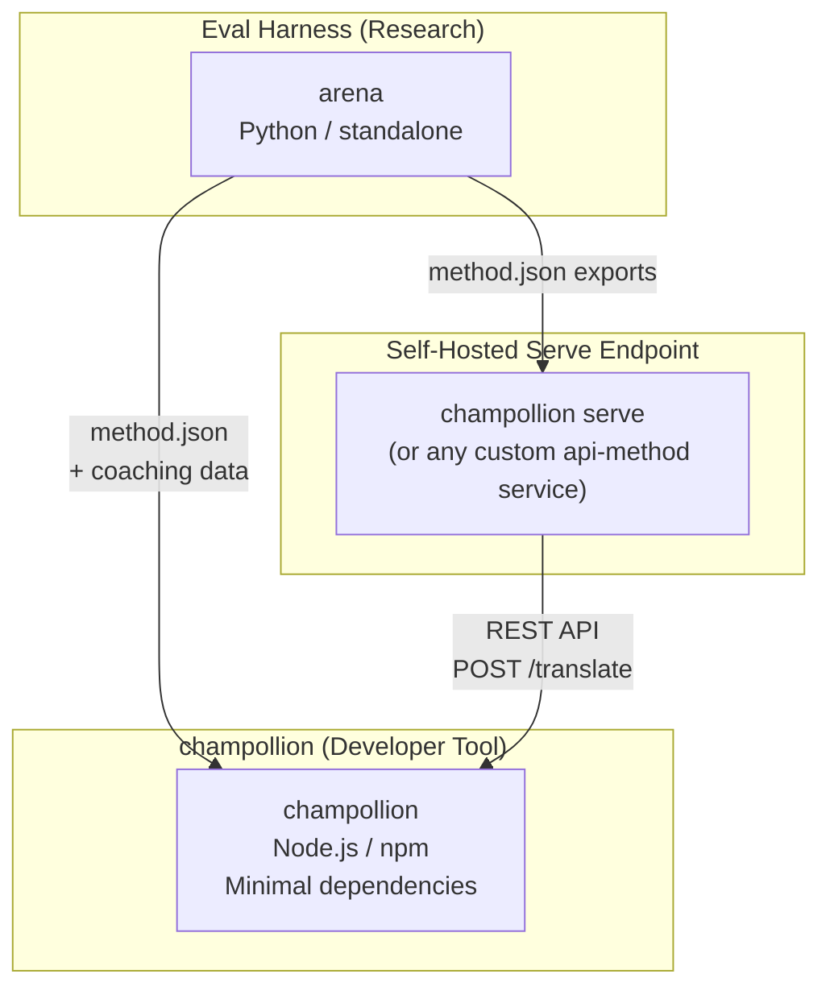
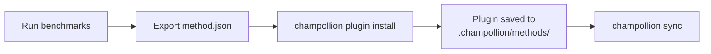
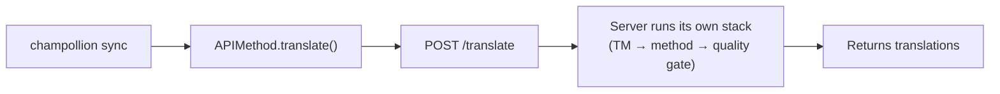
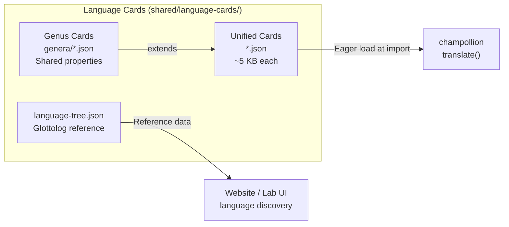

# 架构

Champollion 翻译生态系统由三个独立工具组成，通过明确定义的契约协同工作。它们在构建时互不依赖。它们通过共享的**方法插件格式**和 **REST API 契约**进行通信。

## 三个组件



### champollion（本项目）

源码可见的开发者工具（非商业用途免费）。使用可插拔的方法翻译本地化文件。依赖极少，配置可选，开箱即用。

**内置方法：**
- `llm` → OpenRouter / 任何 LLM（200+ 模型）
- `llm-coached` → LLM + 语法/词典指导
- `openai` → 直接 OpenAI API（GPT-4o、GPT-4o-mini）
- `anthropic` → 直接 Anthropic API（Claude Sonnet、Haiku、Opus）
- `gemini` → 直接 Google Gemini API（Flash、Pro — 免费层可用）
- `google-translate` → Google Cloud Translation API v2
- `deepl` → DeepL API 及词汇表支持
- `microsoft-translator` → Azure 认知服务翻译器
- `libretranslate` → 自托管 LibreTranslate（AGPL、免费）
- `api` → 到任何远程 REST 端点的瘦管道

### Eval Harness（配套项目）

用于开发、测试和基准测试翻译方法的研究工具。当方法达到可接受的质量时，harness 导出一个**方法插件** — 一个 `method.json` 清单和可选的指导数据文件。

harness 永远不会在 champollion 内部运行。它是一个单独的工具，生成静态输出（JSON 文件）。Champollion 只是读取这些文件。

[→ GitHub 上的 Eval Harness](https://github.com/gamedaysuits/Champollion)

### 自托管服务端点 (`champollion serve`)

任何 champollion 项目都可以通过一条命令——[`champollion serve`](/docs/guides/serving-a-method#the-zero-code-path-champollion-serve)——通过 HTTP 提供其自身配置的翻译栈服务，并且任何其他项目都可以通过 `api` 方法来消费它。提示词、辅导数据、翻译记忆库（Translation Memory）以及提供商密钥都保留在所有者的基础设施上；消费者只需发送源字符串并接收翻译结果。完全独立于 champollion 之外的流水线（例如 FST 链、研究系统）也可以实现与[自定义服务](/docs/guides/serving-a-method)相同的契约。不存在托管的 Champollion 服务——按照设计，服务始终是自托管的。

## 它们如何连接

### Eval Harness → champollion（单向导出）



**契约**：[插件规范](/docs/reference/plugin-spec)

### 服务端点 → champollion（运行时 API）



Champollion 的 `APIMethod` 是一个**哑管道**。它发送密钥并接收翻译。它不包含任何翻译逻辑和零专有内容。

## 每个组件对其他组件的了解

| 工具 | 了解 champollion 吗？ | 了解服务端点吗？ | 了解 harness 吗？ |
|------|---------------------|-------------------------------|---------------------|
| **champollion** | *(本身就是 champollion)* | 是 —— `api` 方法会调用它 | 否 —— 仅读取插件导出 |
| **服务端点** | 是 —— 为其请求提供服务 | *(本身就是服务端点)* | 否 —— 像任何项目一样安装导出的方法 |
| **Eval Harness** | 是 —— 导出插件格式 | 否 —— 方法单独部署 | *(本身就是 harness)* |

## 用户场景

### 场景 1：免费、零配置（大多数用户）

```bash
export OPENROUTER_API_KEY=sk-...
npx champollion sync
```

使用内置的 `llm` 方法。没有插件，没有服务器，没有 harness。

### 场景 2：Google Translate 基线

```bash
export GOOGLE_TRANSLATE_API_KEY=AIza...
npx champollion sync
```

使用内置 `google-translate` 方法。无需插件。

### 场景 3：带捆绑指导的开放插件

```bash
champollion plugin install ./french-formal-v1/
champollion sync
```

插件有 `type: "llm-coached"` → champollion 使用用户自己的 OpenRouter 密钥。指导数据是本地的（无服务器调用）。

### 场景 4：DIY 指导（无插件、无 harness）

```json title="champollion.config.json"
{
  "pairs": {
    "en:fr": { "method": "llm-coached" }
  }
}
```

用户在 `.champollion/coaching/fr.json` 中维护自己的语法规则和词典。

### 场景 5：消费另一个项目提供的翻译栈服务

```bash
champollion plugin install ./their-project-serve/   # manifest from `champollion serve --emit-manifest`
CHAMPOLLION_API_KEY=<their bearer token> champollion sync
```

该对的 `api` 方法将源字符串通过 POST 请求发送到他们自托管的 [`champollion serve`](/docs/guides/serving-a-method#the-zero-code-path-champollion-serve) 端点；他们的翻译栈（辅导数据、翻译记忆库、质量门禁）负责执行翻译。

## 语言卡

champollion 中的每种语言都通过**语言卡**配置 — 一个统一的 JSON 文件，包含寄存器预设、正式性规则、方法支持标志、排版约定、系统发生学分类和语言参考数据。



卡在导入时急切加载。每张卡包含翻译引擎和开发者文档需要的所有元数据 — 没有单独的参考层。卡从权威来源（IANA、CLDR、[Glottolog](https://glottolog.org)、[WALS](https://wals.info)）使用 `scripts/generate-language-card.mjs` 和 `scripts/build-language-tree.mjs` 生成，然后由人工策划以确保语言学准确性。

## 设计原则

1. **没有循环依赖。** 桥接是单向的。
2. **Champollion 是轻量级核心。** 依赖极少，配置可选。插件和 API 都是附加的。
3. **知识产权保护是架构层面的。** 专有技术保留在服务端——无论谁运行该端点，都能保留其提示词、辅导数据和密钥。npm 包不附带任何专有内容。
4. **插件格式即契约。** 一切都通过 `method.json` 流转。
5. **每个工具各司其职。** Harness → 开发方法。`champollion serve` → 托管方法。Champollion → 翻译文件。

---

## 另请参阅

- [翻译方法](/docs/guides/translation-methods) — 每个内置方法如何工作
- [插件规范](/docs/reference/plugin-spec) — method.json 清单格式
- [Eval Harness](/docs/network/specifications/harness) — 配套研究工具
- [通过 API 提供方法](/docs/guides/serving-a-method) — 托管自定义翻译管道
- [支持低资源语言](/docs/network/community/low-resource-languages) — 驱动此架构的用例
