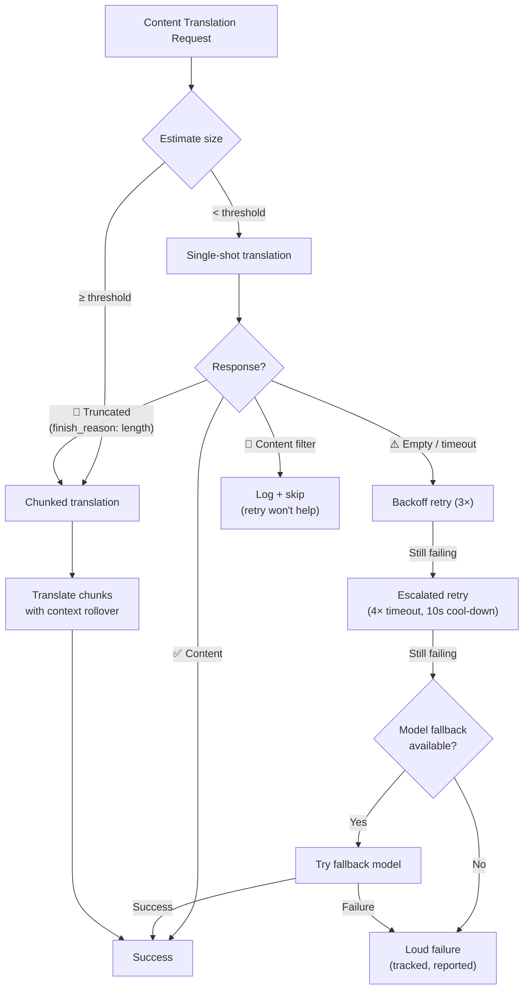

# 内容翻译弹性

Champollion 的内容翻译管道（Markdown/MDX 文档）使用多层弹性系统来优雅地处理故障。与键值翻译不同——每个批次很小，重试成本低廉——内容翻译涉及大型提示和长输出，可能因结构原因而失败，而不仅仅是瞬时原因。

## 问题

内容翻译与键值翻译的故障模式从根本上不同：

| 故障模式 | 键值 | 内容 |
|---|---|---|
| 速率限制 (429) | 常见，瞬时 | 常见，瞬时 |
| 超时 | 罕见（小批次） | 常见（长输出） |
| 空响应 | 罕见 | 常见（输出限制、过滤器） |
| 输出截断 | 不适用（JSON 验证） | 无声发生 |
| 内容过滤 | 极其罕见 | 可能（CLI 文档、安全文档） |
| 模型限制 | 重试可修复 | 重试无法修复 |

关键洞察：**重试相同的失败请求不是冗余，而是固执。** 适当的弹性系统应识别*为什么*某事失败，并相应地改变其方法。

## 架构概览



## 第 1 层：诊断优先重试

在决定*如何*重试之前，系统检查 API 响应以理解*什么*失败了。

### 完成原因分析

每个 LLM API 都返回一个 `finish_reason` 以及生成的文本。Champollion 使用它来做出智能重试决策：

| `finish_reason` | 含义 | 操作 |
|---|---|---|
| `stop` + 内容 | 模型正常完成 | ✅ 接受结果 |
| `stop` + 空 | 模型未生成任何内容 | ⚠️ 重试相同请求（瞬时） |
| `length` | 输出达到令牌限制 | 🔶 自动分块文档 |
| `content_filter` | 安全过滤器阻止输出 | 🔴 记录并跳过（重试无法帮助） |
| `null` / 缺失 | 格式错误的响应 | ⚠️ 重试相同请求（瞬时） |

这取代了当前方法，即用退避重试来统一处理每个故障。

### 重试预算

瞬时故障的标准重试预算：

| 轮次 | 尝试次数 | 超时 | 退避 |
|---|---|---|---|
| 标准 | 4 (0→3) | 60s | 1s → 2s → 4s |
| 升级 | 4 (0→3) | 120s | 1s → 2s → 4s |
| **总计** | **8** | — | **~3.5 分钟最坏情况** |

轮次之间，10 秒的冷却时间允许瞬时问题得到解决。

## 第 2 层：内容分块

当文档超过大小阈值时——或当第 1 层发出输出截断信号时——系统将文档分成翻译大小的块。

参见 [Context Rollover](/docs/concepts/context-rollover#content-chunking) 了解详细的分块配置。关键要点：

### 分割策略

1. **标题边界** — `##` 和 `###` 是自然的翻译单元边界。每个部分都足够独立以进行独立翻译。
2. **段落回退** — 如果单个标题部分超过块大小，则在双换行处分割。
3. **硬分割** — 极长段落的最后手段（例如表格）。在句子边界处分割。

### 块之间的上下文

每个块接收*前一个块翻译*的最后 2-3 段作为上下文。这可以防止：
- **术语漂移** — 模型看到它在前一个块中称为"tableau de bord"的内容
- **代词解析** — 前一部分的先行词向前传递
- **寄存器一致性** — 第 1 块中建立的语调在第 N 块中持续

### 自动分块触发器

| 触发器 | 行为 |
|---|---|
| `contentChunkSize` 在配置中设置 | 始终分块超过该大小的文档 |
| `finish_reason: "length"` 返回 | 自动分块作为回退（即使没有配置） |
| 输入 > ~12KB（自动检测） | 记录建议，但不强制 |

## 第 3 层：模型回退链

当配置的模型持续失败时——不是瞬时失败，而是结构性失败——系统尝试替代模型。不同的模型具有不同的上下文窗口、输出限制、安全过滤器和多语言优势。

### 默认回退链

```json title="champollion.config.json"
{
  "contentFallbackChain": [
    "google/gemini-2.5-flash",
    "anthropic/claude-sonnet-4"
  ]
}
```

配置的模型始终首先尝试。回退模型仅在所有重试轮次（标准 + 升级）耗尽后使用。

### 为什么使用多个架构

| 场景 | 主模型失败 | 回退模型成功 |
|---|---|---|
| 越南语 CLI 文档 | Gemini 返回空 | Claude 处理得很好 |
| 安全过滤的内容 | OpenAI 阻止它 | Gemini 有不同的过滤阈值 |
| 长结构化表格 | 模型 A 截断 | 模型 B 有更大的输出窗口 |

回退的价值在于架构多样性——不同的模型族具有不同的故障模式。对一个模型来说是结构性故障的问题对另一个模型可能是微不足道的。

### 范围

> 模型回退**仅限内容**。键值批次很小，几乎不会结构性失败。在那里添加回退复杂性会过度设计。

## 第 4 层：故障计数

当故障确实发生时，系统会正确跟踪和报告它们，而不是无声地继续。

### 同步期间

- 失败的项目在进度输出中显示 `[FAIL]`
- 每个故障记录具体原因（超时、空响应、内容过滤、截断）
- 完成的项目立即保存到清单（增量持久化）

### 同步后

故障摘要在末尾打印：

```
  ┌─ Content Translation Failures ─────────────────────────────────────┐
  │                                                                     │
  │  2 of 24 content translations failed:                              │
  │                                                                     │
  │  ✗ docs/reference/cli.md → vi                                      │
  │    Reason: empty response after 8 attempts + 1 fallback model      │
  │    Models tried: google/gemini-3.1-pro-preview, gemini-2.5-flash   │
  │                                                                     │
  │  ✗ docs/guides/troubleshooting.md → ar                             │
  │    Reason: content_filter (no retry — blocked by safety filter)    │
  │                                                                     │
  │  Re-run: npx champollion@latest sync                              │
  │  (22 completed translations are cached and won't re-run)           │
  └─────────────────────────────────────────────────────────────────────┘
```

### 重试清单

失败的文件写入 `.champollion-retry.json`：

```json
{
  "failedAt": "2026-05-27T21:45:00Z",
  "files": [
    {
      "source": "docs/reference/cli.md",
      "locale": "vi",
      "reason": "empty_response",
      "attempts": 8,
      "modelsTried": ["google/gemini-3.1-pro-preview", "google/gemini-2.5-flash"]
    }
  ]
}
```

在下一个 `sync` 运行中，仅重新处理这些文件。完成的文件通过内容哈希清单保留（`.champollion-content.lock`）。

### 退出代码

| 代码 | 含义 |
|---|---|
| 0 | 所有翻译成功 |
| 1 | 配置错误、缺少 API 密钥等 |
| 2 | 部分失败 — 某些内容翻译失败 |

## 配置

```json title="champollion.config.json"
{
  "contentChunkSize": 4000,
  "contentOverlap": 200,
  "contentFallbackChain": [
    "google/gemini-2.5-flash",
    "anthropic/claude-sonnet-4"
  ]
}
```

| 字段 | 类型 | 默认值 | 描述 |
|---|---|---|---|
| `contentChunkSize` | `number \| null` | `null` | 每个内容块的最大令牌数。`null` = 无分块（仅在截断时自动分块） |
| `contentOverlap` | `number` | `200` | 内容块之间的重叠令牌数以实现上下文连续性 |
| `contentFallbackChain` | `string[]` | `[]` | 当配置的模型结构性失败时尝试的回退模型 |

## 实现状态

| 功能 | 状态 |
|---|---|
| 诊断优先重试（finish_reason 解析） | 🔲 计划中 |
| 内容分块（标题/段落分割） | 🔲 计划中 |
| 块之间的上下文翻转 | 🔲 计划中 |
| 模型回退链 | 🔲 计划中 |
| 故障摘要报告 | 🔲 计划中 |
| 重试清单 (.champollion-retry.json) | 🔲 计划中 |
| 部分失败的退出代码 2 | 🔲 计划中 |
| 升级重试（扩展超时） | ✅ 已实现 (v3.3.3) |
| 尝试编号的重试消息 | ✅ 已实现 (v3.3.3) |
| 内容错误的大声失败 | ✅ 已实现 (v3.3.3) |

## 另见

- [Context Rollover](/docs/concepts/context-rollover) — 批处理一致性和内容分块配置
- [同步工作原理](/docs/concepts/how-sync-works) — 完整的同步管道
- [翻译方法](/docs/guides/translation-methods) — 可用的方法及其特性
