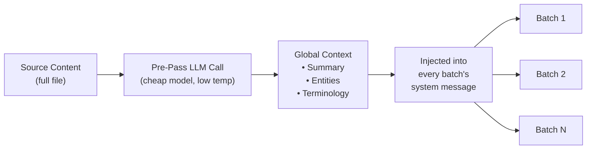

# 上下文翻转批处理

上下文翻转是一项文档级翻译一致性功能，它将先前翻译的一个窗口内容转移到后续批次中，为 LLM 在批次边界处提供"短期记忆"。

## 存在的原因

在翻译大型文件（100+ 个键或长 Markdown 文档）时，champollion 会将工作分成多个批次。没有翻转功能，每个批次都会独立翻译——LLM 无法记住它在前一个批次中翻译的内容。这会导致：

- **术语漂移**：同一个英文术语在不同批次中被翻译成不同的内容（例如，"dashboard" 在批次 1 中翻译为"仪表板"，在批次 3 中翻译为"面板"）
- **指代失败**：跨越批次边界的代词和引用会失去其先行词
- **语域不一致**：语气可能在批次之间发生变化（正式 → 非正式 → 正式）

这是机器翻译文献中一个有充分记录的问题。滑动窗口方法已通过文档级机器翻译研究验证（ACL、WMT 研讨会）。

## 工作原理

### 滑动窗口

当 `contextRollover` 启用时，翻译管道维护一个最近翻译的键值对窗口。每个批次完成后，其输出的一部分（默认：`batchSize` 的 20%）被转移到下一个批次的提示中作为"参考翻译"。

```
Batch 1: Translate keys 1-80         → LLM sees: system prompt + keys 1-80
Batch 2: Translate keys 81-160       → LLM sees: system prompt + [16 reference translations from batch 1] + keys 81-160
Batch 3: Translate keys 161-240      → LLM sees: system prompt + [16 reference translations from batch 2] + keys 161-240
```

参考翻译被注入到用户消息中，带有清晰的标签：

```
--- Previous translations for context (do NOT re-translate these) ---
"nav.dashboard": "Tableau de bord"
"nav.settings": "Paramètres"
"header.welcome": "Bienvenue sur la plateforme"
---

{
  "content.main_heading": "Getting Started with Your Dashboard",
  ...
}
```

### 选择策略

两种模式用于选择要转移的翻译：

| 策略 | 行为 | 最适用于 |
|----------|----------|----------|
| `tail`（默认） | 前一个批次的最后 N 个翻译 | 顺序文档、Markdown 内容 |
| `diverse` | 选择涵盖不同键类型的条目（按钮、标题、描述） | 具有混合 UI 元素类型的大型 JSON 文件 |

### 令牌预算

翻转窗口消耗输入令牌。Champollion 计算近似令牌成本，如果窗口超过模型估计上下文窗口的 15%，则发出警告。警告包括建议的减少量：

```
[WARN] Rollover window is ~2400 tokens (18% of model context).
       Consider reducing rolloverSize to 0.15 or lowering batchSize.
```

## 全局上下文预处理

一个可选的首次处理 LLM 调用，在翻译开始**之前**运行。LLM 分析完整的源内容并生成：

1. **文档摘要** — 2-3 句话描述正在翻译的内容
2. **命名实体** — 产品名称、技术术语和专有名词及其建议处理方式
3. **术语一致性列表** — LLM 识别的需要一致翻译的关键术语

这个全局上下文被注入到每个批次的**系统消息**中，使每个批次都能了解完整文档，即使它只看到一个切片。



### 预处理模型

全局上下文提取使用单独的、廉价的 LLM 调用（默认：`google/gemini-3.5-flash`，温度 0.1），无论用户配置的翻译模型如何。这是一项元数据提取任务，而不是翻译任务——速度和成本比创意输出更重要。

## 内容分块 {#content-chunking}

对于长 Markdown 文档（内容翻译），正文可能超过 LLM 的有效上下文窗口，或模型可能截断其输出。内容分块将文档分成重叠的段，每个段独立翻译，然后重新组合。

### 分割策略

分块遵循优先级级联——它首先尝试最具语义意义的分割点：

1. **标题边界** — `##` 和 `###` 标记创建自然的翻译单元。每个部分都足够独立以进行独立翻译，标题为 LLM 提供了关于其翻译内容的结构上下文。
2. **段落边界** — 如果单个标题部分超过块大小，则在双换行符处分割（`\n\n`）。段落是下一个最佳边界，因为它们代表完整的思想。
3. **句子边界** — 对于极长的段落（例如大型表格、密集散文）的最后手段。在句号-空格边界处分割，同时尊重缩写。

受保护的块（代码围栏、短代码——参见[同步工作原理](/docs/concepts/how-sync-works)）永远不会跨块分割。如果受保护的块会被切割，分割点会移到它之前或之后。

### 自动分块触发

分块以两种方式激活：

| 触发器 | 行为 |
|---------|----------|
| 在配置中设置 `contentChunkSize` | 主动分块所有超过该令牌数的文档 |
| 模型返回 `finish_reason: "length"` | 作为后备自动分块，即使没有配置 |

后备触发器意味着即使不配置分块，它也能作为安全网工作——如果模型截断，champollion 会自动使用块重试。

### 配置

- **`contentChunkSize`**：每个块的最大令牌数（默认：null = 发送完整正文；设置为例如 4000 用于长文档）
- **`contentOverlap`**：块之间的重叠令牌数（默认：200）。重叠确保块边界处的平滑过渡。

当分块处于活动状态时，上下文翻转自动应用于块之间——前一个块最后一段的翻译输出被添加到下一个块的提示前面。

```json title="champollion.config.json"
{
  "contentChunkSize": 4000,
  "contentOverlap": 200
}
```

> 有关完整的内容翻译弹性系统（诊断重试、模型后备、失败计数），请参见[内容弹性](/docs/concepts/content-resilience)。

## 配置

### 快速开始

```json title="champollion.config.json"
{
  "contextRollover": true,
  "globalContext": true,
  "contentChunkSize": 4000,
  "contentOverlap": 200
}
```

### 完整选项

```json title="champollion.config.json (advanced)"
{
  "contextRollover": {
    "size": 0.2,
    "strategy": "tail",
    "maxTokens": null
  },
  "globalContext": {
    "model": "google/gemini-3.5-flash",
    "maxEntities": 20,
    "temperature": 0.1
  },
  "contentChunkSize": 4000,
  "contentOverlap": 200,
  "contentFallbackChain": [
    "google/gemini-2.5-flash",
    "anthropic/claude-sonnet-4"
  ]
}
```

| 字段 | 类型 | 默认值 | 描述 |
|-------|------|---------|-------------|
| `contextRollover` | `boolean \| object` | `false` | 启用滑动窗口翻转 |
| `contextRollover.size` | `number` | `0.2` | 要转移的 `batchSize` 的分数（0.0–1.0） |
| `contextRollover.strategy` | `string` | `"tail"` | 选择策略：`"tail"` 或 `"diverse"` |
| `contextRollover.maxTokens` | `number \| null` | `null` | 翻转令牌预算的硬上限 |
| `globalContext` | `boolean \| object` | `false` | 启用全局上下文预处理 |
| `globalContext.model` | `string` | `"google/gemini-3.5-flash"` | 预处理调用的模型 |
| `globalContext.maxEntities` | `number` | `20` | 要提取的最大命名实体数 |
| `globalContext.temperature` | `number` | `0.1` | 预处理调用的温度 |
| `contentChunkSize` | `number \| null` | `null` | 每个内容块的最大令牌数（null = 无分块） |
| `contentOverlap` | `number` | `200` | 内容块之间的重叠令牌数 |
| `contentFallbackChain` | `string[]` | `[]` | 当配置的模型在结构上失败时，用于内容翻译的后备模型 |

## 何时使用

| 场景 | 建议 |
|----------|---------------|
| 小型 JSON 文件（< 50 个键） | 不需要——单个批次，无边界问题 |
| 大型 JSON 文件（100+ 个键） | 启用 `contextRollover` 以保证术语一致性 |
| 长 Markdown 文档 | 启用 `contextRollover` + `contentChunkSize` + `globalContext` |
| 技术文档 | 启用 `globalContext` 以进行实体提取 |
| 混合语域的 UI 字符串 | 使用 `contextRollover` 配合 `strategy: "diverse"` |

## 实现状态

| 功能 | 状态 |
|---------|--------|
| 滑动窗口翻转（键值） | 🔲 计划中 |
| 滑动窗口翻转（内容） | 🔲 计划中 |
| 全局上下文预处理 | 🔲 计划中 |
| 内容分块 | 🔲 计划中 |
| 截断时自动分块 | 🔲 计划中 |
| `diverse` 选择策略 | 🔲 计划中 |

## 文献

此功能基于文档级机器翻译的已发表研究：

- **滑动窗口方法**：在使用 LLM 进行翻译时，已验证可改进 BLEU、chrF 和 COMET 分数（ACL 2023–2025 文档级 MT 研讨会）
- **多知识融合**：将文档摘要和实体列表作为全局上下文注入可改进长文档中的术语一致性
- **上下文感知提示（CAP）**：通过注意力分数或语义相似性选择相关上下文以进行上下文学习

## 另见

- [内容弹性](/docs/concepts/content-resilience) — 诊断重试、模型后备和失败计数
- [同步工作原理](/docs/concepts/how-sync-works) — 翻转增强的批处理管道
- [教练数据](/docs/concepts/coaching-data) — 用于语法/字典注入的互补功能
- [翻译记忆](/docs/concepts/translation-memory) — 与翻转一起工作的 TM 缓存
