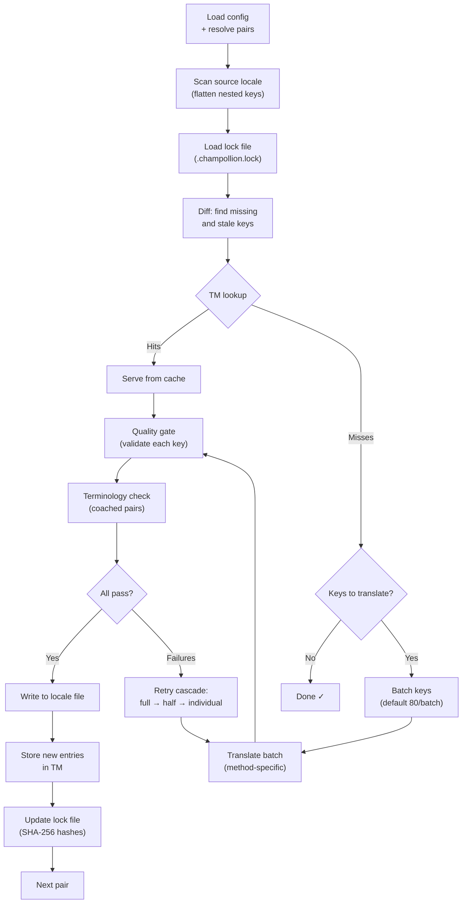

# 同步工作原理

`sync` 命令是 champollion 的核心操作。以下是运行 `npx champollion sync` 时发生的情况。

## 管道概览



## 逐步说明

### 1. 配置解析

Champollion 加载 `champollion.config.json`（或自动检测设置）。它解析：
- 源语言和目标语言
- 语言对图（要处理的源→目标组合）
- 每个语言对的方法、模型和质量设置

在扫描文件之前，champollion 会打印一个启动标题：

```
champollion v0.1.0

[INFO] Detected format: json (auto)
[INFO] Detected framework: Hugo
```

- **版本横幅**：显示已安装的版本，用于调试和问题报告。
- **格式检测**：报告文件格式以及是否自动检测 `(auto)` 或显式配置 `(config)`。支持 `json`、`toml` 和 `yaml`。
- **框架检测**：当设置 `contentDir` 时，识别框架（`Hugo`）以确认内容同步处于活动状态。

### 2. 源扫描

源语言文件被加载并展平为键→值映射：

```json
// Input (nested)
{ "hero": { "title": "Welcome", "subtitle": "Build" } }

// Flattened
{ "hero.title": "Welcome", "hero.subtitle": "Build" }
```

### 3. 变更检测

Champollion 读取 `.champollion.lock`，其中存储了先前翻译的源值的 SHA-256 哈希。对于每个键，它检查：

| 条件 | 操作 |
|-----------|--------|
| 键在目标中缺失 | **翻译** |
| 源哈希自上次同步以来已更改 | **重新翻译**（过期） |
| 目标值以 `[EN]` 开头 | **重新翻译**（旧版回退标记） |
| 源哈希未更改，键存在 | **跳过** |

这就是为什么 champollion 只翻译已更改的内容——它不会在每次同步时重新翻译整个文件。

### 4. 批处理

键被分组为批次（LLM 默认：80 个键/批次，Google Translate 为 128 个）。批处理减少了 API 往返次数，同时保持提示词的可管理性。

在翻译期间，champollion 显示一个内联进度条，在每个批次完成后更新：

```
[INFO] fr.json — 2,847 missing
     ████████████████░░░░░░░░░░░░░░░░ 1,440/2,847 keys
```

该进度条使用 `\r` 回车符进行原地更新——无需滚动。在 `--quiet` 和 `--json` 模式下被抑制。

### 4b. 翻译记忆

在批处理之前，champollion 检查翻译记忆缓存（`.champollion/tm.json`）。源文本 + 语言 + 方法匹配先前翻译的键会立即从缓存中提供——无需 API 调用。

```
  [TM] 142 key(s) served from cache
  Translating 3 key(s) to French (llm)... [OK]
```

TM 是主要的成本节省机制。在单个键更改后重新运行同步只翻译该键，而不是整个文件。详见 [翻译记忆](/docs/concepts/translation-memory)。

要在单次运行中绕过缓存：`champollion sync --no-tm`

### 5. 翻译

每个批次被发送到配置的翻译方法：

- **`llm`**：通过 OpenRouter 的结构化提示，包含寄存器和性别指导说明
- **`llm-coached`**：相同，但注入了语法规则、词典和风格说明
- **`google-translate`**：Google Cloud Translation API v2 批处理请求
- **`api`**：HTTP POST 到远程端点

系统消息（寄存器、性别指导、规则）对于给定语言的所有批次都相同，启用**提示缓存**——Anthropic 和 Google 等提供商缓存重复的系统消息，降低令牌成本。

### 6. 质量门

每个翻译在写入磁盘之前都会被验证。运行五项检查：

| 检查 | 捕获内容 | 示例 |
|-------|----------------|---------|
| **空白/空值** | 模型未返回任何内容 | `""` |
| **源回显** | 模型返回了英文输入 | `"Welcome"` 用于日语 |
| **幻觉循环** | 重复的三字组 | `"Qo' Qo' Qo' Qo'"` |
| **长度膨胀** | 输出比源长 4 倍以上 | 10 字符源 → 50 字符输出 |
| **脚本合规性** | 语言环境的脚本错误 | 阿拉伯语环境的拉丁文本 |

失败使用 `[GATE]` 前缀记录。无静默回退。

详见 [质量门](/docs/concepts/quality-gate)。

### 6b. 术语验证

对于带有词典的指导语言对，champollion 检查 LLM 在翻译后是否实际使用了所需的术语。违规被记录为 `[TERM]` 警告：

```
[TERM] en→fr: 2 term violation(s)
  • "dashboard" → expected "tableau de bord" but got "panneau"
```

这些是警告，不是阻止错误——翻译仍然被写入。

### 7. 重试级联

在 JSON 解析失败或批级错误时，champollion 使用逐渐更小的批次重试：

```
Full batch (80 keys) → Failed
  └→ Half batch (40 keys) → 1 failure
      └→ Individual keys (1 each) → Isolates the problem key
```

重试预算由 `maxRetries`（默认：3）限制，以防止令牌支出失控。

### 8. 写入和锁定

通过的翻译被写入目标语言文件，保留原始嵌套结构。锁定文件使用新的 SHA-256 哈希更新。

### 9. 验证

处理完所有语言对后，champollion 从磁盘重新读取写入的语言文件并运行验证通过（除非设置了 `--no-verify`）。这捕获了同步报告成功和键实际错误之间的差距：

- **键奇偶性**——所有源键都存在于每个目标中
- **`[EN]` 回退标记**——来自先前运行的旧版标记
- **空翻译**——漏过的空白值
- **脚本合规性**——非拉丁语言环境的仅 ASCII 翻译
- **占位符保留**——ICU 占位符与源匹配
- **编码问题**——BOM 标记、隐形字符

这也可作为独立的 `champollion verify` 命令用于 CI 门。

## 内容翻译（第 2 阶段）

对于 Docusaurus 和 Hugo 项目，`sync` 在 JSON 键翻译后运行第二阶段。此阶段使用相同的方法和质量门翻译 Markdown 和 MDX 文件（文档、博客文章、教程）。

### 工作原理

1. Champollion 通过遍历内容/文档目录发现所有源内容文件（`.md`、`.mdx`）
2. 对于每个文件 × 语言对，它检查单独的内容锁定文件（`.champollion-content.lock`）以查找 SHA-256 哈希更改
3. 已更改或缺失的文件被收集到平面工作项池中
4. 该池使用**并行并发**处理（默认：12 个同时 API 调用）

```
Phase 2: content (79 translations to process, 341 skipped, concurrency: 48)

    [1/79] (1%)  docs/concepts/security.md → ja [RE-TRANSLATE] (~3328s left)
    [2/79] (3%)  docs/concepts/security.md → th [RE-TRANSLATE] (~1821s left)
    ...
    [79/79] (100%) blog/v3-2-quality.md → de [OK]

  [OK] Created 79 content file(s), 341 unchanged
```

### 并行性

第 1 阶段（JSON 键）和第 2 阶段（内容）现在并行运行：

- **第 1 阶段**：所有语言翻译并发触发（默认：50 个同时语言）。在每种语言内，API 批次也并行运行（4 个并发批次）。12 语言同步，120 个键在约 1 分钟内完成，而不是约 15 分钟。
- **第 2 阶段**：所有文件×语言组合作为平面池翻译（默认：12 个同时 API 调用）。不同的文件和不同的语言同时翻译。

使用 `--json-concurrency`、`--content-concurrency` 或 `--concurrency` 控制并行性（设置两者）：

```bash
# Faster JSON sync (more parallel locale translations)
npx champollion sync --json-concurrency 30

# Faster content sync (more parallel API calls)
npx champollion sync --content-concurrency 20

# Slower (gentler on rate limits)
npx champollion sync --concurrency 4
```

### 内容保护

在翻译期间，champollion 保护不可翻译的内容：

- **代码块**（围栏和缩进）被替换为占位符
- **前置事项**字段不在 `translatableFields` 列表中的被原样保留
- **链接**、图像路径和 HTML 标签被保护
- **短代码**和插值变量（例如 `{count}`、`{{.Params.title}}`）被屏蔽

翻译后，所有占位符都被恢复并验证。如果任何占位符丢失或损坏，翻译被拒绝并重试。

## 部分成功

一个失败的批次不会阻止其余的。如果 10 个批次中有 9 个成功，这 9 个会被写入。失败的批次被记录，您可以重新运行 `sync` 进行重试。

## 干运行

预览会更改什么而不写入任何文件：

```bash
npx champollion sync --dry-run
```

## 强制重新翻译

强制特定键重新翻译，即使未更改：

```bash
npx champollion sync --force-keys "hero.title,nav.about"
```

## 成本估计

在翻译之前，champollion 生成一份**同步前成本报告**，显示每个语言对的估计成本。这在每个 `sync` 期间自动运行——您在进行任何 API 调用之前看到它。

```
╔══════════════════════════════════════════════════════════╗
║  Cost Estimate                                          ║
╠════════════╦═══════╦════════════╦════════════════════════╣
║ Pair       ║ Keys  ║ Est. Cost  ║ Method                 ║
╠════════════╬═══════╬════════════╬════════════════════════╣
║ en → fr    ║   142 ║ $0.07      ║ google-translate       ║
║ en → ja    ║    38 ║   —        ║ llm (model-dependent)  ║
║ en → crk   ║    38 ║   —        ║ llm-coached            ║
╚════════════╩═══════╩════════════╩════════════════════════╝
```

### 估计内容

每个翻译方法提供自己的成本估计：

| 方法 | 成本基础 | 精度 |
|--------|-----------|-----------|
| `google-translate` | Google 公布的费率（$20/百万字符） | 准确 |
| `llm` | 因 OpenRouter 模型而异 | 模型相关——检查 [OpenRouter 定价](https://openrouter.ai/models) |
| `llm-coached` | 与 `llm` 相同加上指导上下文令牌 | 模型相关 |
| `api` | 服务器确定 | 未知——无法在不查询端点的情况下估计 |

当方法无法确定成本（LLM 方法、远程 API）时，champollion 报告 `—` 而不是猜测。使用 `--dry` 查看成本估计而不实际翻译。

---

## 另见

- [CLI 参考 — sync](/docs/reference/cli#sync) — 命令标志和选项
- [翻译记忆](/docs/concepts/translation-memory) — 缓存和成本节省
- [质量门](/docs/concepts/quality-gate) — 翻译如何被验证
- [翻译方法](/docs/guides/translation-methods) — 每个方法如何工作
- [与专业翻译人员合作](/docs/guides/professional-translators) — XLIFF 工作流
- [配置](/docs/getting-started/configuration) — 配置参考
- [CI/CD 指南](/docs/guides/ci-cd) — 在管道中自动化同步
