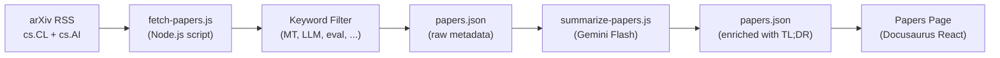

# 研究论文源

Champollion 维护一个精选的机器翻译和自然语言处理研究论文源，来自 arXiv，经过筛选和总结供实践者使用。该源是半自动化的：论文每日获取和筛选，由 AI 总结，并发布到网站。

## 存在的原因

champollion 的翻译管道建立在已发表研究的技术基础上——寄存器引导提示、教练数据注入、上下文滚动、质量门控。论文源有三个目的：

1. **透明度**：用户可以看到每个功能背后的研究支持
2. **发现**：arXiv 上发布的新技术可能会影响未来的功能或用户配置
3. **社区**：将 champollion 定位为一个以研究为基础的工具，而不仅仅是另一个 API 包装器

## 架构



### 管道步骤

#### 1. 获取（每日）

`scripts/fetch-papers.js` 查询 arXiv Atom API 以获取以下领域的最新论文：
- `cs.CL`（计算与语言）
- `cs.AI`（人工智能）

返回：标题、作者、摘要、arXiv ID、PDF 链接、发布日期、分类。

#### 2. 筛选

论文按关键词相关性筛选。论文必须至少匹配一个主要关键词：

**主要关键词**（必须匹配 ≥1）：
- `machine translation`、`neural machine translation`、`NMT`
- `LLM`、`large language model`
- `multilingual`、`cross-lingual`
- `document-level translation`
- `low-resource language`、`endangered language`
- `translation evaluation`、`BLEU`、`COMET`、`chrF`
- `tokenization`、`morphology`、`polysynthetic`
- `context window`、`sliding window`
- `prompt engineering`（在翻译上下文中）

**增强关键词**（提高相关性分数）：
- `i18n`、`internationalization`、`localization`
- `few-shot`、`in-context learning`
- `terminology`、`glossary`、`consistency`
- `quality estimation`、`hallucination`

#### 3. 总结（AI 辅助）

`scripts/summarize-papers.js` 处理新的（未总结的）论文：

对于每篇论文，将摘要发送到 Gemini 3.5 Flash，使用：
```
Read this ML research abstract and produce:
1. A 2-sentence TL;DR accessible to a software developer (not a researcher)
2. A single bullet: "Why this matters for MT" — how could this technique
   improve machine translation quality, cost, or speed in production?

Abstract: {abstract}
```

输出与原始元数据一起存储在 `papers.json` 中。

#### 4. 发布

Docusaurus 论文页面（`website/src/pages/papers.js`）将 `papers.json` 呈现为可筛选的分页卡片网格。

每张卡片显示：
- **标题**（链接到 arXiv）
- **作者**（前 3 名 + "et al."）
- **日期**（发布或最后更新）
- **TL;DR**（AI 生成）
- **为什么重要**（AI 生成）
- **分类**（arXiv 标签）
- **PDF 链接**

### 自动化

GitHub Actions 工作流每日运行管道：

```yaml title=".github/workflows/fetch-papers.yml"
name: Fetch MT Research Papers
on:
  schedule:
    - cron: '0 6 * * *'  # 06:00 UTC daily
  workflow_dispatch: {}   # Manual trigger

jobs:
  fetch:
    runs-on: ubuntu-latest
    steps:
      - uses: actions/checkout@v4
      - uses: actions/setup-node@v4
        with:
          node-version: 20
      - run: node scripts/fetch-papers.js
      - run: node scripts/summarize-papers.js
        env:
          GEMINI_API_KEY: ${{ secrets.GEMINI_API_KEY }}
      - name: Commit if changed
        run: |
          git config user.name "github-actions[bot]"
          git config user.email "github-actions[bot]@users.noreply.github.com"
          git add website/src/data/papers.json
          git diff --cached --quiet || git commit -m "chore: update research papers feed"
          git push
```

## 数据架构

```typescript
interface Paper {
  id: string;           // arXiv ID (e.g., "2406.12345")
  title: string;
  authors: string[];
  abstract: string;
  published: string;    // ISO date
  updated: string;      // ISO date
  pdfUrl: string;
  categories: string[];
  primaryCategory: string;

  // Computed by filter
  relevanceScore: number;
  matchedKeywords: string[];

  // Computed by summarizer (null until processed)
  tldr: string | null;
  whyItMatters: string | null;
  summarizedAt: string | null;
}
```

## 文件位置

| 文件 | 用途 |
|------|---------|
| `scripts/fetch-papers.js` | arXiv RSS 获取器和关键词筛选器 |
| `scripts/summarize-papers.js` | 通过 Gemini 进行 AI 总结 |
| `website/src/data/papers.json` | 论文数据（提交到仓库） |
| `website/src/pages/papers.js` | Docusaurus 页面组件 |
| `website/src/pages/papers.module.css` | 页面样式 |
| `.github/workflows/fetch-papers.yml` | 每日自动化 |

## 实现状态

| 功能 | 状态 |
|---------|--------|
| `fetch-papers.js`（arXiv 获取 + 筛选） | 🔲 计划中 |
| `summarize-papers.js`（AI 总结） | 🔲 计划中 |
| 论文页面（React 组件） | 🔲 计划中 |
| GitHub Actions 工作流 | 🔲 计划中 |
| 页面上的分类/关键词筛选 | 🔲 计划中 |
| 分页 | 🔲 计划中 |

## 另见

- [架构](/docs/concepts/architecture) — champollion 的组件如何相互关联
- [上下文滚动](/docs/concepts/context-rollover) — 直接受此研究论文源启发的功能
