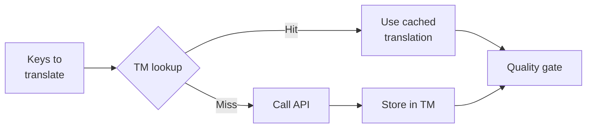

# 翻译记忆库

翻译记忆库（TM）是 champollion 的内置缓存层。它按源文本 + 语言 + 方法为键存储每个翻译，因此重新运行 `sync` 仅对真正改变的键调用 API。

## TM 存在的原因

没有 TM，每次 `sync` 都会重新翻译每个修改的键——即使你在之前的运行中已经为同一语言翻译过完全相同的英文文本。以下是浪费成本的常见场景：

| 场景 | 无 TM | 有 TM |
|----------|-----------|---------|
| 修改 1 个键后重新运行同步（500 个键 × 10 种语言） | 5,000 次 API 调用 | 10 次 API 调用 |
| 将键恢复为之前的英文值 | 完整 API 调用 | 即时缓存命中 |
| 同一短语出现在 3 个语言文件中 | 3 × API 调用 | 1 次 API 调用 + 2 次缓存命中 |
| 试运行 → 真实同步 | 两次都是完整 API 调用 | 第一次运行缓存，第二次重用 |

TM **默认启用**，无需配置。翻译在每次 `sync` 期间自动缓存，并在后续运行中提供。

## 工作原理

### 缓存键

每个 TM 条目由三个值的 SHA-256 哈希作为键：

```
SHA-256( sourceValue + '\x00' + locale + '\x00' + method )
```

| 组件 | 为什么在键中 |
|----------|-------------------|
| `sourceValue` | 不同的英文文本 → 不同的翻译 |
| `locale` | "Hello" 翻译成法语和日语的结果不同 |
| `method` | Google Translate 输出 ≠ GPT-4o 输出 |

空字节分隔符（`\x00`）防止 `"ab" + "c"` 和 `"a" + "bc"` 之间的碰撞。

### 同步期间



1. 在调用翻译 API 之前，champollion 将键分为 **TM 命中**和 **TM 未命中**
2. 命中的键从缓存中立即提供——无 API 调用、无延迟、无成本
3. 未命中的键通过正常翻译管道
4. 来自 API 的新翻译存储在 TM 中供将来运行使用
5. 所有翻译（缓存的 + 新的）通过质量门控

### 存储

TM 存储在项目根目录的 `.champollion/tm.json` 中。该文件使用紧凑 JSON（无美化打印）以保持大小可控。每个条目存储：

| 字段 | 描述 |
|-------|-------------|
| `t` | 翻译后的文本 |
| `ts` | 缓存时的 ISO-8601 时间戳 |
| `l` | 目标语言代码（用于统计/筛选） |
| `m` | 翻译方法名称（用于统计/筛选） |

在 50 种语言 × 500 个键 = 25,000 个条目的情况下，文件应该约为 2-3 MB。

## 管理缓存

### 查看统计信息

```bash
champollion tm stats
```

显示条目数、文件大小和按语言的细分：

```
  Translation Memory — .champollion/tm.json

  Entries:      2,847
  File size:    1.2 MB
  Created:      2026-05-20
  Last entry:   2026-05-24

  By locale:
    fr       482 entries  (llm: 380, llm-coached: 102)
    de       471 entries  (llm: 471)
    ja       465 entries  (llm: 465)
```

### 清除缓存

```bash
# Clear everything (with confirmation prompt)
champollion tm clear

# Clear without prompt (CI environments)
champollion tm clear --yes

# Clear only one locale
champollion tm clear --locale fr
```

### 跳过一次运行的 TM

```bash
# Force fresh API calls for all keys (useful when switching providers)
champollion sync --no-tm
```

这不会删除缓存——它只是在此运行中忽略它，也不存储新结果。

## TM 无法帮助的情况

在以下情况下 TM 不会产生缓存命中：

- **源文本改变**——哈希改变，所以是未命中
- **方法改变**——从 `llm` 切换到 `google-translate` 意味着不同的缓存键
- **首次运行**——冷启动，还没有条目
- **`--no-tm` 标志**——显式绕过缓存

## 应该提交 `.champollion/tm.json` 吗？

**通常不应该。** TM 是本地开发者优化。它在同步期间自动填充，仅在同一台机器上重新运行同步时有帮助。但在以下情况下你可能考虑提交它：

- 你的团队共享一个执行翻译同步的 CI 运行器
- 你想要无需 API 调用的可重现构建
- 你正在存档翻译以满足合规要求

对于典型用法，将 `.champollion/tm.json` 添加到 `.gitignore`。

---

## 另见

- [同步工作原理](/docs/concepts/how-sync-works) — TM 在管道中的位置
- [CLI 参考 — tm](/docs/reference/cli#tm) — 命令参考
- [CLI 参考 — sync --no-tm](/docs/reference/cli#sync) — 绕过 TM
