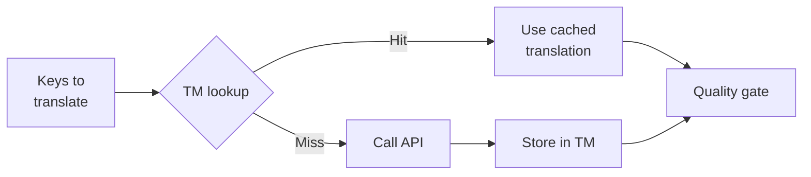

# 翻译记忆库

翻译记忆库（TM）是 champollion 的内置缓存层。它按源文本 + 语言 + 方法为键存储每个翻译，因此重新运行 `sync` 仅对真正改变的键调用 API。

## TM 存在的原因

没有 TM，每次 `sync` 都会重新翻译每个修改的键——即使你在之前的运行中已经为同一语言翻译过完全相同的英文文本。以下是浪费成本的常见场景：

| 场景 | 无 TM | 有 TM |
|----------|-----------|---------|
| 修改 1 个键后重新运行同步（500 个键 × 10 种语言） | 5,000 次 API 调用 | 10 次 API 调用 |
| 将键恢复为之前的英文值 | 完整 API 调用 | 即时缓存命中 |
| 同一短语出现在 3 个语言文件中 | 3 × API 调用 | 1 次 API 调用 + 2 次缓存命中 |
| 试运行 → 真实同步 | 两次都是完整 API 调用 | 第一次运行缓存，第二次重用 |

TM **默认启用**，无需配置。翻译在每次 `sync` 期间自动缓存，并在后续运行中提供。

## 运作方式

### 缓存键

每个 TM 条目由三个值的 SHA-256 哈希作为键：

```
SHA-256( sourceValue + '\x00' + locale + '\x00' + method )
```

| 组件 | 为什么在键中 |
|----------|-------------------|
| `sourceValue` | 不同的英文文本 → 不同的翻译 |
| `locale` | "Hello" 翻译成法语和日语的结果不同 |
| `method` | Google Translate 输出 ≠ GPT-4o 输出 |

空字节分隔符（`\x00`）防止 `"ab" + "c"` 和 `"a" + "bc"` 之间的碰撞。

`sourceValue` 是键翻译所依据的源文本，并融入了用于区分两个相同文本的其他所有信息：

- **gettext 上下文。** 带有 `msgctxt` 的条目会与其上下文一起缓存：动词的“Open”和形容词的“Open”是两个不同的条目。
- **源语言中不存在的复数形式。** i18next 将复数存储为带后缀的键，而目标语言可能会具有源语言所欠缺的形式：法语和西班牙语增加了 `count_many`，这是从英语的 `count_other` 文本翻译而来的。这两个键发送相同的文本，但要求模型提供不同的形式（`"2 recettes"` 和 `"1 000 000 de recettes"`），因此各自拥有独立的条目：`count_other` 保留普通形式，而 `count_many` 则缓存在文本及其形式之下。对于从其他类别的文本翻译出的所有形式同样如此（阿拉伯语 `_zero`、`_two`、`_few`、`_many`；俄语 `_few`、`_many`；序数词形式）。
- **gettext `msgid_plural` 以及 ARB / ICU 复数** 每个键对应一条消息（所有形式都在一个值内），因此与之前一样，它们属于单个条目。

在 0.4.0 之前，借用的形式会与其翻译来源形式共享同一个条目，并且该条目保存最后存储的答案，因此 `--redo all` 可能会将一种形式同时写入两个键。彼时的旧缓存会在使用时自动修复。当共享条目保存的是借用形式的文本时，它会移至该形式自己的条目中，而另一种形式将在下次加入队列时重新翻译。否则，该条目保留给其借用的形式，而借用的形式则在其首次加入队列时发送给模型一次（运行日志中会对此进行说明）。当借用形式保存的文本与其借用的形式完全一致，且缓存未显示模型是以这种方式生成时，`champollion verify` 会发出警告。某些语言确实会将两种形式写得完全相同，因此这只是一个警告；`--redo keys:<key>` 会重新请求。

### 同步期间


```mermaid
flowchart LR
    A["Keys to\ntranslate"] --> B{"TM lookup"}
    B -->|Hit| C["Use cached\ntranslation"]
    B -->|Miss| D["Call API"]
    D --> E["Store in TM"]
    C --> F["Quality gate"]
    E --> F
```

1. 在调用翻译 API 之前，champollion 将键分为 **TM 命中**和 **TM 未命中**
2. 命中的键从缓存中立即提供——无 API 调用、无延迟、无成本
3. 未命中的键通过正常翻译管道
4. 来自 API 的新翻译存储在 TM 中供将来运行使用
5. 所有翻译（缓存的 + 新的）通过质量门控

### 存储

TM 存储在项目根目录的 `.champollion/tm.json` 中。该文件使用紧凑 JSON（无美化打印）以保持大小可控。每个条目存储：

| 字段 | 描述 |
|-------|-------------|
| `t` | 翻译后的文本 |
| `ts` | 缓存时的 ISO-8601 时间戳 |
| `l` | 目标语言代码（用于统计/筛选） |
| `m` | 翻译方法名称（用于统计/筛选） |

在 50 种语言 × 500 个键 = 25,000 个条目的情况下，文件应该约为 2-3 MB。

## 管理缓存

### 查看统计信息

```bash
champollion tm stats
```

显示条目数、文件大小和按语言的细分：

```
  Translation Memory — .champollion/tm.json

  Entries:      2,847
  File size:    1.2 MB
  Created:      2026-05-20 09:14 MDT
  Last entry:   2026-05-24 17:52 MDT

  By locale:
    fr       482 entries
               380  llm · model google/gemini-3.8-flash · register formal-vous
               102  llm-coached · model google/gemini-3.8-flash · register formal-vous · coaching 3f2a9c1b
    de       471 entries
               471  llm · model google/gemini-3.8-flash · register formal-Sie
    ja       465 entries
               465  llm · model google/gemini-3.8-flash · register polite
```

日期使用本机本地时间，并指明时区（`--json`
也以 `createdAt` 和 `lastEntryAt` 的形式记录存储的 UTC 时间戳）。
每个语言环境下的每一行都说明了生成这些条目的要素：翻译方法、模型和
语域（以及指导文本的指纹，适用于 prompt 中包含指导文本的所有方法：`llm`、`local`、`openai`、`anthropic`、`gemini`、
`llm-coached`；为此会读取语言对、语言本身或 fallback 的 `coachingFile`，
计算的是其文本内容，而非文件路径）。同一个
语言环境下的两个模型通常意味着发生过模型切换；`champollion status`
会说明语言环境文件本身目前是否混杂了这两种模型的文本。

### 清除缓存

```bash
# Clear everything (with confirmation prompt)
champollion tm clear

# Clear without prompt (CI environments)
champollion tm clear --yes

# Clear only one locale
champollion tm clear --locale fr
```

### 跳过一次运行的 TM

```bash
# Fresh API calls for everything queued (useful when debugging quality)
champollion sync --redo all --fresh     # --fresh = --no-tm
```

这不会删除缓存，本次运行也不会读取它——但本次运行所翻译（并付费）的内容仍会被存储，因此下次运行可以再次利用缓存。

## 切换模型

**如何切换。** 模型是 `champollion.config.json` 中的一项设置：编辑 `"model"`（若方法同时更改，还需编辑 `"defaultMethod"`），或编辑 `"pairs"` 中特定语言对专属的 `"model"`。下一次 `champollion sync` 即可生效。

`sync --model <name>`（以及 `--method <name>`）指定模型**仅用于单次运行**：配置文件不会被修改，sync 会对此予以提示，下一次常规的 `sync` 将重新使用配置好的模型。该次运行所翻译的内容会保留在文件中。随后的常规 sync 会指出哪些翻译是由另一个模型生成的，并给出两种解决方案：将该模型设为配置模型以保留它们（将 `"model"` 设置为该模型——不会发送任何请求），或者让配置的模型重新翻译它们（打印出的 redo 命令及其费用）。`champollion status` 的说明与之相同。切换模型无需再次运行 `champollion init`；`init --force` 仅会重写其标志所指定的项，并保留所有其他设置（[CLI 参考](/docs/reference/cli#init)）。

更改模型并不会丢弃您的缓存。当某个字符串在新模型下没有条目时，只要翻译方法、语域和指导文本未变，sync 就会复用在先前模型下生成的翻译。被复用的条目会像其他任何缓存命中一样接受相同的质量检查。在费用估算之前，sync 会说明将复用多少条翻译以及是由哪个模型生成的——在 dry run（空运行）中同样如此，切换完成之后亦然：如果一个字符串恢复为仅有早期模型翻译过的文本，则会提供该模型的翻译，运行日志也会在估算前说明这一点。

若要改由新模型来翻译它们（将发送早期模型已翻译过的键；新模型已经翻译过的部分仍从缓存获取）：

```bash
champollion sync --redo all --fresh-on-model-change
```

单独使用时，`--fresh-on-model-change` 只会影响本次运行本就会翻译的键（新增或更改的键）。在完全重新翻译之后，sync 便不再提示该语言发生了模型更改。新模型回答失败的键会在 `.champollion.lock` 中记录为 **pending**（待处理）：下一次 `champollion sync` 会再次向新模型请求这些键（而不是从缓存获取），当它们全部完成后，切换即告完成。`champollion status` 会列出待处理的键，并在文件中包含早期模型的文本时（与当前模型的文本混杂，或全部为旧模型文本）进行提示（[质量门禁](/docs/concepts/quality-gate#a-redo-that-could-not-finish)）。
它知道每个值是由哪个模型生成的，因为 sync 会将其记录在 `.champollion.lock` 中（提供回答的模型，或是提供缓存翻译的模型）。对于在 0.4.0 之前写入的值，它会回退检查缓存，并在两个模型缓存了相同文本时提示“model unknown”（未知模型）。在没有任何内容需要翻译的情况下，常规 `champollion sync` 会为每种语言输出一行信息，提示文件是否由非配置模型生成，并附带上述命令。
批量重做（bulk redo）绝不会覆盖人工在文件中编辑过的翻译（[编辑翻译](/docs/guides/professional-translators#editing-key-value-files)）。

更改方法、语域或指导文本仍会生成全新的翻译，因为这些更改本身就是为了获得不同的文本。尽管缓存中保存着用另一种方式翻译的同一文本，当键依然被发送给模型时（例如在 `local` → `llm` 切换之后），sync 会为每种语言提示一次，并指明当时是由何种配置生成的——这也解释了为何本次运行显示没有任何内容取自缓存。

仅仅更改方法、语域或指导文本本身不会重新翻译任何内容：在没有任何新内容需要翻译时，常规 sync（或 dry run）会保持现有文件不变。它会针对每种语言进行说明：有多少个值是由另一种方法生成的、用于替换它们的重做命令（`champollion sync --pair en:fr --redo all`），以及该操作所需的费用。

## TM 无法帮助的情况

在以下情况下 TM 不会产生缓存命中：

- **源文本已更改** — 哈希值改变，导致未命中
- **方法已更改** — 从 `llm` 切换到 `google-translate` 意味着缓存键不同
- **语域或指导文本已更改** — 缓存键包含它们（仅模型更改会被复用；见上文）。语言对的 fallback 拥有自己的键（方法、模型、语域、指导文本）：更改后，`sync` 和 `status` 会列出其早期配置写入的值以及重做命令（`--redo all`；仅更改模型时使用 `--fresh-on-model-change`）。在 0.4.0 之前写入的缓存仅针对 `llm-coached` 对指导文本进行建键；首次运行时，将保留当时语言对所具备的指导文本所生成的条目
- **不属于键的一部分：** 术语表，以及 `llm-coached` 的语法规则和风格说明 — 编辑它们不会重新翻译已缓存的内容（`--redo keys:… --fresh` 会重新请求）
- **`--retranslate <glob>`** — 指定的内容文件会被有意重新全新翻译
- **首次运行** — 冷启动，尚无条目
- **`--no-tm` / `--fresh`** — 显式绕过缓存
- **待处理的键（pending key）** — redo 未能完成的键会重新向模型请求，而不是从缓存提供

缓存绝不会决定某个键是否*进入队列*：如果一个键未发生更改且其翻译已存在于文件中，则在执行任何查找之前就会被跳过（它不会计入缓存命中）。而且，被质量门禁拒绝的模型生成的键，在常规 sync 中不会再次发送给该模型——否则会为相同的结果再次计费（[被搁置](/docs/concepts/quality-gate#refused-keys-are-held-back)）；但仍会为其读取缓存。

## 应该提交 `.champollion/tm.json` 吗？

**通常不应该。** TM 是本地开发者优化。它在同步期间自动填充，仅在同一台机器上重新运行同步时有帮助。但在以下情况下你可能考虑提交它：

- 你的团队共享一个执行翻译同步的 CI 运行器
- 你想要无需 API 调用的可重现构建
- 你正在存档翻译以满足合规要求

对于典型用法，将 `.champollion/tm.json` 添加到 `.gitignore`。

---

## 另请参阅

- [同步工作原理](/docs/concepts/how-sync-works) — TM 在管道中的位置
- [CLI 参考 — tm](/docs/reference/cli#tm) — 命令参考
- [CLI 参考 — sync --no-tm](/docs/reference/cli#sync) — 绕过 TM
