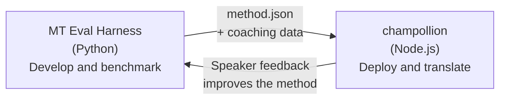

# Eval Harness Bridge

champollion 和 MT Eval Harness 是两个独立的工具，共同构成一个生态系统。Harness 是翻译方法被**验证**的地方。Champollion 是经过验证的方法被**部署**的地方。它们通过共享的插件格式连接。



## 流程：研究 → 生产

### 1. 在 Harness 中构建方法

任何实现 `async translate(entries, config) → [{id, predicted}]` 的 Python 类都可以接入 Harness。Harness 不关心内部发生了什么——提示词驱动的 LLM、自定义训练模型、确定性规则，任何方式都可以。

### 2. 对其进行基准测试

Harness 使用标准化语料库和可重现的指标对你的方法进行评分：chrF++、FST 接受度（用于形态丰富的语言）、形态学准确性和语义评分。

### 3. 导出为插件

当你的方法达到可接受的质量时，将其打包为 champollion 插件——一个 `method.json` 清单，可选包含教练数据。

:::info[计划推出导出 CLI]
目前，你需要手动创建 method.json 清单文件。`mt-eval export` 命令将自动化此过程。详见 [方法接口](/docs/network/specifications/methods) 了解完整的插件格式。
:::

### 4. 在 champollion 中安装

```bash
champollion plugin install ./my-method-plugin/
```

### 5. 翻译真实内容

```bash
champollion sync
```

你的基准测试方法现在正在生产环境中生成真实翻译。

## 流程：生产 → 研究

已部署的翻译由双语使用者审查。他们的反馈识别系统性错误（错误的时态模式、缺失的词汇、不自然的措辞）。研究人员在 Harness 中更新方法、重新基准测试、重新导出并重新部署。系统从使用中学习。

## 插件格式

`method.json` 清单是两个工具之间的契约：

```json
{
  "name": "crk-coached-v3",
  "type": "llm-coached",
  "version": "3.0.0",
  "description": "Coached LLM translation for Plains Cree",
  "locales": ["crk"],
  "config": {
    "model": "google/gemini-3.5-flash",
    "temperature": 0.3
  },
  "benchmarks": {
    "crk": {
      "composite_score": 0.67,
      "fst_acceptance": 0.82,
      "corpus_size": 150
    }
  }
}
```

参见[插件规范](/docs/reference/plugin-spec)了解完整格式。

## 已构建与已规划的内容

| 组件 | 状态 |
|-----------|--------|
| TranslationMethod 协议 | ✅ 已构建 |
| Harness 基准测试运行器 | ✅ 已构建 |
| method.json 插件格式 | ✅ 已构建 |
| `champollion plugin install/remove/list` | ✅ 已构建 |
| 教练数据加载 | ✅ 已构建 |
| `mt-eval export` CLI | 🔲 已规划 |
| 社区审查界面 | 🔲 已规划 |
| 密码学测试集评估 | 🔲 已规划 |

## 进一步阅读

- [翻译方法](/docs/guides/translation-methods) — 所有可用方法及其工作原理
- [插件规范](/docs/reference/plugin-spec) — method.json 格式
- [通过 API 提供方法](/docs/guides/serving-a-method) — 在服务端托管方法
- [数据主权](/docs/network/sovereignty/data-sovereignty) — 原住民数据主权原则、CARE 及密码学保护
- [面向 MT 研究人员](/docs/network/leaderboard/rules) — eval harness 文档
