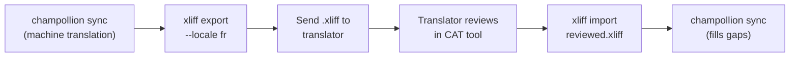

# 与专业翻译人员合作

Champollion 生成机器翻译，但某些项目需要人工审核——监管内容、品牌敏感文案或高风险 UI。XLIFF 工作流让你导出翻译供专业审核，然后无缝导入回来。

## 什么是 XLIFF？

XLIFF（XML 本地化交换文件格式）是翻译工具的行业标准交换格式。每个专业 CAT（计算机辅助翻译）工具都支持它：

- **memoQ** — 导入 XLIFF、上下文审核、导出审核文件
- **SDL Trados Studio** — 原生 XLIFF 支持
- **Phrase (Memsource)** — 上传 XLIFF 任务供翻译团队处理
- **Smartling** — XLIFF 摄取管道
- **OmegaT** — 免费/开源 CAT 工具，支持 XLIFF

Champollion 生成 XLIFF 1.2（通用支持版本）而非 2.0+ 以获得最大工具兼容性。

## 工作流



### 第 1 步：生成机器翻译

首先运行 `sync` 获取基线机器翻译：

```bash
champollion sync
```

### 第 2 步：导出 XLIFF

将源语言和目标语言对导出为 XLIFF：

```bash
champollion xliff export --locale fr
```

这会写入 `.champollion/xliff/fr.xliff`，包含：
- 每个源键及其英文值
- 当前机器翻译（如果有）作为 `<target>`
- 没有翻译的键标记为 `state="new"`

```xml
<trans-unit id="hero.title" xml:space="preserve">
  <source>Welcome to our platform</source>
  <target state="translated">Bienvenue sur notre plateforme</target>
</trans-unit>
```

### 第 3 步：发送给翻译人员

将 `.xliff` 文件发送给翻译人员或上传到 CAT 平台。翻译人员可以并排查看源语言和目标语言，并可以：

- 编辑机器翻译
- 填写缺失的翻译
- 标记质量问题
- 应用自己的翻译记忆库和术语库

### 第 4 步：导入审核文件

当翻译人员返回审核后的 `.xliff` 时，导入它：

```bash
# Preview what will change
champollion xliff import .champollion/xliff/fr.xliff --dry

# Apply changes
champollion xliff import .champollion/xliff/fr.xliff
```

输出：
```
  ✓ Imported 142 translations for fr
    Updated:    23 (changed from existing)
    Added:      0 (new keys)
    Unchanged:  119
    Written to: locales/fr.json
```

### 第 5 步：填补空白

如果在导出 XLIFF 后添加了新键，运行 `sync` 翻译它们：

```bash
champollion sync
```

Champollion 仅翻译仍然缺失的键——来自 XLIFF 导入的审核翻译会被保留。

## 提示

### 导出自定义路径

```bash
# Export to a specific directory
champollion xliff export --locale ja --out ./for-review/

# Export with a specific filename
champollion xliff export --locale de --out ./review/german.xliff
```

### 多个语言区域

分别导出每个语言区域：

```bash
for locale in fr de ja ko; do
  champollion xliff export --locale $locale
done
```

### 版本控制

将 `.champollion/xliff/` 添加到 `.gitignore`——XLIFF 文件是临时工件，不是项目源代码：

```gitignore
.champollion/xliff/
```

### 何时使用 XLIFF vs. 仅 `sync`

| 场景 | 建议 |
|----------|---------------|
| 内部应用，90%+ 质量可接受 | 仅 `sync`——机器翻译就足够了 |
| 面向用户的营销文案 | 导出 XLIFF 供人工审核 |
| 法律/监管内容 | 导出 XLIFF——需要人工审核 |
| 50+ 个语言区域，时间紧张 | `sync` 首先，仅前 5 个语言区域导出 XLIFF |
| 翻译人员已使用 CAT 工具 | XLIFF 是自然的交接格式 |

---

## 另见

- [CLI 参考 — xliff](/docs/reference/cli#xliff) — 命令参考
- [翻译记忆库](/docs/concepts/translation-memory) — 缓存审核翻译
- [翻译方法](/docs/guides/translation-methods) — 机器翻译选项
