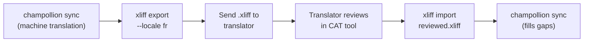

# 与专业翻译人员合作

Champollion 生成机器翻译，但某些项目需要人工审核——监管内容、品牌敏感文案或高风险 UI。XLIFF 工作流让你导出翻译供专业审核，然后无缝导入回来。

XLIFF 适用于您应用的**字符串文件**（键和值）。已翻译的 **Markdown**（简报、博客文章、文档页面）的审校方式则不同：审校人员直接编辑已翻译的 `.md` 文件，而同步过程会保留这些修改。请参阅下文的[审校已翻译的 Markdown](#reviewing-translated-markdown)。

## 什么是 XLIFF？

XLIFF（XML 本地化交换文件格式）是翻译工具的行业标准交换格式。每个专业 CAT（计算机辅助翻译）工具都支持它：

- **memoQ** — 导入 XLIFF、上下文审核、导出审核文件
- **SDL Trados Studio** — 原生 XLIFF 支持
- **Phrase (Memsource)** — 上传 XLIFF 任务供翻译团队处理
- **Smartling** — XLIFF 摄取管道
- **OmegaT** — 免费/开源 CAT 工具，支持 XLIFF

Champollion 生成 XLIFF 1.2（通用支持版本）而非 2.0+ 以获得最大工具兼容性。

## 工作流


```mermaid
flowchart LR
    A["champollion sync\n(machine translation)"] --> B["xliff export\n--locale fr"]
    B --> C["Send .xliff to\ntranslator"]
    C --> D["Translator reviews\nin CAT tool"]
    D --> E["xliff import\nreviewed.xliff"]
    E --> F["champollion sync\n(fills gaps)"]
```

### 第 1 步：生成机器翻译

首先运行 `sync` 获取基线机器翻译：

```bash
champollion sync
```

### 第 2 步：导出 XLIFF

将源语言和目标语言对导出为 XLIFF：

```bash
champollion xliff export --locale fr
```

这会写入 `.champollion/xliff/fr.xliff`，包含：
- 每个源键及其英文值
- 当前机器翻译（如果有）作为 `<target>`
- 没有翻译的键标记为 `state="new"`

```xml
<trans-unit id="hero.title" xml:space="preserve">
  <source>Welcome to our platform</source>
  <target state="translated">Bienvenue sur notre plateforme</target>
</trans-unit>
```

### 第 3 步：发送给翻译人员

将 `.xliff` 文件发送给翻译人员或上传到 CAT 平台。翻译人员可以并排查看源语言和目标语言，并可以：

- 编辑机器翻译
- 填写缺失的翻译
- 标记质量问题
- 应用自己的翻译记忆库和术语库

### 第 4 步：导入审核文件

当翻译人员返回审核后的 `.xliff` 时，导入它：

```bash
# Preview what will change
champollion xliff import .champollion/xliff/fr.xliff --dry

# Apply changes
champollion xliff import .champollion/xliff/fr.xliff
```

输出：
```
  ✓ Imported 142 translations for fr
    Updated:    23 (changed from existing)
    Added:      0 (new keys)
    Unchanged:  119
    Written to: locales/fr.json
```

### 第 5 步：填补空白

如果在导出 XLIFF 后添加了新键，运行 `sync` 翻译它们：

```bash
champollion sync
```

Champollion 仅翻译仍然缺失的键——来自 XLIFF 导入的审核翻译会被保留。

## 提示

### 导出自定义路径

```bash
# Export to a specific directory
champollion xliff export --locale ja --out ./for-review/

# Export with a specific filename
champollion xliff export --locale de --out ./review/german.xliff
```

### 多个语言区域

分别导出每个语言区域：

```bash
for locale in fr de ja ko; do
  champollion xliff export --locale $locale
done
```

### 版本控制

将 `.champollion/xliff/` 添加到 `.gitignore`——XLIFF 文件是临时工件，不是项目源代码：

```gitignore
.champollion/xliff/
```

### 何时使用 XLIFF vs. 仅 `sync`

| 场景 | 建议 |
|----------|---------------|
| 内部应用，90%+ 质量可接受 | 仅 `sync`——机器翻译就足够了 |
| 面向用户的营销文案 | 导出 XLIFF 供人工审核 |
| 法律/监管内容 | 导出 XLIFF——需要人工审核 |
| 50+ 个语言区域，时间紧张 | `sync` 首先，仅前 5 个语言区域导出 XLIFF |
| 翻译人员已使用 CAT 工具 | XLIFF 是自然的交接格式 |

## 在语言文件中编辑翻译 {#editing-key-value-files}

审校人员也可以直接在语言文件（`messages/fr.json`、`locale/fr/LC_MESSAGES/django.po`、`app_fr.arb`……）中修改翻译并提交。Champollion 会在 `.champollion.lock` 中记录它所写入的每个值的指纹。不再匹配的值即视为由人工修改，同步时会将其视作人工翻译处理：

| 执行的操作 | 对已编辑值的处理方式 |
|-----------|----------------------------------|
| 常规 `sync`，英文未变更 | 保持不变（与之前一致）。 |
| `sync --redo all` / `--force`、切换模型（`--redo all --fresh-on-model-change`），或重试重做时挂起的键 | **保留。**运行日志会说明保留了多少个键、分别是哪些键，以及如何替换其中某个键：`--redo keys:<key>`。 |
| 指定该键的 `sync --redo keys:<key>` | 替换——因为您显式指定了该键。系统会先输出之前编辑的译文。 |
| 该键的**英文源文本发生变更** | 重新翻译（之前的编辑是针对旧文本的）。系统会输出编辑过的译文以便重新应用，并将其追加到项目根目录下的 `.champollion-replaced-edits.jsonl` 中。 |

`.champollion-replaced-edits.jsonl` 是与 lock 文件位于同一目录下的受版本控制的文件（`.champollion/` 缓存文件夹为每台机器独立生成并已被 git 忽略）：每行一个 JSON，记录一次被替换的人工编辑，包含语言区域、文件、键、编辑过的译文、被替换的原因以及新的源文本。请将其与 lock 文件一同提交——这是该编辑译文的唯一副本。`champollion status` 会显示其中包含的条目数。

在此记录机制存在之前写入的值，或由其他工具写入的值，没有指纹。仅当翻译缓存中该键的文本与之一致时，此类值才会被视为由 Champollion 写入；否则将视作人工翻译，并在批量重做时予以保留（运行日志会将其列为没有写入记录的值）。通过 `champollion xliff import` 导入的值属于人工成果，会以相同方式保留。

## 审校已翻译的 Markdown {#reviewing-translated-markdown}

来自 `contentDir` 的内容文件（例如 `newsletters/2026-10.md` → `newsletters/2026-10.crk.md`）不支持导出 XLIFF。审校人员直接在已翻译的文件本身中进行修改：

1. 运行 `champollion sync` 并将翻译结果与 `.champollion-content.lock` 一起提交。
2. 审校人员编辑已翻译的文件（无论是某个段落还是已翻译的 front-matter 字段，例如 `title`），然后提交更改。
3. 在后续同步中，这些编辑将被保留。如果英文源文本中的其他段落发生变更，审校人员修改过的段落将逐字保留，仅翻译发生变更的段落。运行日志会输出 `kept the edits made by hand to …`。

存在两种例外情况，同步时都会对此发出警告。如果审校人员修正过的英文段落本身也发生了变更，则该段落会被重新翻译，并输出审校人员之前的译文以便重新应用。如果审校人员添加或删除了段落，而随后源文件又发生了变更，则该文件将保持原样，并在每次同步时列出，直到有人手动更新它。

如需放弃这些编辑并恢复为机器翻译，请指定文件名：`champollion sync --redo files:2026-10.md`。完整规则请参见[内容翻译](/docs/guides/content-translation#reviewing-and-editing-translations)。

---

## 另请参阅

- [CLI 参考 — xliff](/docs/reference/cli#xliff) — 命令参考
- [翻译记忆库](/docs/concepts/translation-memory) — 缓存已审校的翻译
- [翻译方法](/docs/guides/translation-methods) — 机器翻译选项
- [内容翻译](/docs/guides/content-translation) — 翻译 Markdown 以及如何保留审校人员的编辑
- [质量门禁](/docs/concepts/quality-gate#refused-keys-are-held-back) — 被门禁拒绝的键以及重做时挂起的键
