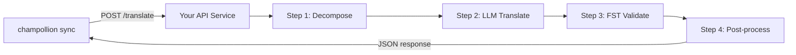

# 将自定义方法作为 API 提供

champollion 的 **`api` 方法** 让你可以将任何翻译对指向外部 HTTP 端点。这是集成过于复杂而无法用单个 LLM 提示处理的管道的方式 — 形态分析器、有限状态转换器 (FST)、多步 LLM 链，或任何你构建的自定义研究方法。

有两种方法可以建立这样的端点：

1. **`champollion serve`** — 通过一条命令，将现有 champollion 项目配置的技术栈（方法、语体、辅导、翻译记忆库、质量门禁）作为服务提供，并遵循此契约。无需编写服务器代码。请参阅[零代码路径](#the-zero-code-path-champollion-serve)。
2. **自定义服务** — 编写你自己的 HTTP 服务器来实现该契约，适用于完全独立于 champollion 之外的流水线。

## 为什么需要 API 服务？

某些翻译管道无法在简单的请求-响应循环内运行：

| 管道步骤 | 示例 |
|---|---|
| **形态分解** | 在翻译前将多综合词分解为语素 |
| **FST 验证** | 拒绝违反音韵或形态规则的输出 |
| **多步 LLM 链** | 使用不同模型进行生成 → 验证 → 纠正循环 |
| **字典查询** | 在管道中间交叉引用精选双语词典 |
| **人工参与** | 将不确定的翻译排队供专家审查 |

`api` 方法将你的管道视为黑盒 — champollion 发送源字符串，你的服务返回翻译。内部发生的一切完全由你决定。

## 架构



## 零代码路径：`champollion serve`

如果你的流水线已经是一个 champollion 项目——包含已配置的方法（LLM、辅导或引擎）、语体、辅导文件、翻译记忆库以及确定性质量门禁——你完全不需要编写服务器。`champollion serve` 会严格按照下文描述的契约，将**你自己配置的技术栈**作为服务运行：

```bash
# Owner side — run from the project whose champollion.config.json defines the stack
CHAMPOLLION_SERVE_TOKEN=$(openssl rand -hex 24) npx champollion serve
# [OK] champollion serve listening on http://127.0.0.1:1822/translate
```

每个请求都会经过与 `champollion sync` 使用的相同的流水线：

- **翻译记忆库** — TM 中已有的字符串会免费从缓存中提供，而不会触及你的上游提供商。经过门禁验证的 API 结果会被缓存，供下一次请求使用。
- **质量门禁** — 每个响应都会经过确定性验证（重复、长度比、书写系统合规性、源文本回显）。失败的结果会作为结构化的按键错误（HTTP 207/422）返回——绝不会是静默降级的输出。
- **成本守卫** — 在进行任何提供商调用之前，如果请求的*预估*上游成本超过了你的上限，`--max-cost-per-request` 和 `--max-session-cost` 会拒绝该请求。定价未知的方法在有上限的情况下也会被拒绝：未知并不等于免费。被 TM 覆盖的请求已知成本为 $0，始终会通过。

服务器默认绑定到 `127.0.0.1`：任何能访问该端口的人都可以消耗你的上游 API 预算，因此暴露它必须是一个明确的决定——需要 `--bind 0.0.0.0` 加上一个强 bearer token。`--no-auth` 仅在与环回地址绑定（loopback bind）一起使用时才被接受。默认开启单 IP 速率限制和请求大小上限；请参阅 `champollion serve --help`。

### 将消费者指向该服务

生成消费者安装的插件清单（两端各执行一条命令）：

```bash
# Owner side
champollion serve --emit-manifest --endpoint https://translate.example.org
# [OK] Wrote ./my-project-serve/method.json
```

```bash
# Consumer side
champollion plugin install ./my-project-serve
```

```json title="champollion.config.json (consumer)"
{
  "pairs": {
    "en:crk": { "methodPlugin": "my-project-serve" }
  }
}
```

```bash
CHAMPOLLION_API_KEY=<the server's bearer token> champollion sync
```

消费者的 `api` 方法将源字符串 POST 到你的服务器；你的技术栈进行翻译、门禁验证和缓存；清单的 `qualityTier` 是你配置的语言对的如实透传（当它们不同时，取最保守的层级）。你的提示词、辅导数据和提供商密钥永远不会离开你的机器。

本指南的其余部分涵盖了编写**自定义**服务的内容——当你的流水线不是 champollion 项目（例如 Python FST 链、定制的研究系统）时，这非常有用。无论哪种方式，网络传输契约都是相同的。

## 设置你的服务

你的 API 服务必须实现一个接受并返回 JSON 的单个端点：

### 请求格式

champollion 发送以下确切的 JSON 请求体（参见 [api.js](https://github.com/gamedaysuits/Champollion/blob/main/cli/lib/methods/api.js)）：

```json
POST /translate
Content-Type: application/json
Authorization: Bearer <CHAMPOLLION_API_KEY>

{
  "source_locale": "en",
  "target_locale": "crk",
  "method": "crk-coached-v1",
  "keys": {
    "greeting": "Hello, welcome to our app",
    "farewell": "Goodbye and thanks"
  }
}
```

| 字段 | 类型 | 描述 |
|-------|------|-------------|
| `source_locale` | string | BCP 47 源语言代码 |
| `target_locale` | string | BCP 47 目标语言代码 |
| `method` | string | 插件名称或 `"default"` |
| `keys` | object | 要翻译的键 → 源字符串映射 |
```

### Response Format

Your service must return a `translations` object. An optional `meta` object can include cost and diagnostic info:

```json
{
  "translations": {
    "greeting": "tânisi, pê-kîwêw ôta",
    "farewell": "ekosi mâka, kinanâskomitin"
  },
  "meta": {
    "model": "my-custom-pipeline/v1",
    "cost_usd": 0.0042,
    "method": "decompose-translate-validate"
  }
}
```

| Field | Type | Required | Description |
|-------|------|----------|-------------|
| `translations` | object | ✅ | Map of key → translated string |
| `meta` | object | — | Optional metadata |
| `meta.cost_usd` | number | — | If present, displayed in champollion's output |
| `errors` | object | — | For partial success (HTTP 207): map of key → `{ message }` |

### Minimal Express Server

```javascript
import express from 'express';

const app = express();
app.use(express.json());

/**
 * champollion API 契约：
 *
 * 请求：  { source_locale, target_locale, method, keys: { "key": "source" } }
 * 响应：{ translations: { "key": "translated" }, meta: { ... } }
 */
app.post('/translate', async (req, res) => {
  const { source_locale, target_locale, method, keys } = req.body;

  const translations = {};

  for (const [key, source] of Object.entries(keys)) {
    // --- 你的管道代码放在这里 ---
    // 步骤 1：形态分解
    const morphemes = await decompose(source, source_locale);

    // 步骤 2：带上下文的 LLM 翻译
    const draft = await llmTranslate(morphemes, target_locale);

    // 步骤 3：FST 验证
    const validated = await fstValidate(draft, target_locale);

    // 步骤 4：后处理（正字法规范化等）
    translations[key] = await postProcess(validated);
  }

  res.json({
    translations,
    meta: {
      model: 'my-custom-pipeline/v1',
      method: 'decompose-translate-validate',
    },
  });
});

app.listen(3001, () => {
  console.log('Translation API running on http://localhost:3001');
});
```

## Configuring champollion

Point a translation pair at your running service in `champollion.config.json`:

```json
{
  "inputLocale": "en",
  "pairs": {
    "en:crk": {
      "method": "api",
      "endpoint": "http://localhost:3001/translate",
      "register": "Formal Plains Cree. Use SRO orthography."
    }
  }
}
```

Then run sync as usual:

```bash
npx champollion sync
```

champollion will POST your source strings to the endpoint and write the returned translations to `crk.json`.

## Case Study: Plains Cree Pipeline

:::info[Under Development]
The Plains Cree pipeline described below is **under active development** and is not yet running in production. Details here reflect the current design direction and may change as the project evolves.
:::

The **arena** project demonstrates this pattern. Its Plains Cree pipeline uses:

1. **Morphological decomposition** — Break polysynthetic Cree words into translatable morpheme chains
2. **LLM translation** — Context-enriched GPT-4o translation with coaching data (SRO orthography rules, register instructions)
3. **FST validation** — Finite-state transducer checks that outputs conform to Cree phonological rules
4. **Confidence scoring** — Each translation gets a confidence score based on FST pass rate and dictionary coverage

The entire pipeline runs as a single HTTP endpoint that champollion calls via the `api` method.

### Running Evaluations

After translating, you can evaluate output quality using the harness directly:

```bash
# Clone the harness
git clone https://github.com/gamedaysuits/Champollion.git
cd Champollion/arena
pip install -e .

# 针对真实的、非捆绑的语料库运行评估
mt-eval run --corpus eval-amh-fra-globalvoices-test-v1 --model gemini-pro --yes
```

This produces structured evaluation records with chrF++, BLEU, and exact match scores that can be used as regression baselines.

## Authentication

If your API requires authentication, set the `apiKey` field or use an environment variable:

```json
{
  "pairs": {
    "en:crk": {
      "method": "api",
      "endpoint": "https://my-mt-service.example.com/translate",
      "apiKey": "${CRK_API_KEY}"
    }
  }
}
```

## Data Sovereignty

The `api` method is particularly important for **Indigenous language communities**. By self-hosting the translation pipeline, a community keeps full control over:

- **Proprietary coaching data** — register instructions, orthography rules, and domain glossaries never leave community infrastructure.
- **Linguistic resources** — curated dictionaries, FST grammars, and elder-verified translations remain under community ownership.
- **Access policies** — the community decides who can call the endpoint and under what terms.

This design follows the direction of [Indigenous data-sovereignty principles](/docs/network/community/low-resource-languages#data-sovereignty-principles) — community ownership and control of language data: sensitive language data stays governed by the community rather than a third-party platform.

:::tip
Combine the `api` method with a private deployment (e.g., a community-hosted VM or on-prem server) for the strongest data-sovereignty posture. `champollion serve` gives a community exactly this self-hosting posture without writing any server code — coaching data, provider keys, and the Translation Memory all stay on community infrastructure. See [Support a Low-Resource Language](/docs/network/community/low-resource-languages) for a full walkthrough.
:::

## Cost Estimation

The `api` method returns `null` for cost estimation by default — your service controls pricing. If you want to provide cost transparency, have your API return a `cost` field in the metadata:

```json
{
  "translations": { "...": "..." },
  "metadata": {
    "cost": {
      "estimatedCost": 0.0042,
      "currency": "USD",
      "source": "my-service-pricing"
    }
  }
}
```

## 最佳实践

1. **为失败返回空字符串** — 不要将源字符串作为"翻译"返回。返回 `""`，champollion 的质量门控会捕获它。该键将被跳过并在下次同步时重试。
2. **包含置信度分数** — 如果你的管道可以估计质量，在元数据中返回它。这有助于质量审计。
3. **实现健康检查** — 添加 `GET /health` 端点，以便 champollion 在开始大型同步前验证连接。
4. **优雅地处理速率限制** — 如果你的管道有吞吐量限制，返回 `429` 状态码。champollion 的批处理系统将退避。
5. **记录所有内容** — 多步管道可能会无声地失败。记录每个步骤的输入/输出以便调试。

## 许可证

`api` 方法模式完全开放 — 将你自己的翻译管道包装为 HTTP 服务没有许可限制。`arena` 评估框架采用 AGPL-3.0-or-later 许可（带有 §7 eval-standard-plugin 例外）；你可以在这些条款下研究和构建它。

## 另请参阅

- [翻译方法](/docs/guides/translation-methods) — 所有内置方法（`openai`、`google`、`api` 等）的概述
- [插件规范](/docs/reference/plugin-spec) — `champollion.config.json` 的完整 schema，包括 `api` 方法字段
- [支持低资源语言](/docs/network/community/low-resource-languages) — 针对资源匮乏语言的端到端指南，包括数据主权原则
- [架构](/docs/concepts/architecture) — champollion 的同步循环、批处理和方法分发的工作原理
- [机器翻译评估](/docs/network/leaderboard/rules) — 评估方法、指标以及排行榜提交流程
- [方法排行榜](/leaderboard) — 跨方法和语言对的实时质量排名
