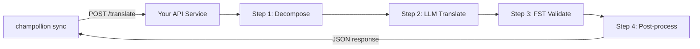

# 将自定义方法作为 API 提供

champollion 的 **`api` 方法** 让你可以将任何翻译对指向外部 HTTP 端点。这是集成过于复杂而无法用单个 LLM 提示处理的管道的方式 — 形态分析器、有限状态转换器 (FST)、多步 LLM 链，或任何你构建的自定义研究方法。

搭建此类端点有两种方式：

1. **`champollion serve`** — 只需一条命令，即可将现有 champollion 项目配置的技术栈（方法、语域、引导词、翻译记忆库、质量门控）通过此协议提供服务。无需编写服务器代码。请参阅[零代码路径](#the-zero-code-path-champollion-serve)。
2. **自定义服务** — 自己编写实现该协议的 HTTP 服务器，适用于完全独立于 champollion 之外运行的流水线。

## 为什么需要 API 服务？

某些翻译管道无法在简单的请求-响应循环内运行：

| 管道步骤 | 示例 |
|---|---|
| **形态分解** | 在翻译前将多综合词分解为语素 |
| **FST 验证** | 拒绝违反音韵或形态规则的输出 |
| **多步 LLM 链** | 使用不同模型进行生成 → 验证 → 纠正循环 |
| **字典查询** | 在管道中间交叉引用精选双语词典 |
| **人工参与** | 将不确定的翻译排队供专家审查 |

`api` 方法将你的管道视为黑盒 — champollion 发送源字符串，你的服务返回翻译。内部发生的一切完全由你决定。

## 架构


```mermaid
graph LR
    A[champollion sync] -->|POST /translate| B[Your API Service]
    B --> C[Step 1: Decompose]
    C --> D[Step 2: LLM Translate]
    D --> E[Step 3: FST Validate]
    E --> F[Step 4: Post-process]
    F -->|JSON response| A
```

## 零代码路径：`champollion serve`

如果您的流水线本身已经是一个 champollion 项目 —— 包含配置好的方法（LLM、带引导词或翻译引擎）、语域、引导词文件、翻译记忆库以及确定性质量门控 —— 您完全无需编写服务器。`champollion serve` 会将**您自己配置的技术栈**直接通过下方详述的协议对外提供服务：

```bash
# Owner side — run from the project whose champollion.config.json defines the stack
CHAMPOLLION_SERVE_TOKEN=$(openssl rand -hex 24) npx champollion serve
# [OK] champollion serve listening on http://127.0.0.1:1822/translate
```

每个请求都会经过 `champollion sync` 所使用的同一流水线：

- **翻译记忆库** — 翻译记忆库（TM）中已有的字符串直接从缓存免费提供，不会调用上游提供商。通过门控验证的 API 结果会被缓存以供下一次请求使用。
- **质量门控** — 每个响应都会经过确定性验证（重复率、长度比、书写系统合规性、原文回显）。失败将以结构化的逐键错误（HTTP 207/422）返回 —— 绝不会以静默降级的输出返回。
- **成本防护** — `--max-cost-per-request` 和 `--max-session-cost` 会在发起任何提供商调用之前，拒绝上游*预估*成本超出上限的请求。定价未知的方法在设有上限时也会被拒绝：未知不等于免费。被 TM 覆盖的请求确定为 $0，始终可以通过。

服务器默认绑定到 `127.0.0.1`：任何能访问该端口的人都可能消耗您的上游 API 预算，因此将其对外暴露必须是一项明确的决定 —— `--bind 0.0.0.0` 加上高强度的 Bearer 令牌。只有在绑定到环回地址时才接受 `--no-auth`。默认启用针对每个 IP 的速率限制和请求大小上限；请参阅 `champollion serve --help`。

### 将使用者指向该端点

生成供使用者安装的插件清单（双方各一条命令）：

```bash
# Owner side
champollion serve --emit-manifest --endpoint https://translate.example.org
# [OK] Wrote ./my-project-serve/method.json
```

```bash
# Consumer side
champollion plugin install ./my-project-serve
```

```json title="champollion.config.json (consumer)"
{
  "pairs": {
    "en:crk": { "methodPlugin": "my-project-serve" }
  }
}
```

```bash
CHAMPOLLION_API_KEY=<the server's bearer token> champollion sync
```

使用者的 `api` 方法向您的服务器发送 POST 请求提交源字符串；您的技术栈负责翻译、门控和缓存；清单中的 `qualityTier` 忠实透传您配置的语言对（若有差异则采用最保守的层级）。您的提示词、引导词数据和提供商密钥永远不会离开您的机器。

本指南的其余部分将介绍如何编写**自定义**服务 —— 当您的流水线不是 champollion 项目（例如 Python FST 处理链、定制的研究系统）时非常有用。无论哪种方式，传输协议完全相同。

## 设置你的服务

你的 API 服务必须实现一个接受并返回 JSON 的单个端点：

### 请求格式

champollion 发送以下确切的 JSON 请求体（参见 [api.js](https://github.com/gamedaysuits/Champollion/blob/main/cli/lib/methods/api.js)）：

```json
POST /translate
Content-Type: application/json
Authorization: Bearer <CHAMPOLLION_API_KEY>

{
  "source_locale": "en",
  "target_locale": "crk",
  "method": "my-project-serve",
  "keys": {
    "greeting": "Hello, welcome to our app",
    "farewell": "Goodbye and thanks"
  }
}
```

| 字段 | 类型 | 说明 |
|------|------|------|
| `source_locale` | string | 源语言的 BCP 47 代码 |
| `target_locale` | string | 目标语言的 BCP 47 代码 |
| `method` | string | 插件名称或 `"default"` |
| `keys` | object | 待翻译的 key → 源字符串映射表 |
| `instructions` | object | 仅当端点声明了 `"acceptsInstructions": true` 时存在：key → 单键备注（消息所需的复数形式、质量门控重试的反馈意见） |
| `text_format` | string | 对于 Markdown 文档文本为 `"markdown"`（见下文）；对于应用字符串则缺省 |

### 响应格式

您的服务必须返回一个 `translations` 对象。可选的 `meta` 对象可包含成本和诊断信息：

```json
{
  "translations": {
    "greeting": "<the greeting, translated>",
    "farewell": "<the farewell, translated>"
  },
  "meta": {
    "model": "my-custom-pipeline/v1",
    "cost_usd": 0.0042,
    "method": "decompose-translate-validate"
  }
}
```

| 字段 | 类型 | 必填 | 说明 |
|------|------|------|------|
| `translations` | object | ✅ | key → 翻译字符串的映射表 |
| `meta` | object | — | 可选的元数据 |
| `meta.cost_usd` | number | — | 若存在，会显示在 champollion 的输出中 |
| `errors` | object | — | 用于部分成功（HTTP 207）：key → `{ message }` 的映射表 |

### 最简 Express 服务器

```javascript
import express from 'express';

const app = express();
app.use(express.json());

/**
 * champollion API contract:
 *
 * Request:  { source_locale, target_locale, method, keys: { "key": "source" } }
 * Response: { translations: { "key": "translated" }, meta: { ... } }
 */
app.post('/translate', async (req, res) => {
  const { source_locale, target_locale, method, keys } = req.body;

  const translations = {};

  for (const [key, source] of Object.entries(keys)) {
    // --- Your pipeline goes here ---
    // Step 1: Morphological decomposition
    const morphemes = await decompose(source, source_locale);

    // Step 2: LLM translation with context
    const draft = await llmTranslate(morphemes, target_locale);

    // Step 3: FST validation
    const validated = await fstValidate(draft, target_locale);

    // Step 4: Post-processing (orthography normalization, etc.)
    translations[key] = await postProcess(validated);
  }

  res.json({
    translations,
    meta: {
      model: 'my-custom-pipeline/v1',
      method: 'decompose-translate-validate',
    },
  });
});

app.listen(3001, () => {
  console.log('Translation API running on http://localhost:3001');
});
```

## 配置 champollion

在 `champollion.config.json` 中将某个翻译语言对指向运行中的服务：

```json
{
  "inputLocale": "en",
  "pairs": {
    "en:crk": {
      "method": "api",
      "endpoint": "http://localhost:3001/translate",
      "register": "Formal Plains Cree. Use SRO orthography."
    }
  }
}
```

然后像往常一样运行同步：

```bash
npx champollion sync
```

champollion 将向该端点 POST 发送您的源字符串，并将返回的翻译写入 `crk.json`。

### 您的端点是否遵循指令？

在语言对上（或在插件 `method.json` 的顶层）通过 `"acceptsInstructions"` 进行声明：

- **`false`** — 训练好的 NMT 模型（例如由 `nmt-forge serve` 提供服务的模型）仅翻译文本，不处理其他内容；询问两次答案相同。当质量门控拒绝其某个答案时，champollion **不会**再次询问（那将是徒劳的调用）；它会按照评判二次回答的方式来评判首次回答（保留原样的专有名词会被接受），并将其余内容发送至该语言对的 `fallback`。
- **`true`** — 端点背后的 LLM 可以使用逐键备注：请求包含 `instructions` 对象，被拒绝的键会附带门控的反馈意见重新发起请求。
- **未设置** — champollion 无法判断。被拒绝的键会在不带反馈的情况下再重试一次，运行提示信息会说明该端点可能会忽略反馈。

```json
{
  "pairs": {
    "en:crk": {
      "method": "api",
      "endpoint": "http://127.0.0.1:8378/translate",
      "acceptsInstructions": false,
      "fallback": { "method": "llm-coached" }
    }
  }
}
```

此处的后备方式是托管模型。若要将所有内容保留在本地机器上，请改用 `"fallback": { "method": "local", "model": "<your local model>" }`（关于如何选择，请参阅[后备方法](/docs/getting-started/configuration#fallback)）。

## 案例研究：平原克里语流水线

:::info[开发中]
下方描述的平原克里语（Plains Cree）流水线**正在积极开发中**，尚未在生产环境中运行。此处的细节反映当前的设计方向，可能会随着项目的推进而变化。
:::

**arena** 项目演示了这种模式。其平原克里语流水线采用了：

1. **词法分解（Morphological decomposition）** — 将多式综合语的克里语单词拆分为可翻译的语素链
2. **LLM 翻译** — 结合引导词数据（SRO 正字法规则、语域说明）的富上下文 GPT-4o 翻译
3. **FST 验证** — 有限状态转换器检查输出是否符合克里语音系规则
4. **置信度评分** — 根据 FST 通过率和词典覆盖率，为每个翻译生成置信度评分

整个流水线作为一个独立的 HTTP 端点运行，champollion 通过 `api` 方法对其进行调用。

### 运行评估

完成翻译后，您可以直接使用评估套件（harness）评估输出质量：

```bash
# Clone the harness
git clone https://github.com/gamedaysuits/Champollion.git
cd Champollion/arena
python3 -m pip install -e .

# Run the evaluation against a real, non-bundled corpus
mt-eval run --corpus eval-amh-fra-globalvoices-test-v1 --model google/gemini-3.1-pro-preview --yes
```

这将生成包含 chrF++、BLEU 和完全匹配（exact match）分数的结构化评估记录，可用作回归测试基准线。

## 身份验证

如果您的 API 需要身份验证，请在语言对上指定保存其令牌的环境变量名称（`"${VAR}"`，从环境或 `.env.local` 中读取），或者设置 `CHAMPOLLION_API_KEY`。Champollion 只会将该令牌发送给端点 —— 绝不会发送其他提供商的密钥。环回端点（`nmt-forge serve`, `champollion serve`）则不需要任何令牌。

```json
{
  "pairs": {
    "en:crk": {
      "method": "api",
      "endpoint": "https://my-mt-service.example.com/translate",
      "apiKey": "${CRK_API_KEY}"
    }
  }
}
```

内容（Markdown 正文）遵循相同的协议：每个块作为一个键（`segment.<N>`，或整页对应 `body`），且请求中包含 `"text_format": "markdown"`，以便服务器区分文档文本与应用字符串。不识别该字段的服务器可以直接忽略它。

## 数据主权

`api` 方法对**原住民语言社区**尤为重要。通过自托管翻译流水线，社区可以完全掌控：

- **专有引导词数据** — 语域说明、正字法规则和领域词汇表永远不会离开社区的基础设施。
- **语言资源** — 精选词典、FST 语法和长者验证的译文始终归社区所有。
- **访问策略** — 由社区决定谁可以调用端点以及在什么条款下调用。

这种设计遵循[原住民数据主权原则](/docs/network/community/low-resource-languages#data-sovereignty-principles)的导向 —— 语言数据的社区所有权与控制权：敏感的语言数据由社区自主管理，而非托付给第三方平台。

:::tip
将 `api` 方法与私有部署（例如社区托管的虚拟机或本地服务器）相结合，可获得最强有力的数据主权保障。`champollion serve` 让社区无需编写任何服务器代码即可实现这种自托管形态 —— 引导词数据、提供商密钥和翻译记忆库全部保留在社区的基础设施中。完整演练请参阅[支持低资源语言](/docs/network/community/low-resource-languages)。
:::

## 成本估计

`api` 方法默认返回 `null` 作为成本估算 —— 由您的服务自行控制定价。如果您希望提供成本透明度，可让您的 API 在元数据中返回 `cost` 字段：

```json
{
  "translations": { "...": "..." },
  "metadata": {
    "cost": {
      "estimatedCost": 0.0042,
      "currency": "USD",
      "source": "my-service-pricing"
    }
  }
}
```

## 最佳实践

1. **失败时不要返回翻译** — 不要将源字符串作为“翻译”返回。在 `translations` 中省略该键（或者通过 HTTP 207 在 `errors` 下报告它）：该键会被跳过并在下次同步时重新请求。被质量门控拒绝的答案（例如空字符串、原样回显原文）会被记录下来，普通的同步操作不会再将该键发送给您的端点，直到有人通过 `--redo keys:` 明确指定它（否则会为同样的答案重复付费）。
2. **包含置信度分数** — 如果您的流水线可以评估质量，请在元数据中返回该分数。这有助于质量审计。
3. **实现健康检查** — 添加 `GET /health` 端点，以便 champollion 在启动大规模同步之前验证连接性。
4. **优雅处理速率限制** — 如果您的流水线有吞吐量限制，请返回 `429` 状态码。champollion 的批处理系统会自动退避重试。
5. **记录所有日志** — 多步骤流水线可能会发生静默失败。请记录每一步的输入/输出以便调试。

## 许可证

`api` 方法模式完全开放 — 将你自己的翻译管道包装为 HTTP 服务没有许可限制。`arena` 评估框架采用 AGPL-3.0-or-later 许可（带有 §7 eval-standard-plugin 例外）；你可以在这些条款下研究和构建它。

## 另请参阅

- [翻译方法](/docs/guides/translation-methods) — 所有内置方法的概述（`openai`、`google`、`api` 等）
- [插件规范](/docs/reference/plugin-spec) — `champollion.config.json` 的完整架构规范，包括 `api` 方法字段
- [支持低资源语言](/docs/network/community/low-resource-languages) — 针对资源匮乏语言的端到端指南，包含数据主权原则
- [架构](/docs/concepts/architecture) — champollion 的同步循环、批处理和方法调度机制
- [机器翻译评估](/docs/network/leaderboard/rules) — 评估方法学、指标及排行榜提交流程
- [方法排行榜](/leaderboard) — 跨方法和语言对的实时质量排名
