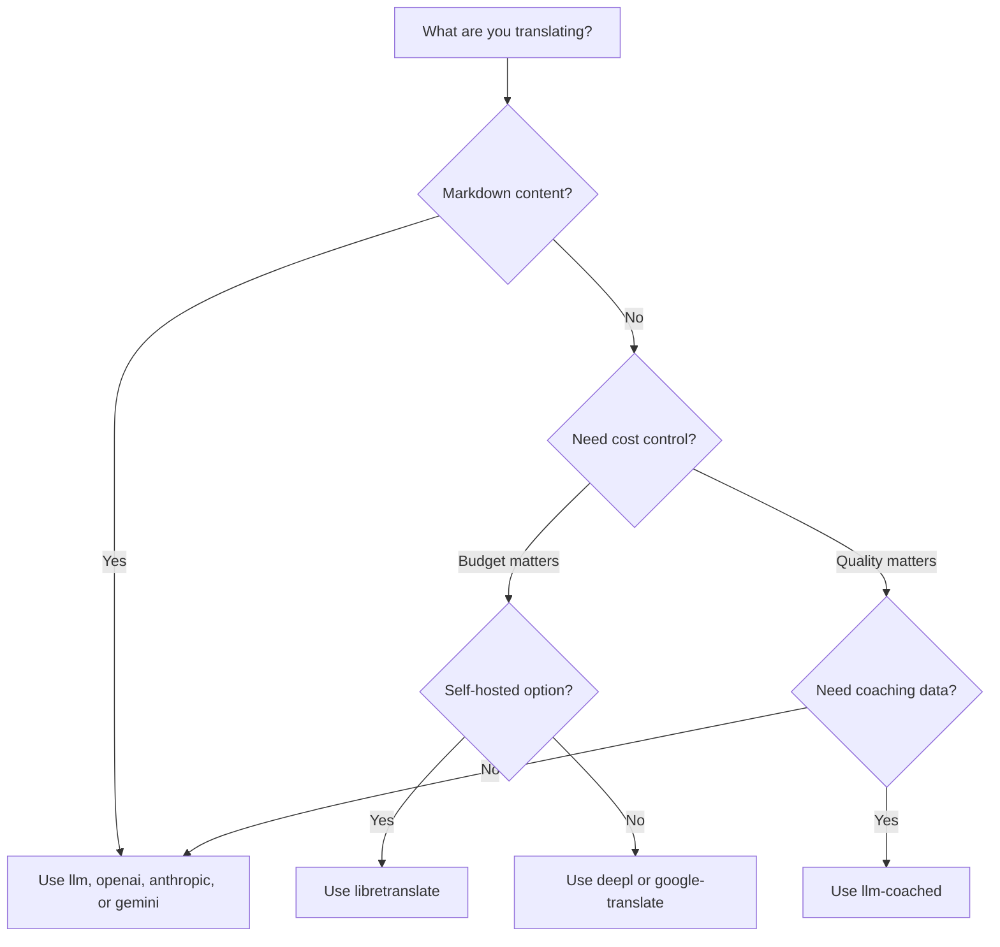

# 翻译方法

Champollion 支持多种翻译方法。每个语言对都可以使用不同的方法——您不必在整个项目中局限于一种方案。

## 方法对比

### LLM 提供商

质量优先、Markdown 感知、支持教练。最适合内容丰富的项目。

| 方法 | 密钥 | 功能 |
|--------|-----|-------------|
| `llm`（默认） | `OPENROUTER_API_KEY` | 通过 OpenRouter 的 LLM — 200+ 模型、自动路由 |
| `llm-coached` | `OPENROUTER_API_KEY` | LLM + 语法规则、词典、风格注释 |
| `openai` | `OPENAI_API_KEY` | 直接 OpenAI API（gpt-4o、gpt-4o-mini） |
| `anthropic` | `ANTHROPIC_API_KEY` | 直接 Anthropic API（Claude Sonnet、Haiku、Opus） |
| `gemini` | `GEMINI_API_KEY` | 直接 Google Gemini API（Flash、Pro）— 免费层 |

### 传统机器翻译

速度和成本优先。最适合大量键值对。

| 方法 | 键 | 功能说明 |
|--------|-----|-------------|
| `google-translate` | `GOOGLE_TRANSLATE_API_KEY` | Google Cloud Translation API v2（194 种语言） |
| `deepl` | `DEEPL_API_KEY` | 支持术语表的 DeepL API（33 种语言） |
| `microsoft-translator` | `MICROSOFT_TRANSLATOR_API_KEY` | Azure Cognitive Services Translator（135 种语言） |
| `libretranslate` | *(自托管)* | 自托管的 LibreTranslate（AGPL，免费） |
| `tilde` | `TILDE_API_KEY` | Tilde MT — 欧盟开发的引擎，在波罗的海和欧洲语言方面表现出色 |
| `translated` | `LARA_ACCESS_KEY_ID` + `LARA_ACCESS_KEY_SECRET` | Translated 的 Lara — 专业的自适应机器翻译（200 种语言） |

### 基础设施

| 方法 | 密钥 | 功能 |
|--------|-----|-------------|
| `api` | *（按提供商）* | 任何 REST 翻译端点的轻量级 HTTP 客户端 |

## 决策树



---

## `llm` — LLM 翻译（默认）

通过 [OpenRouter](https://openrouter.ai) 上的任何 LLM 进行翻译。这是默认方法，也是最通用的。

**工作原理：**
1. 批处理密钥（默认 80/批）并附加寄存器和上下文指令
2. 作为结构化提示发送到 OpenRouter
3. 解析 JSON 响应
4. 通过[质量门](/docs/concepts/quality-gate)验证每个翻译
5. 写入通过的翻译，重试或拒绝失败的翻译

**何时使用：** 大多数项目。特别是内容丰富的网站，其中代码块和短代码需要被屏蔽。

**配置：**

```json
{
  "defaultMethod": "llm",
  "model": "google/gemini-3.5-flash"
}
```

## `llm-coached` — 教练 LLM 翻译

与 `llm` 相同，但将语法规则、术语词典和风格注释注入到每个提示中。

**工作原理：**
1. 从 `.champollion/coaching/<locale>.json` 或插件的 `coaching/` 目录加载教练数据
2. 将语法规则、词典术语和风格注释注入系统提示
3. 匹配源密钥的词典术语被包括为必需术语
4. 翻译按照 `llm` 进行，教练数据增加精度

**何时使用：** 低资源语言、特定领域术语（法律、医学）、正式寄存器，或任何通用 LLM 输出不够精确的情况。

**教练数据格式：**

```json title=".champollion/coaching/fr.json"
{
  "grammar_rules": [
    "French adjectives agree in gender and number with the noun they modify",
    "Use 'vous' for formal contexts, 'tu' for informal"
  ],
  "dictionary": {
    "dashboard": "tableau de bord",
    "deployment": "déploiement",
    "settings": "paramètres"
  },
  "style_notes": "Prefer active voice. Avoid anglicisms where a native French term exists."
}
```

另见：[低资源语言指南](/docs/network/community/low-resource-languages)

---

## `openai` — 直接 OpenAI API

直接通过 OpenAI Chat Completions API 进行翻译。没有 OpenRouter 中间人——你的密钥、你的账户、你的使用仪表板。

**模型：** `gpt-4o`（默认）、`gpt-4o-mini`

**功能：**
- ✅ Markdown 感知（内容翻译）
- ✅ 教练支持（语法规则、词典覆盖、风格注释）
- ✅ 用于结构化键值输出的 JSON 模式
- ✅ 指数退避和重试

**配置：**

```json
{
  "pairs": {
    "en:fr": { "method": "openai", "model": "gpt-4o-mini" }
  }
}
```

```bash
export OPENAI_API_KEY=sk-proj-...
```

在 [platform.openai.com/api-keys](https://platform.openai.com/api-keys) 获取你的密钥。

## `anthropic` — 直接 Anthropic API

直接通过 Anthropic Messages API 进行翻译。使用 `system` 参数处理教练数据，启用 Anthropic 的提示缓存。

**模型：** `claude-sonnet-4-6`（默认）、`claude-haiku-4-5`、`claude-opus-4-7`

**功能：**
- ✅ Markdown 感知（内容翻译）
- ✅ 教练支持（语法规则、词典覆盖、风格注释）
- ✅ 系统提示缓存（在批次间摊销教练成本）
- ✅ 指数退避和重试

**配置：**

```json
{
  "pairs": {
    "en:ja": { "method": "anthropic", "model": "claude-haiku-4-5" }
  }
}
```

```bash
export ANTHROPIC_API_KEY=sk-ant-...
```

在 [console.anthropic.com](https://console.anthropic.com/settings/keys) 获取你的密钥。

## `gemini` — 直接 Google Gemini API

直接通过 Google Gemini `generateContent` API 进行翻译。**免费层可用** — 最佳零成本起点。

**模型：** `gemini-2.5-flash`（默认）、`gemini-2.5-pro`

**功能：**
- ✅ Markdown 感知（内容翻译）
- ✅ 教练支持（语法规则、词典覆盖、风格注释）
- ✅ 通过 `responseMimeType` 的 JSON 响应模式
- ✅ 免费层（慷慨的每日配额）
- ✅ 指数退避和重试

**配置：**

```json
{
  "pairs": {
    "en:ko": { "method": "gemini", "model": "gemini-2.5-pro" }
  }
}
```

```bash
export GEMINI_API_KEY=AI...
```

在 [aistudio.google.com/apikey](https://aistudio.google.com/apikey) 获取你的密钥。

### 模型验证 {#model-validation}

直接 LLM 提供商（`openai`、`anthropic`、`gemini`）在首次使用时验证你的模型字符串。这捕获三类错误：

**错误的方法格式** — 在直接提供商中使用 OpenRouter 风格的模型路径：

```
[WARN] OpenAI: model "google/gemini-3.5-flash" looks like an OpenRouter path.
       Direct providers use bare model names (e.g., "gpt-4o").
       To use OpenRouter models, set method to 'llm' instead.
```

**错误的提供商** — 使用来自完全不同提供商的模型：

```
[WARN] Gemini: model "claude-sonnet-4-6" is an Anthropic model.
       This provider (gemini) cannot serve Anthropic models.
       Use --method anthropic or set "method": "anthropic" in config.
```

**已弃用或拼写错误的模型** — 在首次 API 调用时，champollion 获取提供商的实时模型列表并检查你的模型：

```
[WARN] Gemini: model "gemini-1.5-flash" not found in available models.
       Similar models: gemini-2.0-flash, gemini-2.5-flash, gemini-2.5-pro
       The API call will proceed — the provider will give the final verdict.
```

:::note[这些是警告，不是错误]
模型验证会记录警告，但不会阻止 API 调用。提供商 API 给出最终判决——未来的模型名称可能匹配不同的模式，我们不想基于启发式方法进行限制。
:::

---

## `google-translate` — Google Cloud Translation API

与 Google Cloud Translation API v2 的直接集成。使用 REST API — 无 SDK、无服务账户。只需 API 密钥。

**适用场景：** 速度和成本比细微语义更重要的大量键值对字符串。开箱即用支持 194 种语言（[Google 发布的列表](https://docs.cloud.google.com/translate/docs/languages)）。

**限制：**
- ⚠️ **无 Markdown 感知。** 将破坏代码块、短代码和插值变量。
- 无寄存器/语调控制
- 无教练或术语强制

```bash
npx champollion sync --method google-translate
```

:::tip[自动检测]
如果仅设置了 `GOOGLE_TRANSLATE_API_KEY`（没有 OpenRouter 密钥），champollion 会自动切换到 Google Translate。无需更改配置。
:::

## `deepl` — DeepL API

与 DeepL 翻译 API 的直接集成。支持词汇表以实现一致的术语。

**何时使用：** DeepL 表现出色的欧洲语言（德语、法语、西班牙语、荷兰语、波兰语等）。词汇表支持在不使用教练数据的情况下强制一致的术语。

**功能：**
- ✅ 自动免费/专业端点检测（免费密钥上的 `:fx` 后缀）
- ✅ 词汇表创建和管理
- ✅ 正式程度控制
- ⚠️ **无 Markdown 感知** — 仅限键值对

**配置：**

```json
{
  "pairs": {
    "en:de": { "method": "deepl" }
  }
}
```

```bash
export DEEPL_API_KEY=your-key-here
```

在 [deepl.com/pro-api](https://www.deepl.com/pro-api) 获取你的密钥。

## `microsoft-translator` — Azure 认知服务

与 Microsoft Translator Text API v3 的直接集成。

**适用场景：** 拥有现有 Azure 基础设施的企业环境。支持 135 种语言，包括一些 Google Translate 未涵盖的语言（藏语、法罗语、伊努克提图特语等）。

**功能：**
- ✅ 每个请求最多 100 个片段（高吞吐量）
- ✅ 可选的区域参数用于延迟优化
- ⚠️ **无 Markdown 感知** — 仅限键值对
- ⚠️ **无内容翻译** — 仅限键值对

**配置：**

```json
{
  "pairs": {
    "en:ar": { "method": "microsoft-translator" }
  }
}
```

```bash
export MICROSOFT_TRANSLATOR_API_KEY=your-key
export MICROSOFT_TRANSLATOR_REGION=global  # optional
```

从 [Azure 门户](https://portal.azure.com) → 认知服务 → 翻译器获取你的密钥。

## `libretranslate` — 自托管翻译

使用 LibreTranslate 的自托管开源翻译。在本地或你自己的基础设施上运行——零 API 成本、完全数据主权。

**何时使用：** 需要离线翻译、数据隐私合规（GDPR）或零成本运营的项目。特别适用于不应依赖外部 API 的 CI 管道。

**功能：**
- ✅ 自托管 — 无外部 API 调用
- ✅ 免费和开源（AGPL-3.0）
- ✅ Docker 部署可用
- ⚠️ **无 Markdown 感知** — 仅限键值对
- ⚠️ **无内容翻译** — 仅限键值对
- ⚠️ 质量因语言对而异

**设置：**

```bash
# Run LibreTranslate locally with Docker
docker run -d -p 5000:5000 libretranslate/libretranslate

# Configure (optional — defaults to localhost:5000)
export LIBRETRANSLATE_API_URL=http://localhost:5000/translate
```

```json
{
  "pairs": {
    "en:es": { "method": "libretranslate" }
  }
}
```

---

## `api` — 远程翻译 API

社区托管或受 IP 保护的翻译端点的轻量级 HTTP 客户端。Champollion 发送密钥并接收翻译——它不包含任何翻译逻辑。

**何时使用：** 翻译方法托管在服务器端时（例如专有教练数据、微调模型、无法分发的 FST 管道）。

```json
{
  "pairs": {
    "en:crk": {
      "method": "api",
      "endpoint": "https://api.example.com/v1/translate",
      "apiKey": "your-key"
    }
  }
}
```

:::note[社区控制的翻译（以数据主权为目标）]
`api` 方法是通往**社区控制下的社区托管翻译（以数据主权为目标）**的桥梁。原住民和少数民族语言社区可以托管自己的翻译端点——将训练数据、微调模型和语言知识产权保留在社区控制之下——而 Champollion 则作为瘦客户端连接到这些端点。

有关完整的社区托管演练，请参阅[支持低资源语言](/docs/network/community/low-resource-languages)，有关端点要求，请参阅[通过 API 提供方法](/docs/guides/serving-a-method)。
:::

---

## 按对配置

真正的力量在于按语言对混合方法：

```json title="champollion.config.json"
{
  "version": 3,
  "pairs": {
    "en:fr": { "method": "deepl" },
    "en:ja": { "method": "openai", "model": "gpt-4o" },
    "en:ko": { "method": "gemini" },
    "en:ar": { "method": "microsoft-translator" },
    "en:crk": { "methodPlugin": "crk-coached-v1" }
  }
}
```

这通过 DeepL（词汇表支持）翻译法语、通过 OpenAI（质量）翻译日语、通过 Gemini（免费层）翻译韩语、通过 Microsoft Translator（覆盖）翻译阿拉伯语，以及通过教练插件（专业化）翻译平原克里语。

## 插件

插件是针对特定语言对的预打包翻译方案。它们是 JSON 清单——不是代码——告诉 champollion 使用哪种方法、使用什么设置以及已基准测试的质量。

:::tip[从评估工具到生产环境，一条命令搞定]
在 [eval harness](/docs/network/specifications/harness) 中开发和验证的插件可以直接安装——你在那里验证的方法通过单个 `plugin install` 命令部署到这里。查看 [MT Evaluation](/docs/network/leaderboard/rules) 了解完整的评估工作流程。
:::

```bash
champollion plugin install ./french-formal-v1/
champollion plugin list
champollion plugin remove french-formal-v1
```

有关完整的清单格式，请参阅[插件规范](/docs/reference/plugin-spec)。

---

## 切换提供商

在方法之间移动？模型格式和环境变量会改变——这是映射：

### OpenRouter → 直接提供商

```diff title="champollion.config.json"
 {
   "pairs": {
     "en:fr": {
-      "method": "llm",
-      "model": "openai/gpt-4o"
+      "method": "openai",
+      "model": "gpt-4o"
     }
   }
 }
```

```diff title="Environment variables"
- export OPENROUTER_API_KEY=sk-or-v1-...
+ export OPENAI_API_KEY=sk-proj-...
```

**关键差异：**
- OpenRouter 使用 `provider/model` 格式（例如 `openai/gpt-4o`）。直接提供商使用裸模型名称（例如 `gpt-4o`）。
- 每个直接提供商都有自己的环境变量（`OPENAI_API_KEY`、`ANTHROPIC_API_KEY`、`GEMINI_API_KEY`）。
- 如果你使用错误的模型格式，champollion 会警告你——参见[模型验证](#model-validation)。

### 直接提供商 → OpenRouter

```diff title="champollion.config.json"
 {
   "pairs": {
     "en:ja": {
-      "method": "anthropic",
-      "model": "claude-sonnet-4-6"
+      "method": "llm",
+      "model": "anthropic/claude-sonnet-4-6"
     }
   }
 }
```

:::tip[何时使用 OpenRouter 与直接连接]
**使用 OpenRouter** 当你想在不改变环境变量的情况下在模型之间切换，或者想从单个密钥访问 200+ 个模型时。**使用直接提供商** 当你想要更简单的计费、更低的延迟（没有中间商）或访问提供商特定功能（如 Anthropic 的提示缓存）时。
:::

---

## 成本对比

每 1,000 个翻译密钥的近似成本（假设每个密钥约 10 个令牌，每批 80 个密钥）：

| 方法 | 成本 / 1K 密钥 | 速度 | 质量 | 最适合 |
|--------|----------------|-------|---------|----------|
| `gemini`（Flash） | **免费**（在层内） | 快 | 良好 | 入门、个人项目 |
| `google-translate` | ~$0.02 | 最快 | 足够 | 高量、欧洲语言 |
| `deepl` | ~$0.02 | 快 | 良好 | 欧洲语言、术语 |
| `microsoft-translator` | ~$0.01 | 快 | 足够 | Azure 商店、广泛的语言覆盖 |
| `libretranslate` | **免费**（自托管） | 变化 | 一般 | 隔离、GDPR、CI 管道 |
| `gemini`（Pro） | ~$0.07 | 中等 | 非常好 | 质量敏感、免费配额 |
| `openai`（GPT-4o-mini） | ~$0.01 | 快 | 良好 | 预算 LLM |
| `openai`（GPT-4o） | ~$0.10 | 中等 | 非常好 | 质量敏感 |
| `anthropic`（Haiku） | ~$0.01 | 快 | 良好 | 预算 LLM |
| `anthropic`（Sonnet） | ~$0.10 | 中等 | 非常好 | 质量敏感 |
| `anthropic`（Opus） | ~$0.50 | 慢 | 优秀 | 最大质量 |
| `llm`（OpenRouter） | 按模型变化 | 变化 | 变化 | 模型比较、实验 |

:::note[这些是估计值]
实际成本取决于你的源文本长度、批处理大小和提供商定价变化。查看每个提供商的当前定价页面以获取确切费率。
:::

---

## 另请参阅

- [支持的语言](/docs/reference/supported-languages)
- [教练数据](/docs/concepts/coaching-data)
- [支持低资源语言](/docs/network/community/low-resource-languages)
- [插件规范](/docs/reference/plugin-spec)
- [通过 API 提供方法](/docs/guides/serving-a-method)
- [质量门](/docs/concepts/quality-gate)
- [架构](/docs/concepts/architecture)
- [故障排除](/docs/guides/troubleshooting) — 模型错误、API 问题
