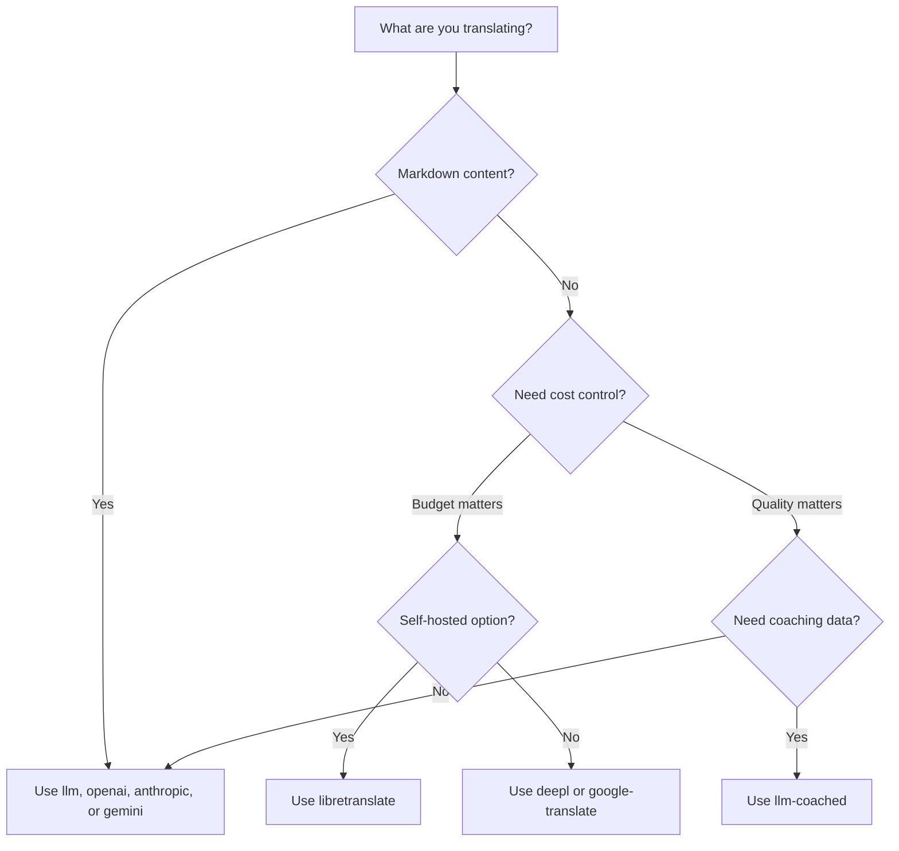

# 翻译方法

Champollion 支持多种翻译方法。每个语言对都可以使用不同的方法——你无需在整个项目中局限于同一种方案。

## 方法对比

### LLM 提供商

质量优先、Markdown 感知、支持教练。最适合内容丰富的项目。

| 方法 | 密钥 | 功能说明 |
|--------|-----|-------------|
| `llm`（默认） | `OPENROUTER_API_KEY` | 基于 OpenRouter 的大语言模型——支持 200+ 模型及自动路由 |
| `llm-coached` | `OPENROUTER_API_KEY` | 大语言模型 + 语法规则、词典、风格说明 |
| `openai` | `OPENAI_API_KEY` | 直接调用 OpenAI API (gpt-4o, gpt-4o-mini) |
| `anthropic` | `ANTHROPIC_API_KEY` | 直接调用 Anthropic API (Claude Sonnet, Haiku, Opus) |
| `gemini` | `GEMINI_API_KEY` | 直接调用 Google Gemini API (Flash, Pro)——提供免费层级 |
| `local` | *(无)* | 本地机器或服务器上的模型：Ollama、vLLM、LM Studio、llama.cpp，或使用 `nmt-forge` 训练的模型。文本绝不离开你的基础设施 |

### 传统机器翻译

速度和成本优先。最适合大量键值对。

| 方法 | 密钥 | 功能说明 |
|--------|-----|-------------|
| `google-translate` | `GOOGLE_TRANSLATE_API_KEY` | Google Cloud Translation API v2（194 种语言） |
| `deepl` | `DEEPL_API_KEY` | 支持术语表的 DeepL API（33 种语言） |
| `microsoft-translator` | `MICROSOFT_TRANSLATOR_API_KEY` | Azure Cognitive Services Translator（135 种语言） |
| `libretranslate` | *(自托管)* | 自托管 LibreTranslate（AGPL，免费） |
| `tilde` | `TILDE_API_KEY` | Tilde MT——欧盟自研引擎，擅长波罗的海和欧洲语言 |
| `translated` | `LARA_ACCESS_KEY_ID` + `LARA_ACCESS_KEY_SECRET` | Translated 出品的 Lara——专业自适应机器翻译（200 种语言） |

### 基础设施

| 方法 | 密钥 | 功能 |
|--------|-----|-------------|
| `api` | *（按提供商）* | 任何 REST 翻译端点的轻量级 HTTP 客户端 |

## 决策树


```mermaid
flowchart TD
    A["What are you translating?"] --> B{"Markdown content?"}
    B -->|Yes| C["Use llm, openai, anthropic, or gemini"]
    B -->|No| D{"Need cost control?"}
    D -->|Budget matters| E{"Self-hosted option?"}
    D -->|Quality matters| F{"Need coaching data?"}
    E -->|Yes| G["Use libretranslate"]
    E -->|No| H["Use deepl or google-translate"]
    F -->|Yes| I["Use llm-coached"]
    F -->|No| C
```

---

## `llm` — LLM 翻译（默认）

通过 [OpenRouter](https://openrouter.ai) 上的任何 LLM 进行翻译。这是默认方法，也是最通用的。

**工作原理：**
1. 批处理密钥（默认 80/批）并附加寄存器和上下文指令
2. 作为结构化提示发送到 OpenRouter
3. 解析 JSON 响应
4. 通过[质量门](/docs/concepts/quality-gate)验证每个翻译
5. 写入通过的翻译，重试或拒绝失败的翻译

**何时使用：** 大多数项目。特别是内容丰富的网站，其中代码块和短代码需要被屏蔽。

**配置：**

```json
{
  "defaultMethod": "llm",
  "model": "google/gemini-3.8-flash"
}
```

## `llm-coached` — 教练 LLM 翻译

与 `llm` 相同，但将语法规则、术语词典和风格注释注入到每个提示中。

**工作原理：**
1. 从 `.champollion/coaching/<locale>.json` 或插件的 `coaching/` 目录加载教练数据
2. 将语法规则、词典术语和风格注释注入系统提示
3. 匹配源密钥的词典术语被包括为必需术语
4. 翻译按照 `llm` 进行，教练数据增加精度

**何时使用：** 低资源语言、特定领域术语（法律、医学）、正式寄存器，或任何通用 LLM 输出不够精确的情况。

**教练数据格式：**

```json title=".champollion/coaching/fr.json"
{
  "grammar_rules": [
    "French adjectives agree in gender and number with the noun they modify",
    "Use 'vous' for formal contexts, 'tu' for informal"
  ],
  "dictionary": {
    "dashboard": "tableau de bord",
    "deployment": "déploiement",
    "settings": "paramètres"
  },
  "style_notes": "Prefer active voice. Avoid anglicisms where a native French term exists."
}
```

另见：[低资源语言指南](/docs/network/community/low-resource-languages)

---

## `openai` — 直接 OpenAI API

直接通过 OpenAI Chat Completions API 进行翻译。没有 OpenRouter 中间人——你的密钥、你的账户、你的使用仪表板。

**支持模型：**`gpt-5.4-mini-2026-03-17`（默认——指定日期的快照版本），或 OpenAI 列出的任何确切模型 ID

**特性：**
- ✅ 感知 Markdown（内容翻译）
- ✅ 与 `llm` 相同的提示词——语域、性别指引、提示上下文、受保护术语、`coachingFile` 指引以及每个批次的术语表词汇（[参见下文](#one-prompt-every-llm-method)）
- ✅ 用于结构化键值输出的 JSON 模式
- ✅ 指数退避重试

**配置：**

```json
{
  "pairs": {
    "en:fr": { "method": "openai", "model": "gpt-4o-mini" }
  }
}
```

```bash
export OPENAI_API_KEY=sk-proj-...
```

在 [platform.openai.com/api-keys](https://platform.openai.com/api-keys) 获取你的密钥。

## `local`——自建模型（Ollama、vLLM、LM Studio、已训练模型）

使用由你运行的任何 **OpenAI 兼容**端点背后的模型进行翻译：Ollama、vLLM、LM Studio、llama.cpp 服务，或使用 `nmt-forge` 训练的模型。无需 API 密钥，且不会将任何文本发送给第三方。这是处理敏感文本的首选方法，也是部署自建模型的方式。

```json
{ "defaultMethod": "local", "model": "llama3.1" }
```

```bash
# Optional: only if your server is not at Ollama's default address
export LOCAL_API_BASE=http://localhost:11434/v1
npx champollion sync --method local
```

端点按以下顺序读取：`LOCAL_API_BASE`、`OPENAI_API_BASE`、`OPENAI_BASE_URL`，最后是 Ollama 的默认值 `http://localhost:11434/v1`。当端点位于本机（`localhost`、`127.0.0.1`、`::1`）时，费用显示为 **$0 API cost (runs on this machine)**（API 费用为 0 美元（在本机运行））——不存在 API 账单；你自己的硬件和电力消耗不计入费用——且 `--max-cost` 会允许运行通过。任何其他端点（Groq、Together、你网络中的某台服务器）均报告为 **unknown**，绝不会显示为 $0，因为工具无法得知其收费标准，因此 `--max-cost` 会直接拒绝而不是盲目猜测。在 `--json` 中，预估行在第一种情况下显示 `"estimatedCost": 0, "local": true`，在第二种情况下显示 `"estimatedCost": null`。（在本机运行并将请求转发到付费 API 的代理——如 LiteLLM 或网关——是在上游计费的，Champollion 无法感知：请在上游做好预算。）

在开始翻译前，sync 会检查端点处是否有服务器响应。若无响应，本应向其发送内容的运行会在发送任何数据前终止（退出代码 `1`）并指出该地址。若此次运行无需向其发送任何内容——队列为空，或队列中的所有键均来自缓存（例如重新处理已翻译的文本）——则会警告服务器不可用并继续执行。在 CI Runner 上（设置了 `CI` 或 `GITHUB_ACTIONS`），未响应的服务器会终止每次运行，即使队列中没有任何待处理内容也是如此；这样一来，仍在使用 `local` 的工作流会在首次推送时即告失败，而不是等到某个字符串发生变更时才暴露问题（[CI 指南](/docs/guides/ci-cd)）。

`openai` 方法接受相同的 `OPENAI_API_BASE` / `OPENAI_BASE_URL` 覆盖配置，以便携带密钥访问任何 OpenAI 兼容的提供商（Groq、Together 等）。

## `anthropic` — 直接 Anthropic API

直接通过 Anthropic Messages API 进行翻译。指令放置在 `system` 参数中，从而启用 Anthropic 的提示词缓存功能。

**模型：** `claude-sonnet-4-6`（默认）、`claude-haiku-4-5`、`claude-opus-4-7`

**特性：**
- ✅ 感知 Markdown（内容翻译）
- ✅ 与 `llm` 相同的提示词——语域、性别指引、提示上下文、受保护术语、`coachingFile` 指引以及每个批次的术语表词汇（[参见下文](#one-prompt-every-llm-method)）
- ✅ 系统提示词缓存（跨批次分摊指令开销）
- ✅ 指数退避重试

**配置：**

```json
{
  "pairs": {
    "en:ja": { "method": "anthropic", "model": "claude-haiku-4-5" }
  }
}
```

```bash
export ANTHROPIC_API_KEY=sk-ant-...
```

在 [console.anthropic.com](https://console.anthropic.com/settings/keys) 获取你的密钥。

## `gemini` — 直接 Google Gemini API

直接通过 Google Gemini `generateContent` API 进行翻译。**免费层可用** — 最佳零成本起点。

**支持模型：**`gemini-3.8-flash`（默认），或 Google 列出的任何确切模型 ID

**特性：**
- ✅ 感知 Markdown（内容翻译）
- ✅ 与 `llm` 相同的提示词——语域、性别指引、提示上下文、受保护术语、`coachingFile` 指引以及每个批次的术语表词汇（[参见下文](#one-prompt-every-llm-method)）
- ✅ 通过 `responseMimeType` 实现的 JSON 响应模式
- ✅ 免费层级（慷慨的每日配额）
- ✅ 指数退避重试

**配置：**

```json
{
  "pairs": {
    "en:ko": { "method": "gemini", "model": "gemini-2.5-pro" }
  }
}
```

```bash
export GEMINI_API_KEY=AI...
```

在 [aistudio.google.com/apikey](https://aistudio.google.com/apikey) 获取你的密钥。

### 所有 LLM 方法使用统一提示词 {#one-prompt-every-llm-method}

针对同一个项目，`llm`、`openai`、`anthropic`、`gemini` 和 `local` 会发送相同的指令；区别仅在于请求发送的目的地不同。系统消息包含语域、该语言的性别指引、你的 `promptContext`、`protectedTerms` 和 `coachingFile` 文本；每个批次的消息包含该批次包含的术语表词汇（`.champollion/coaching/<locale>.json` 中的 `dictionary`）、每个键的专门指令（复数形式、gettext 上下文、描述）以及待翻译的字符串。你可以自行查看——此时不会发送任何内容：

```bash
npx champollion sync --dry --method local --show-prompt
```

指导文件中的语法规则和风格说明会被 `llm-coached` 读取，且支持任何提供商：`{ "method": "llm-coached", "provider": "openai" }`。

### 模型名称 {#model-names}

直连提供商会接收其自身的模型命名。当提供商拥有对应模型时，OpenRouter 风格的 ID 会被映射转换：在 `openai` 上 `openai/gpt-5.5` → `gpt-5.5`，在 `anthropic` 上 `anthropic/claude-haiku-4.5` → `claude-haiku-4-5`，在 `gemini` 上 `google/gemini-3.8-flash` → `gemini-3.8-flash`。若传入提供商不存在该模型的 ID，则会在发送任何请求前终止运行：

```
[ERR] sync failed: en:fr: model "google/gemini-3.8-flash" (from the top-level "model") is an OpenRouter model id
      — openai calls OpenAI directly, which has no model by that name. Use an OpenAI model (e.g. --model gpt-4o),
      --method gemini (its name for it: "gemini-3.8-flash") or --method llm to run it through OpenRouter.
```

`local` 以及通过 `OPENAI_API_BASE` 指向其他服务器的 `openai` 会按你书写的内容原样发送名称——由目标服务器自行解析其含义。

### 仅限精确 Slug {#exact-slugs}

在每种方法中，每个模型都必须使用其精确 slug 进行命名：在 OpenRouter 上使用 `google/gemini-3.8-flash`，在 `openai` 上使用直连提供商自身的精确名称（`gpt-5.5`）。缩写名称无法解析为模型，浮动 ID（OpenRouter 的 `~vendor/…` 路由 ID，任何 `…-latest` 或 `:latest` 名称）也会被拒绝：因为这类 ID 指向提供商当天所指向的任意模型，导致运行记录无法明确究竟是哪个模型完成了翻译。出现这两种情况都会在发送任何请求前终止运行：

```
[ERR] sync failed: "gemini-flash" (from --model) is not a model id — Champollion takes exact model slugs only,
      no aliases. Did you mean google/gemini-3.8-flash (what "gemini-flash" used to stand for)? List models:
      https://openrouter.ai/models (OpenRouter slugs), or champollion models --method <gemini|openai|anthropic>
      (a direct provider's own names).
```

### 模型验证 {#model-validation}

直连 LLM 提供商（`openai`、`anthropic`、`gemini`）也会在首次使用时检查你的模型名称（通过 `OPENAI_API_BASE` 与其他服务器通信时除外）。这可以捕获两类错误：

**错误的提供商** — 使用来自完全不同提供商的模型：

```
[WARN] Gemini: model "claude-sonnet-4-6" is an Anthropic model.
       This provider (gemini) cannot serve Anthropic models.
       Use --method anthropic or set "method": "anthropic" in config.
```

**已弃用或拼写错误的模型** — 在首次 API 调用时，champollion 获取提供商的实时模型列表并检查你的模型：

```
[WARN] Gemini: model "gemini-1.5-flash" not found in available models.
       Similar models: gemini-2.0-flash, gemini-2.5-flash, gemini-2.5-pro
       The API call will proceed — the provider will give the final verdict.
```

:::note[这些是警告，不是错误]
模型验证会记录警告，但不会阻止 API 调用。提供商 API 给出最终判决——未来的模型名称可能匹配不同的模式，我们不想基于启发式方法进行限制。
:::

---

## `google-translate` — Google Cloud Translation API

与 Google Cloud Translation API v2 的直接集成。使用 REST API — 无 SDK、无服务账户。只需 API 密钥。

**适用场景：** 大规模键值字符串对，且速度与成本相比细微语境更为重要的场景。开箱即用支持 194 种语言（[Google 官方公布列表](https://docs.cloud.google.com/translate/docs/languages)）。

**限制：**
- ⚠️ **无 Markdown 感知。** 将破坏代码块、短代码和插值变量。
- 无寄存器/语调控制
- 无教练或术语强制

```bash
npx champollion sync --method google-translate
```

:::tip[自动检测]
如果仅设置了 `GOOGLE_TRANSLATE_API_KEY`（没有 OpenRouter 密钥），champollion 会自动切换到 Google Translate。无需更改配置。
:::

## `deepl` — DeepL API

与 DeepL 翻译 API 的直接集成。支持词汇表以实现一致的术语。

**何时使用：** DeepL 表现出色的欧洲语言（德语、法语、西班牙语、荷兰语、波兰语等）。词汇表支持在不使用教练数据的情况下强制一致的术语。

**功能：**
- ✅ 自动免费/专业端点检测（免费密钥上的 `:fx` 后缀）
- ✅ 词汇表创建和管理
- ✅ 正式程度控制
- ⚠️ **无 Markdown 感知** — 仅限键值对

**配置：**

```json
{
  "pairs": {
    "en:de": { "method": "deepl" }
  }
}
```

```bash
export DEEPL_API_KEY=your-key-here
```

在 [deepl.com/pro-api](https://www.deepl.com/pro-api) 获取你的密钥。

## `microsoft-translator` — Azure 认知服务

与 Microsoft Translator Text API v3 的直接集成。

**适用场景：** 拥有现有 Azure 基础设施的企业环境。支持 135 种语言，包括 Google 翻译尚未覆盖的部分语言（藏语、法罗语、伊努克提图特语等）。

**功能：**
- ✅ 每个请求最多 100 个片段（高吞吐量）
- ✅ 可选的区域参数用于延迟优化
- ⚠️ **无 Markdown 感知** — 仅限键值对
- ⚠️ **无内容翻译** — 仅限键值对

**配置：**

```json
{
  "pairs": {
    "en:ar": { "method": "microsoft-translator" }
  }
}
```

```bash
export MICROSOFT_TRANSLATOR_API_KEY=your-key
export MICROSOFT_TRANSLATOR_REGION=global  # optional
```

从 [Azure 门户](https://portal.azure.com) → 认知服务 → 翻译器获取你的密钥。

## `libretranslate` — 自托管翻译

使用 LibreTranslate 的自托管开源翻译。在本地或你自己的基础设施上运行——零 API 成本、完全数据主权。

**何时使用：** 需要离线翻译、数据隐私合规（GDPR）或零成本运营的项目。特别适用于不应依赖外部 API 的 CI 管道。

**功能：**
- ✅ 自托管 — 无外部 API 调用
- ✅ 免费和开源（AGPL-3.0）
- ✅ Docker 部署可用
- ⚠️ **无 Markdown 感知** — 仅限键值对
- ⚠️ **无内容翻译** — 仅限键值对
- ⚠️ 质量因语言对而异

**设置：**

```bash
# Run LibreTranslate locally with Docker
docker run -d -p 5000:5000 libretranslate/libretranslate

# Configure (optional — defaults to localhost:5000)
export LIBRETRANSLATE_API_URL=http://localhost:5000/translate
```

```json
{
  "pairs": {
    "en:es": { "method": "libretranslate" }
  }
}
```

---

## `api` — 远程翻译 API

社区托管或受 IP 保护的翻译端点的轻量级 HTTP 客户端。Champollion 发送密钥并接收翻译——它不包含任何翻译逻辑。

**何时使用：** 翻译方法托管在服务器端时（例如专有教练数据、微调模型、无法分发的 FST 管道）。

```json
{
  "pairs": {
    "en:crk": {
      "method": "api",
      "endpoint": "https://api.example.com/v1/translate",
      "apiKey": "your-key"
    }
  }
}
```

:::note[社区自主控制的翻译（追求主权）]
`api` 方法是通往**受社区控制的社区自建翻译（追求主权）**的桥梁。原住民及少数族裔语言社区可以托管自己的翻译端点——使指导数据、微调模型和语言知识产权牢牢掌握在社区控制之下——而 Champollion 则充当轻量客户端与其连接。

有关完整的社区托管演练，请参阅[支持低资源语言](/docs/network/community/low-resource-languages)，有关端点要求，请参阅[通过 API 提供方法](/docs/guides/serving-a-method)。
:::

---

## 按对配置

真正的力量在于按语言对混合方法：

```json title="champollion.config.json"
{
  "version": 3,
  "pairs": {
    "en:fr": { "method": "deepl" },
    "en:ja": { "method": "openai", "model": "gpt-4o" },
    "en:ko": { "method": "gemini" },
    "en:ar": { "method": "microsoft-translator" },
    "en:crk": { "method": "llm-coached" }
  }
}
```

这将通过 DeepL 翻译法语（利用其术语表支持），通过 OpenAI 翻译日语（注重翻译质量），通过 Gemini 翻译韩语（利用免费层级），通过 Microsoft Translator 翻译阿拉伯语（语言覆盖广），并通过带指导的 LLM 方法以及你提供的语法说明和词典来翻译平原克里语（Plains Cree）。

## Fallback 回退机制——单个语言对的备选方法 {#fallback}

单一方法往往难以面面俱到。你自己训练的小模型或许能很好地翻译大部分句子，但仍可能会遗漏 `{name}` 占位符、破坏复数形式，或将“Home”翻译成一个长句。为该语言对配置一个 `fallback`：

```json title="champollion.config.json"
{
  "pairs": {
    "en:crk": {
      "method": "api",
      "endpoint": "http://127.0.0.1:8378/translate",
      "fallback": { "method": "llm-coached", "model": "google/gemini-3.8-flash" }
    }
  }
}
```

如果文本绝对不能离开你的机器，可以使用你自己运行的模型作为备选回退：`"fallback": { "method": "local", "model": "<your local model>" }`（本机上的 OpenAI 兼容服务器；[`local`](#local--your-own-model-ollama-vllm-lm-studio-a-trained-model)）。云端托管模型通常是更强大的第二方案，按请求计费；而 `local` 则将文本保留在本地，API 费用为 0 美元。

系统会先由你的模型进行翻译。质量检查门禁（quality gate）拒绝的键以及被其遗漏或损坏的 Markdown 块，会送往回退方法处理一次，并经过相同的门禁检查。两种方法都无法翻译的任何内容将保持未翻译状态，就像没有配置回退方法一样。`sync` 会针对每个语言对打印一行 `[FALLBACK]`，说明有多少条目送往回退处理以及修复了多少条目。`--method` 和 `--model` 仅修改语言对本身的方法，绝不会修改回退方法。启用 `--max-cost` 时，每个回退批次在运行前都会先计算费用，若超出上限则会跳过。详情请见：[Fallback 回退方法](/docs/getting-started/configuration#fallback)。

## 插件

插件是针对特定语言对的预打包翻译方案。它们是 JSON 清单——不是代码——告诉 champollion 使用哪种方法、使用什么设置以及已基准测试的质量。

:::tip[从评估工具到生产环境，一条命令搞定]
在 [eval harness](/docs/network/specifications/harness) 中开发和验证的插件可以直接安装——你在那里验证的方法通过单个 `plugin install` 命令部署到这里。查看 [MT Evaluation](/docs/network/leaderboard/rules) 了解完整的评估工作流程。
:::

```bash
champollion plugin install ./french-formal-v1/
champollion plugin list
champollion plugin remove french-formal-v1
```

有关完整的清单格式，请参阅[插件规范](/docs/reference/plugin-spec)。

---

## 切换提供商

在方法之间移动？模型格式和环境变量会改变——这是映射：

### OpenRouter → 直接提供商

```diff title="champollion.config.json"
 {
   "pairs": {
     "en:fr": {
-      "method": "llm",
-      "model": "openai/gpt-4o"
+      "method": "openai",
+      "model": "gpt-4o"
     }
   }
 }
```

```diff title="Environment variables"
- export OPENROUTER_API_KEY=sk-or-v1-...
+ export OPENAI_API_KEY=sk-proj-...
```

**关键差异：**
- OpenRouter 使用 `provider/model` 格式（例如 `openai/gpt-4o`）。直接提供商使用裸模型名称（例如 `gpt-4o`）。
- 每个直接提供商都有自己的环境变量（`OPENAI_API_KEY`、`ANTHROPIC_API_KEY`、`GEMINI_API_KEY`）。
- 如果你使用错误的模型格式，champollion 会警告你——参见[模型验证](#model-validation)。

### 直接提供商 → OpenRouter

```diff title="champollion.config.json"
 {
   "pairs": {
     "en:ja": {
-      "method": "anthropic",
-      "model": "claude-sonnet-4-6"
+      "method": "llm",
+      "model": "anthropic/claude-sonnet-4.6"
     }
   }
 }
```

:::tip[何时使用 OpenRouter 与直接连接]
**使用 OpenRouter** 当你想在不改变环境变量的情况下在模型之间切换，或者想从单个密钥访问 200+ 个模型时。**使用直接提供商** 当你想要更简单的计费、更低的延迟（没有中间商）或访问提供商特定功能（如 Anthropic 的提示缓存）时。
:::

---

## 成本对比

每 1,000 个翻译密钥的近似成本（假设每个密钥约 10 个令牌，每批 80 个密钥）：

| 方法 | 成本 / 1K 密钥 | 速度 | 质量 | 最适合 |
|--------|----------------|-------|---------|----------|
| `gemini`（Flash） | **免费**（在层内） | 快 | 良好 | 入门、个人项目 |
| `google-translate` | ~$0.02 | 最快 | 足够 | 高量、欧洲语言 |
| `deepl` | ~$0.02 | 快 | 良好 | 欧洲语言、术语 |
| `microsoft-translator` | ~$0.01 | 快 | 足够 | Azure 商店、广泛的语言覆盖 |
| `libretranslate` | **免费**（自托管） | 变化 | 一般 | 隔离、GDPR、CI 管道 |
| `gemini`（Pro） | ~$0.07 | 中等 | 非常好 | 质量敏感、免费配额 |
| `openai`（GPT-4o-mini） | ~$0.01 | 快 | 良好 | 预算 LLM |
| `openai`（GPT-4o） | ~$0.10 | 中等 | 非常好 | 质量敏感 |
| `anthropic`（Haiku） | ~$0.01 | 快 | 良好 | 预算 LLM |
| `anthropic`（Sonnet） | ~$0.10 | 中等 | 非常好 | 质量敏感 |
| `anthropic`（Opus） | ~$0.50 | 慢 | 优秀 | 最大质量 |
| `llm`（OpenRouter） | 按模型变化 | 变化 | 变化 | 模型比较、实验 |

:::note[这些是估计值]
实际成本取决于你的源文本长度、批处理大小和提供商定价变化。查看每个提供商的当前定价页面以获取确切费率。
:::

---

## 另请参阅

- [支持的语言](/docs/reference/supported-languages)
- [教练数据](/docs/concepts/coaching-data)
- [支持低资源语言](/docs/network/community/low-resource-languages)
- [插件规范](/docs/reference/plugin-spec)
- [通过 API 提供方法](/docs/guides/serving-a-method)
- [质量门](/docs/concepts/quality-gate)
- [架构](/docs/concepts/architecture)
- [故障排除](/docs/guides/troubleshooting) — 模型错误、API 问题
