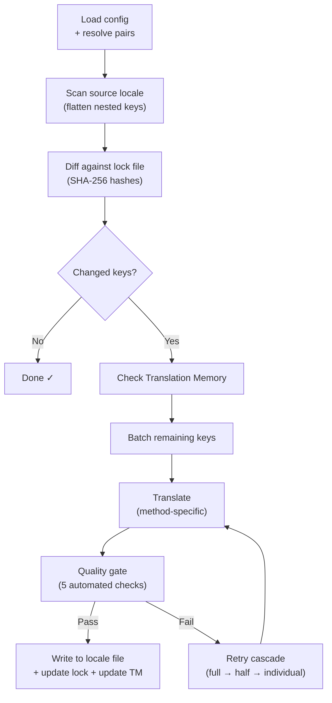

# champollion 的工作原理

champollion 用一条命令翻译你的应用的语言文件。以下是其内部工作原理。

## 管道流程

当你运行 `npx champollion sync` 时，champollion 执行一个六阶段的管道：



**关键设计决策：**

- **通过 SHA-256 哈希进行变更检测。** Champollion 用 `.champollion.lock` 中的哈希跟踪每个源值。当你更新一个英文字符串时，只有该键会被重新翻译。这就是为什么 `sync` 在重复运行时很快——它做的工作最少。

- **翻译记忆缓存。** 在进行任何 API 调用之前，champollion 会检查 `.champollion/tm.json` 中的缓存翻译（以源文本 + 语言 + 方法为键）。在更改一个键后的典型重新同步中，142 个键来自缓存，1 个键调用 API。

- **写入前的质量门控。** 每个翻译在接触你的文件之前都要通过五个自动化检查（空值、源回显、幻觉循环、长度膨胀、脚本合规性）。失败会被记录，永远不会被默默接受。

- **失败时的重试级联。** 如果一个批次失败（JSON 解析错误、API 超时），champollion 会以逐步缩小的批次重试：完整 → 一半 → 单个。这样可以隔离问题键，而不会阻止其余部分。

## 翻译方法

Champollion 支持多种翻译方法，每种方法适用于不同的场景。核心方法如下：

| 方法 | 工作原理 | 最适合 |
|------|--------|--------|
| **`llm`** | 向任何 OpenRouter 模型的结构化提示 | 资源充足的语言 |
| **`llm-coached`** | 相同的提示 + 语法规则、词典和风格说明 | LLM 会犯可预测错误的语言 |
| **`google-translate`** | Google Cloud Translation API 批处理请求 | 具有良好 GT 支持的高资源语言 |
| **`api`** | HTTP POST 到你自己的端点 | 自定义管道、社区控制的模型 |

方法按语言对配置。你可能对法语使用 `google-translate`，但对平原克里语使用 `llm-coached`——每个语言对都使用最适合它的方法。

## 教练数据

对于 `llm-coached` 语言对，教练数据为 LLM 提供明确的语言学知识：语法规则、强制术语和风格偏好。这被注入到每个提示中作为结构化上下文。

```json title="coaching/crk.json"
{
  "grammar_rules": ["Animate nouns take different plural forms than inanimate nouns"],
  "dictionary": {"welcome": "ᑕᓂᓯ", "settings": "ᐃᑕᐢᑌᐘᐃᓇ"},
  "style_notes": "Use Standard Roman Orthography (SRO) unless explicitly configured otherwise."
}
```

教练数据是在不微调模型的情况下改进翻译质量的主要机制。改变规则 → 重新运行同步 → 查看是否有帮助。迭代是即时的。

## 插件

插件是针对特定语言对的预打包翻译方案。它们是 JSON 清单——不是代码——告诉 champollion 使用哪种方法、使用什么设置以及已基准测试的质量。

```bash
champollion plugin install ./crk-coached-v3/
champollion sync   # uses the installed plugin for en→crk
```

插件弥合了研究和生产之间的差距：在 [Network](/arena) 中表现良好的方法可以打包为插件并部署在这里。

## 更大的图景

champollion 是一个两部分生态系统的一半：

- **[the Network](/arena)** ——翻译方法在这里通过可重现的基准测试进行**开发和验证**
- **champollion** ——验证过的方法在这里**部署**以翻译真实内容

[Eval Harness Bridge](/docs/guides/bridge) 连接这两者。在 Network 中证明自己的方法会部署在这里。来自生产的使用者反馈改进下一个版本。

---

## 深入了解

- [同步工作原理](/docs/concepts/how-sync-works) ——详细的分步管道演练
- [质量门控](/docs/concepts/quality-gate) ——五个自动化检查
- [翻译记忆](/docs/concepts/translation-memory) ——缓存和成本节省
- [翻译方法](/docs/guides/translation-methods) ——详细的方法比较
- [架构](/docs/concepts/architecture) ——系统设计概览
