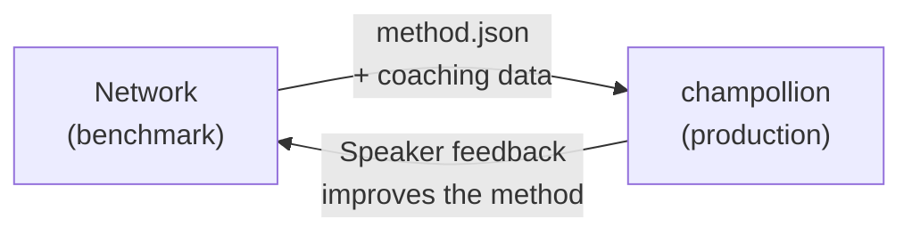

# 部署到生产环境

你已经在 Network 中证明了它的可行性。现在部署它。

Network 用于研发——构建、基准测试和比较翻译方法。**生产部署**通过 [champollion](https://champollion.dev) 进行，这是一个面向开发者的翻译 CLI 工具。它们通过共享的插件格式连接。



---

## 部署路径

### 1. 将你的方法导出为插件

创建一个 `method.json` 清单来打包你的基准测试结果：

```json
{
  "name": "crk-coached-v3",
  "type": "llm-coached",
  "version": "3.0.0",
  "description": "Coached LLM translation for Plains Cree",
  "locales": ["crk"],
  "config": {
    "model": "google/gemini-2.5-flash",
    "temperature": 0.3
  },
  "benchmarks": {
    "crk": {
      "composite_score": 0.67,
      "fst_acceptance": 0.82,
      "corpus_size": 150
    }
  }
}
```

在清单旁边包含任何指导数据（语法规则、词典）。

### 2. 在 Champollion 中安装

```bash
champollion plugin install ./my-method-plugin/
```

### 3. 配置你的语言对

```json title="champollion.config.json"
{
  "pairs": {
    "en-crk": { "method": "plugin", "plugin": "crk-coached-v3" }
  }
}
```

### 4. 翻译真实内容

```bash
npx champollion sync
```

你的基准测试方法现在正在生产环境中生成真实翻译。

---

## 针对土著语言

服务于原住民语言社区的方法在生产部署之前需要获得**社区同意**。原住民数据主权原则——语言数据由社区拥有和控制——规范了翻译方法的开发、评估和部署方式。

达到可部署等级（0.70+）的方法不会自动部署——只有在语言社区的治理机构给予同意时，它才会部署**。

参见 [数据主权](/docs/network/sovereignty/data-sovereignty) 和 [所有权转移](/docs/network/sovereignty/ownership-transfer) 了解完整的治理框架。

---

## 另请参阅

- [Eval Harness Bridge](https://champollion.dev/docs/guides/bridge) — Network→champollion 管道的详细演练
- [插件规范](https://champollion.dev/docs/reference/plugin-spec) — method.json 清单格式
- [champollion Agent 指南](https://champollion.dev/docs/guides/agent-guide) — 如何使用 champollion 进行翻译
