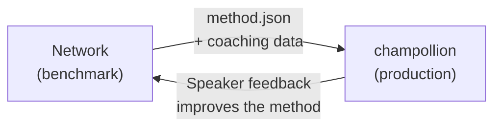

# 部署到生产环境

你已经在 Network 中证明了它的可行性。现在部署它。

Network 用于研发——构建、基准测试和比较翻译方法。**生产部署**通过 [champollion](https://champollion.dev) 进行，这是一个面向开发者的翻译 CLI 工具。它们通过共享的插件格式连接。


```mermaid
graph LR
    A["Network\n(benchmark)"] -->|"method.json\n+ coaching data"| B["champollion\n(production)"]
    B -->|"Speaker feedback\nimproves the method"| A
```

---

## 部署路径

### 1. 将你的方法导出为插件

创建一个 `method.json` 清单来打包你的基准测试结果：

```json
{
  "name": "french-formal-v1",
  "type": "llm-coached",
  "version": "1.0.0",
  "description": "Formal-register French (example manifest; the benchmark values are illustrative)",
  "locales": ["fr"],
  "config": {
    "model": "google/gemini-2.5-flash",
    "temperature": 0.3
  },
  "benchmarks": {
    "fr": {
      "corpus_chrf": 72.3,
      "exact_match_rate": 0.42,
      "corpus_size": 500
    }
  }
}
```

在清单旁边包含任何指导数据（语法规则、词典）。

### 2. 在 Champollion 中安装

```bash
champollion plugin install ./french-formal-v1/
```

### 3. 配置你的语言对

```json title="champollion.config.json"
{
  "pairs": {
    "en:fr": { "methodPlugin": "french-formal-v1" }
  }
}
```

### 4. 翻译真实内容

```bash
npx champollion sync
```

你的基准测试方法现在正在生产环境中生成真实翻译。

---

## 针对土著语言

面向原住民语言社区的方法在投入生产部署前，必须获得**社区同意**。原住民数据主权原则——即社区对语言数据拥有所有权与控制权——规范了翻译方法的开发、评估与部署方式。

没有任何评分能使某种方法直接达到可部署状态——高 chrF++ 分数不行，达到获奖门槛也不行。该方法能够部署，**当且仅当**该语言的使用者对其输出进行评判之后，该语言社区的治理机构给出了许可。

参见 [数据主权](/docs/network/sovereignty/data-sovereignty) 和 [所有权转移](/docs/network/sovereignty/ownership-transfer) 了解完整的治理框架。

---

## 另请参阅

- [Eval Harness Bridge](https://champollion.dev/docs/guides/bridge) — Network→champollion 管道的详细演练
- [插件规范](https://champollion.dev/docs/reference/plugin-spec) — method.json 清单格式
- [champollion Agent 指南](https://champollion.dev/docs/guides/agent-guide) — 如何使用 champollion 进行翻译
