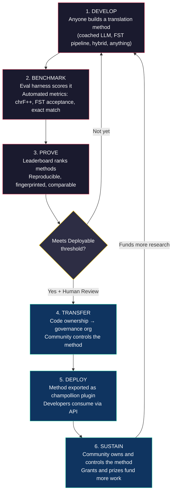
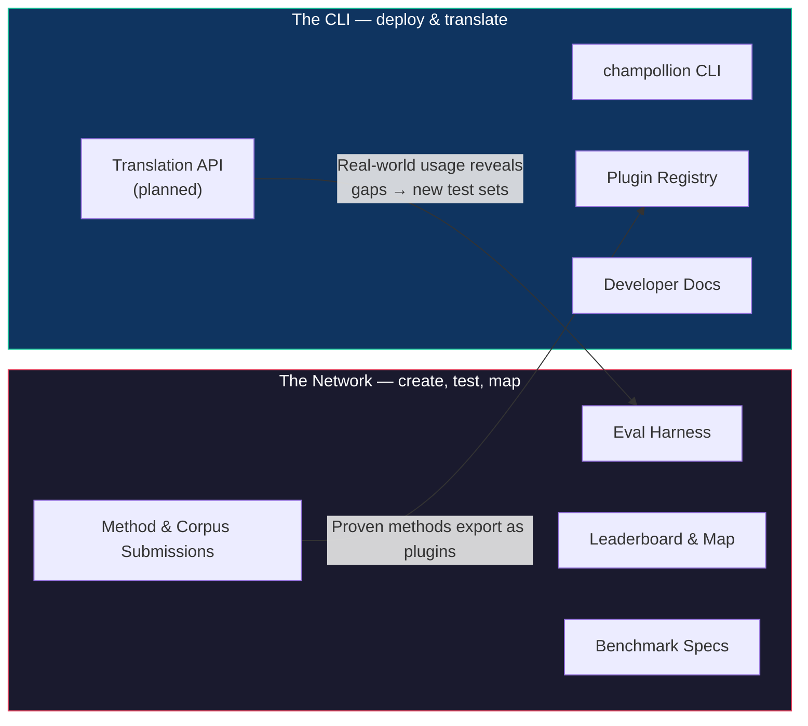
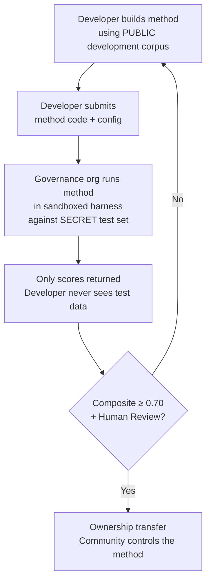

# 网络如何运作：构建、测试、开发、部署

> **执行摘要。** 针对全球资源匮乏语言的机器翻译不是一个模型训练问题——它是一个*基础设施*问题。没有任何单一的模型、实验室或公司能够解决它。本文档描述了一种平台架构，它将全球的机器学习工程师、语言学家和语言使用者社区转变为一个分布式研究实验室：任何人都可以构建一种翻译方法，网络会测试它是否有效——包括使用平台从未见过的、由社区持有的评估数据进行测试——而有效的方法将成为由其所服务语言的社区拥有的资产。其机制是开放、协作的方法开发，并辅以灵活的、由管理者设定的条款——这种组合在实践中仍然很少见，但我们认为这正是解决该问题所需要的。

---

> [!IMPORTANT]
> **范围。** 本平台评估**正式书面文本翻译**——文档、教育材料、官方通信、UI 字符串。它不是聊天机器人、实时口译员或无限制领域的对话系统。排行榜根据特定文本领域中精心策划的平行语料库对翻译方法进行排名（有关领域分类，请参见 [基准规范 §2.7](/docs/network/specifications/benchmark#27-domain)）。机器翻译（MT）是语言复兴的基础设施，而不是其替代品。儿童是从人那里学习语言，而不是从机器那里。

### 当前领域覆盖范围

排行榜是**实时更新并不断填充的**——运行结果会持续发布到排行榜上，
任何人都可以添加更多内容。下表显示了每个领域*支持*哪些公共参考语料库；
[排行榜](/leaderboard)包含实时排名。
语料库在运行时从源获取，绝不托管在此处。

| 领域 | 参考语料库 | 状态 | 备注 |
|--------|------------------|--------|-------|
| 新闻 / 记者 | Global Voices (OPUS) | 支持 — 开放提交 | 493 个语言对，CC BY 3.0 |
| 日常 / 混合（书面） | Tatoeba | 支持 — 开放提交 | 874 个语言对，CC BY 2.0 |
| 教育 / 教科书 | EdTeKLA (Plains Cree) | 仅限研究 — **不参与排名**；远程模型 API 评估需同意授权 | EdTeKLA 修改版的 CC BY-NC-SA（主权范围，非商业用途）；不参与排行榜、奖金和 API/商业通道 |
| 叙事 / 文学 | — | 计划中 | 尚未接入可运行的语料库 |
| 宗教 / 经文 | FLORES+ (Bible-domain) | 已接入，仅限相对比较 | 可运行的语料库；污染度高，因此仅限相对比较 — 绝不用于官方评分 |
| 口语 / 实时 | — | 超出范围 | 本系统评估书面文本，而非语音 |
| 技术 / 科学 | — | 未来计划 | 需要特定领域的术语验证 |

## 网络的作用

在介绍机制之前，先谈谈使命。Champollion Network 建立在四项承诺之上：

1. **创建并信任翻译测试集。** 对于大多数语言来说，稀缺且有价值的不是另一个模型——而是一个*值得信赖*的测试集：由人类编写、领域真实且版本固定。网络的存在就是为了创建这些测试集并使其值得信赖。
2. **使该领域易于导航。** 谁能翻译什么，每种方法在每种文本上的效果如何，以及差距在哪里——这些都作为公共地图呈现，而不是埋没在零散的论文和 PDF 中。
3. **欢迎每一种方法——无论是人类还是机器。** 我们是偏向于解决问题的实用主义者。专业译者、基于规则的系统、经过指导的 LLM、微调模型——所有这些都是一等公民。我们关心的是让语言得到翻译，而不是哪个工具获胜。
4. ***与*社区共同构建，绝不抓取——主权是不容谈判的。** 语言数据是生物数据；提供语料库的人掌握着它的钥匙，以及任何针对它进行衡量的事物的钥匙。

以下所有内容——循环、测试工具（harness）、排行榜、部署桥梁——都是为了服务于这四项承诺。

---

## 1. 问题：机器翻译 ≠ 机器学习

低资源语言（LRLs）的机器翻译通常被构建为一个机器学习问题：收集数据、训练模型、部署。这种框架是错误的，而且这种错误影响深远——它将资金、人才和基础设施引向了一种在结构上无法适用于世界上大多数语言的方法。

### 1.1 为什么机器学习框架会失败

用于机器翻译的标准机器学习流水线需要三样东西：大型平行语料库、经过验证的评估基准以及部署路径。对于 Google Cloud Translation 列表上的 194 种语言和 NLLB-200 涵盖的 200 种语言，这三者都存在。对于 OMT-1600 长尾中的约 1,200 种语言——我们的算法是：它涵盖的 1,600 种语言减去其作者报告模型“理解得足够好”的 400 多种语言——评估数据存在，但质量大多低于可用阈值，模型权重未公开，也没有部署流水线。对于剩余的约 5,400 多种语言，这三者都不存在。

| 需求 | 高资源语言 | OMT-1600 长尾（约 1,200 种 LRLs） | 剩余约 5,400 种语言 |
|-------------|------------------------|-------------------------------|---------------------------|
| **平行语料库** | 数百万个句子对（Europarl、UN Corpus、OpenSubtitles） | 圣经领域的双语文本、网络抓取、合成回译。没有社区策划的数据。 | 几百到几千个（如果有的话） |
| **评估基准** | WMT、FLORES、NTREX — 标准化、可重复 | BOUQuET（圣经领域）、met-BOUQuET。没有形态学验证。没有独立评估。 | 没有标准基准；临时评估 |
| **部署路径** | Google Translate、DeepL、Azure — 商业 API | 模型权重未发布。没有 CLI，没有插件系统，没有社区可部署的 API。 | 什么都没有。没有 API，没有产品，没有市场。 |

当存在用于训练的数据和用于部署的市场时，机器学习方法是有效的。OMT-1600 极大地扩展了第一个条件——但如果没有独立的质量验证、形态学验证或社区治理，这种扩展就是没有信任的扩展。问题不仅仅是“我们需要一个更好的模型”——而是“我们需要基础设施来证明模型有效，并且是在社区控制的条款下”。

### 1.2 LRLs 的机器翻译实际需要什么

资源匮乏语言的翻译主要不是一个训练问题。它是一个**方法工程（method engineering）**问题——挑战在于将可用资源（LLM、形态学工具、社区知识、语言规则）组装成有效的翻译流水线，然后通过严格的评估证明它们有效。

这种区别很重要：

| 维度 | 机器学习方法 | 方法工程方法 |
|-----------|------------|---------------------------|
| **核心活动** | 在数据上训练模型 | 将工具、提示词和语言知识组合成流水线 |
| **瓶颈** | 平行数据量 | 工程创造力 + 评估基础设施 |
| **谁能贡献** | 拥有 GPU 集群和数据集的团队 | 任何拥有 API 密钥、字典和想法的人 |
| **评估** | 在保留测试集上的 BLEU/chrF | 形态学验证 + 人工审查 + 自动化指标 |
| **部署** | 提供模型服务 | 将方法打包为插件 |

现代 LLM 已经包含了许多低资源语言的潜在知识——足以产生*看起来*合理的输出。问题在于，这种输出通常在形态学上是无效的（模型会幻觉出该语言中不存在的词形）。工程挑战在于：你如何提取 LLM 所知道的内容，根据语言现实对其进行验证，并将结果打包以供生产使用？

这就是为什么我们对**方法**而不是模型进行基准测试。方法是完整的配方：模型选择 + 提示词工程 + 工具使用 + 预处理/后处理 + 指导数据 + 重试策略。两个团队使用相同的模型和不同的方法会得到不同的分数。这正是重点所在。

### 1.3 为什么多式综合语会打破一切

世界上许多最缺乏资源的语言都是**多式综合语（polysynthetic）**——它们通过多产的形态学过程将整个句子编码成单个单词。以 Plains Cree（平原克里语）单词为例：

> **ê-kî-nitawi-kîskinwahamâkosiyân**
> *"当我上学的时候" (when I had gone to school)*

一个词。它编码了时态（过去时）、方向（去）、词根（学习）、语态（被动/反身）和人称（第一人称单数）。英语需要六个词来表达克里语一个词所表达的意思。

这在各个层面上打破了标准的机器翻译：

- **分词（Tokenization）** — BPE 和 SentencePiece 将多式综合语单词撕裂成毫无意义的片段，因为它们是为黏着语态设计的。
- **幻觉（Hallucination）** — LLM 会产生看起来合理但并非有效单词的字符串。非母语者无法分辨其中的区别。如果没有形态学验证，幻觉是不可见的。
- **评估（Evaluation）** — 词级指标（BLEU）会惩罚自然的屈折变化，而这种变化是这些语言运作方式的基础。字符级指标（chrF++）更好，但如果没有结构验证，仍然不够。

解决方案不是更大的模型或更多的训练数据。而是**在幻觉到达用户之前捕获它们的基础设施**——能够明确指出“这不是该语言中的单词”的形态分析器（FST）。

---

## 2. 为什么现有方法行不通

### 2.1 商业机器翻译

商业翻译服务历来针对市场容量进行优化。Meta 的 OMT-1600（2026 年 3 月）代表了一个重大转变——一个系统包含 1,600 种语言。但对于其长尾中的约 1,200 种语言（我们的算法：1,600 减去其作者报告模型“理解得足够好”的 400 多种语言），质量低于可用阈值，模型权重不可用，也没有部署流水线。结构性激励问题已经演变：大型科技公司现在可以为 LRLs 构建模型，但如果没有独立评估、形态学验证或社区治理，仅靠覆盖率并不能解决问题。

### 2.2 学术研究

学术界的机器翻译研究绝大多数集中在高资源语言对上，因为那里有训练数据、共享任务和发表渠道。研究低资源语言对的研究人员在发表论文、筹集计算资金和部署方面举步维艰——因为 LRLs 的部署基础设施根本不存在。

### 2.3 一次性竞赛

你可以举办一场 Kaggle 竞赛：“英语→Plains Cree，最佳 chrF++ 赢得 10,000 美元。” 以下是会发生的情况：

1. 有人获胜，提交一个 notebook，领走奖金，然后回家。
2. 这个 notebook 在 Kaggle 的档案中腐烂。没有人部署它。没有人维护它。
3. 测试集最终被公开——永远被污染。
4. 治理组织根据 Google 的服务条款将他们的语言数据上传到 Google 的基础设施，对生命周期没有真正的控制权。
5. 没有部署桥梁。获胜的 notebook 不是一个可用的 API。

一次性的赏金会吸引赏金猎人。而具有社区治理的持续排行榜则能创造持续的参与。

### 2.4 微调

在平行文本上微调开放模型是显而易见的机器学习方法。但对于大多数 LRLs 来说，微调所需的平行语料库恰恰是不存在的数据——而创建它需要双语使用者和社区参与，这正是微调本应取代的东西。你无法用一种需要数据的技术来引导自己摆脱数据稀缺的问题。

---

## 3. 解决方案：具有主权评估的协作方法开发

该平台颠覆了传统方法：不再是一个团队构建一个模型，而是**全球社区共同构建和测试翻译方法**，网络验证哪些方法有效，有效的方法部署到生产环境中，而语言社区保留所有权和控制权。

### 3.1 完整循环

每个阶段都有特定的功能：

| 阶段 | 发生什么 | 谁受益 |
|-------|-------------|--------------|
| **开发 (Develop)** | 研究人员、学生或爱好者使用他们想要的任何工具构建翻译方法——LLM 提示词、FST 流水线、字典、微调模型、基于规则的系统或混合系统 | 贡献者学习、实验、发表 |
| **基准测试 (Benchmark)** | 评估工具（eval harness）使用可重复的指标根据标准化语料库对方法进行评分。每次运行都会生成一个 [运行卡 (run card)](/docs/network/specifications/benchmark#3-run-card-schema)——完整记录测试内容及其表现 | 研究人员获得可重复、可比较的结果 |
| **证明 (Prove)** | 结果出现在公共排行榜上。方法被排名、比较和审查。社区可以看到什么有效，什么无效 | 每个人都能了解最先进的技术水平 |
| **转移 (Transfer)** | 对于原住民语言，达到可部署阈值（综合得分 ≥ 0.70）且通过人工验证的方法，其代码所有权将转移给语言社区的治理组织 | 社区完全拥有该方法——代码、权重和部署决策 |
| **部署 (Deploy)** | 该方法被导出为社区可以在其自身基础设施上运行的 [champollion](https://github.com/gamedaysuits/Champollion) 插件。开发者无需了解底层方法即可使用翻译 | 开发者获得商业 API 不提供的语言翻译 |
| **维持 (Sustain)** | 赠款资金和赞助奖金——该项目正在积极寻求这些资金；目前它是自筹资金的——用于支付更多语料库、母语者验证和研究的费用。Champollion 是非商业性的，不从社区通过其拥有的资产赚取的任何收益中抽成 | 有偿的语料库工作和社区拥有的方法比任何单一的赠款都更持久 |

### 3.2 为什么开放协作有效

开放参与不是偶然的——它就是机制本身。原因如下：

**方法的多样性。** 英语→Plains Cree 的最佳方法可能是由 FST 门控的指导型 LLM。英语→Quechua 的最佳方法可能是字典增强的流水线。英语→Inuktitut 的最佳方法可能是从 Nunavut Hansard 语料库引导的微调模型。没有任何单一的团队或方法能够主导所有语言。排行榜揭示了哪些*类型*的方法适用于哪些*类型*的语言——这种元结果本身就是一项研究贡献。

**持续参与。** 排行榜永远不会完结。总有更好的方法可以构建。每一次提交都为解决这个问题贡献了计算资源和智力成果。与一次性赠款不同，这种开放、持续的过程会产生来自全球社区的持续研究投资。

**低准入门槛。** 你只需要一个 API 密钥、一本字典和一个想法。评估工具是开源的。语料库格式是简单的 JSON。一个语言学学生可以与资源丰富的实验室相匹敌——有时甚至做得更好，因为领域知识（理解语言）可以胜过计算资源。

**部署桥梁。** 在测试工具中得分很高的方法，只需更改一次配置即可部署到生产环境中。“在这里证明，在那里部署。” 这是 Kaggle、WMT 共享任务和学术出版物未能跨越的鸿沟。

### 3.3 平台架构

champollion.dev 是**一个具有两面的枢纽**。同一个网站托管着 Network（网络）——在这里创建测试集、评估方法并映射结果——以及 CLI，在这里经过验证的方法被部署到实际项目中。它们共享一个域名、一套文档和一个数据层；下面的标签描述的是两个*角色*，而不是两个网站。

**[Network](/docs/network/)** 是试验场。它的受众是译者、语言学家、社区和研究人员。这里的一切都是关于创建测试集，根据测试集评估方法——无论是人类还是机器——并映射差距所在。

**[CLI](https://champollion.dev)** 是部署端。它的受众是需要为其应用程序提供翻译的开发者。他们不需要了解方法是如何工作的——他们只需调用它。

连接这两面的桥梁是**方法**：在 Network 上创建并获得信任，通过 CLI 打包部署，并且——对于社区语言——由社区拥有。

---

## 4. 主权评估：为什么基础设施很重要

评估基础设施不是一个技术细节——它是主权模型的核心。标准评估（将你的测试集上传到共享平台）对原住民语言不起作用，因为它放弃了对语言数据的控制权。

### 4.1 主权机制

开发者永远看不到黄金标准的评估数据。他们针对公共开发语料库进行开发，然后将他们的方法代码提交给治理组织，治理组织在沙盒中针对秘密测试集运行该代码。只有分数会返回。这不仅仅是安全性——它的构建是朝向原住民数据主权原则——语言数据由社区拥有和控制——的要求。它是否符合这些原则不是由我们决定的：决定权属于相关社区。

### 4.2 为什么这不能在别人的平台上运行

在 Kaggle 上，治理组织根据 Google 的服务条款将他们的语言数据上传到 Google 的基础设施。他们无法按照自己的时间表撤销访问权限。他们无法在提交中附加自定义法律条款（如所有权转移）。他们没有加密保证数据不会被用于其他目的。数据主权意味着社区控制评估端点，掌握密钥，并且可以将其关闭。

---

## 5. 评估理念：微评估 (Microeval) 与 LYSS

标准机器翻译指标（BLEU、chrF++、COMET）旨在跨语言泛化。这种泛化性是它们的优势——也是它们的盲点。对于多式综合语，一个在形态学上无效但与参考文本共享字符 n-gram 的单词在 chrF++ 上得分很高，但任何母语者都会认为它是胡言乱语。

**微评估开发**意味着使用最好的可用语言工具构建为特定语言量身定制的评估指标。该框架被称为 **LYSS**（Linguistically-informed Yield & Structural Scoring，基于语言学的产出与结构评分）：

| 组件 | 测量内容 | 工具 | 状态 |
|-----------|-----------------|------|--------|
| **LYSS-fst** | 形态学有效性 | 有限状态转换器 (FST) | ✅ 已实现 (Plains Cree) |
| **LYSS-eq** | 语言等效性 | 语言学家策划的变体规则 | ✅ 已实现 (Plains Cree) |
| **LYSS-sem** | 语义保留 | 特定语言的语义模型 | ✅ 已实现 (Plains Cree) |

通用指标（chrF++、BLEU）作为基线，并作为没有 LYSS 工具的语言的主要信号。只要存在特定语言的工具，LYSS 组件就会承担评分权重——因为对每种语言来说最重要的事情，只有特定语言的工具才能衡量。

有关完整的 LYSS 规范和综合评分逻辑，请参见 [SCORING_SPEC.md §4](/docs/network/specifications/scoring#4-composite-score)。

> [!WARNING]
> **跨运行可比性。** 当比较具有不同指标可用性的运行（例如，一个运行有 FST 分数，另一个没有）时，综合分数不能直接比较。综合分数会根据可用指标进行归一化，但在 5 个指标上评估的运行比在 2 个指标上评估的运行包含更多信息。排行榜会指示每个条目的指标覆盖范围。

---

## 6. 服务对象

### 面向机器学习工程师和研究人员

一个开放的排行榜，为没有共享任务涵盖的语言对提供标准化基准。使用评估工具重现任何结果。发布你的方法。打破最高分。每次提交都与特定的配置和数据集版本绑定指纹——测试内容没有任何歧义。

### 面向语言社区

拥有并控制为你的语言构建的翻译技术。竞争机制意味着多个团队同时在研究你的语言——你从所有团队中受益并拥有最终成果。利益通过社区治理的所有权、归属权、能力和数据条款流动——绝不是收入分成：Champollion 是非商业性的，不从社区通过其拥有的资产赚取的任何收益中抽成。

### 面向资助者和赠款审查员

透明、可重复的指标，用于评估翻译研究提案。超越出版物的可衡量成果：随时间推移的质量指标、语言覆盖率、在管理者控制下构建和注册的语料库、向社区提供的有偿母语者工时。成功的方法将成为在开放评估基础设施上运行的社区自有资产——赠款的影响力通过可重用的方法和公共基准不断复合，而不是在资金结束时终止。

### 面向开发者

为没有商业 API 服务的语言提供翻译。一个 CLI 命令 (`npx champollion sync`) 即可使用经过社区验证的方法翻译你的区域设置文件。在同一个项目中，使用 Google Translate 翻译法语，使用经过指导的 LLM 翻译 Plains Cree，使用社区 API 翻译 Quechua——所有这些都使用相同的接口。

### 面向学生

一项具有现实世界影响力的公开挑战。为资源匮乏的语言构建翻译方法，对其进行基准测试，并发布你的结果。基础设施是免费的，数据集是开放的，排行榜不在乎你是在排名前十的大学还是在图书馆终端工作。

---

## 7. 社会与技术背景

### 7.1 语言复兴正在加速

语言复兴工作正在全球范围内发展。沉浸式学校、社区语言巢和数字存档项目正在加拿大、美国、澳大利亚、新西兰和北欧的原住民社区中扩展。这些工作需要技术——具体来说，是尊重社区对语言数据主权的翻译技术。

### 7.2 LLM 改变了基线

在 2023 年之前，为多式综合语构建任何机器翻译能力都需要大量的 NLP 专业知识、定制模型训练和庞大的计算预算。现代 LLM 改变了基线：精心设计的提示词加上指导数据和形态学验证，可以为某些语言对生成可用的翻译——无需训练。这极大地降低了方法开发的门槛。问题已经从“我们如何构建一个模型？”转变为“我们如何构建一个流水线来验证和纠正模型产生的内容？”

### 7.3 开放、可重复的测量

公开、共享的评估重塑了该领域了解什么有效的方式。Chatbot Arena、LMSYS 和 Hugging Face Open LLM Leaderboard 表明，开放、可重复的测量——任何人都可以运行，任何人都可以检查——比封闭的、自我报告的声明能更快地展现真正的进展。我们吸取了这一经验，而不是锦标赛文化，并将其指向数千种商业机器翻译不存在或尚未经过独立验证的语言的翻译。目标是建立一个共享的、可检查的地图，说明什么方法适用于哪些语言和哪些类型的文本——而不是谁击败了谁的排名。

### 7.4 原住民数据主权是不容谈判的

原住民数据主权原则——语言数据由社区拥有和控制、CARE 原则（集体利益、控制权、责任、道德）以及 Te Mana Raraunga（毛利数据主权）等框架不是可选的附加组件——它们是任何涉及原住民语言资源的技术的结构性要求。我们的评估基础设施在架构上（而不仅仅是在政策声明中）旨在符合这些原则——至于它是否符合，决定权属于社区，而不是我们。

---

## 8. 冲突与局限性 {#8-tensions-and-limitations}

本项目使用一种西方机制——竞争性基准测试——来服务于通常是公共的、关系型的、由长者指导的知识系统。这种冲突是真实存在的，必须被指出来，而不是通过断言来解决。

**基准测试与公共知识。** 排行榜对个人进行排名并优化数字分数。原住民知识传统强调关系权威、公共纠正和基于关系的合法性。我们不能在构建一个核心机制是个人竞争优化的平台的同时，声称服务于这些知识系统。主权架构（§4）——社区拥有方法、控制评估并决定部署什么——是我们的结构性回应，但它并没有消除这种冲突。排行榜仍然是排行榜。

**我们正在采取的措施。** 平台支持团队和社区提交，也支持个人提交。排行榜将结果构建为“当前最先进的技术”，而不是“谁在获胜”。治理组织——而不是排行榜分数——决定部署什么。没有任何自动分数赋予开发者任何权利；由社区决定。我们与合作社区保持持续的咨询反馈循环，以了解平台的框架和激励结构是否为他们服务。如果不是，我们会改变它。

**机器翻译不是复兴。** 翻译在语言之间转换文本。复兴创造新的母语者。一个完美的机器翻译系统并不能解决传承问题、声望问题或教学问题。它甚至可能制造“计算机可以说这种语言”的错觉，从而削弱人类传承的紧迫性。我们将机器翻译构建为基础设施——用于译后编辑的草稿翻译、用于语言学习应用程序的形态学工具、社区要求以其语言提供服务的政治筹码——而不是作为代际传承的替代品。社区控制是否、何时以及如何部署该技术。

本节的存在是因为这些冲突在一次受邀的批评（2026 年 5 月）中被指出，我们承诺公开指出它们，而不是将它们掩埋在内部文档中。

> [!NOTE]
> **排行榜分数是自动化的代理指标。** 排行榜上显示的所有分数都是由评估工具在受控条件下计算出的自动化测量值。它们指示相对的方法性能，但不构成质量保证。经过社区验证的方法会单独标记。没有任何自动分数赋予开发者部署的权利——治理组织做出该决定。

---

## 9. 当前状态

### 目前已有的内容

- **champollion** — CLI 工具。多种翻译方法、每对语言的配置、质量门控，以及对常见区域设置文件格式的支持。
- **MT Eval Harness** — 工作中的评估框架。实现了 chrF++、FST 接受度和完全匹配指标。运行卡模式已最终确定。指纹识别和完整性验证正在工作。
- **EDTeKLA Dev v1** — Plains Cree 评估语料库（EdTeKLA 修改版的 CC BY-NC-SA — 主权范围，非商业用途），源自阿尔伯塔大学的 EdTeKLA 研究组。不参与排行榜、奖金和 API/商业通道（非商业许可）；条目数量在[评估数据集页面](/docs/network/leaderboard/datasets#edtekla-development-set-v1)上说明了一次。
- **FLORES+ Devtest** — 1,012 个句子 × 870 个编目的语言对 (CC BY-SA 4.0)。
- **Network 网站** — 基于 Docusaurus 的文档网站，包含排行榜、规范、教程和主权框架。
- **基准规范** — 定义语料库模式、运行卡格式和评估协议的[规范标准](/docs/network/specifications/benchmark)。有关指标定义、综合权重和质量层级，请参见 [SCORING_SPEC.md](/docs/network/specifications/scoring)。

### 下一步计划

| 阶段 | 内容 | 状态 |
|-------|------|--------|
| 基线扫描 | 在 EDTeKLA 上进行 12 个模型 × 3 个温度 × 2 个指导配置的测试 | ⏸ 需同意授权 — 等待权利人记录在案的远程模型 API 评估许可 |
| 综合得分 | 在测试工具中实现加权指标 | ✅ 完成 |
| 语义得分 | 来自 CrkSemanticMetric（评估标准）的判决加权得分 | ✅ 完成 |
| 形态学准确性 | 根据黄金标准分析进行逐个语素评分 | 🔲 计划中 |
| 等效匹配 | 通过 CrkLinterMetric（评估标准）进行变体类匹配 | ✅ 完成 |
| Champollion API | 社区自有方法的 API | 🔲 计划中 |
| 第二语言 | 扩展到第二个语言对（Inuktitut、Quechua 或 Sámi） | 🔲 计划中 |

---

## 10. 快速入门

**构建方法：** 克隆[评估工具](https://github.com/gamedaysuits/Champollion)，运行基线实验，看看你在排行榜上的位置。

**贡献语料库：** 如果你说的是一种资源匮乏的语言，即使是 50 个精心策划的翻译对也足以开启一条新的排行榜赛道。请参见[面向语言社区](/docs/network/community/for-language-communities)。

**部署翻译：** 安装 [champollion](https://github.com/gamedaysuits/Champollion) 并使用 `npx champollion sync` 翻译你的应用程序。

**资助这项工作：** 有关成本框架和可持续性预测，请参见[经济模型](/docs/network/sovereignty/economic-model)。

---

## 另请参阅

- **[基准规范](/docs/network/specifications/benchmark)** — 语料库格式、运行卡模式、评估协议、主权
- **[评分规范](/docs/network/specifications/scoring)** — 指标、综合权重、质量层级、成本/速度公式
- **[Network](/arena)** — 研发试验场
- **[champollion](https://github.com/gamedaysuits/Champollion)** — 部署平台
- **[支持低资源语言](/docs/network/community/low-resource-languages)** — 深入探讨多式综合语机器翻译的挑战和方法

---

*本文档是任何首次接触该项目的人的切入点。有关完整的技术规范，请参见 [BENCHMARK_SPEC.md](/docs/network/specifications/benchmark)（协议）和 [SCORING_SPEC.md](/docs/network/specifications/scoring)（指标）。*
