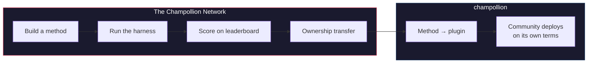

# Champollion 网络

> **执行摘要。** Champollion 网络是一个开放的基础设施，旨在为尽可能多的语言对*创建并信任*翻译测试集——它由专业人士和社区*共同*构建，绝非从他们那里抓取——并使整个领域变得清晰可导航：谁能翻译什么，每种方法在各类文本上的表现如何，以及差距在哪里。欢迎任何方法，无论是人工还是机器。你也可以构建并提交一种方法，查看它在真实语料库中的得分。对于由社区提供数据的语言，主权是不容谈判的：提供语料库的人掌握着该语料库以及任何基于它进行衡量的结果的控制权。

本节是该地图的主页。其下的页面解释了如何构建已测量语言对的网络（[网络如何运作](/docs/network/how-it-works)），为什么公共工作队列会这样排序（[为什么需要队列](/docs/network/perspectives/why-the-queue)和[队列构建规范](/docs/network/specifications/queue-construction)），以及如何计算连接强度（[连接强度](/docs/network/specifications/connection-strength)）。如果你正在决定是否要信任这个项目，请从[诚实的局限性](/docs/network/honest-limitations)开始；如果你已经知道自己想构建什么，入口在[Champollion 是什么](/docs/what-is-champollion)。

**它运行在两种基准测试上。** *公共基准测试（Public benchmarks）*使用开放数据集，以低成本和公开的方式对每种方法进行映射和排名——这是抓取/开放数据的基准层，并注明了污染风险。*主权基准测试（Sovereign benchmarks）*是黄金标准：由语言社区创建、拥有和控制的秘密测试集，Champollion **永远看不到**这些数据——仅在社区授权时进行盲测评估。基础设施本身是源码可用的（source-available）且由单一主体管理；属于社区的是他们语言的测试集以及为其构建的方法。

:::info[启动/种子阶段]
该网络还很年轻，但已上线：排行榜上展示了真实发布的运行结果，并开放供任何人提交。关于我们确切声明和尚未声明的内容——验证、社区确认、保留评估（held-out evaluation）——请参阅 **[诚实的局限性](/docs/network/honest-limitations)**。
:::

---

## 问题

Google 的 Cloud Translation 服务列出了 194 种语言（[Google 发布的列表](https://docs.cloud.google.com/translate/docs/languages)）。Meta 的 NLLB-200 涵盖了 200 种，而 OMT-1600（2026 年 3 月）声称涵盖 1,600 种。地球上使用的口语超过 7,000 种。对于 OMT-1600 长尾中的约 1,200 种语言——我们的算法是：它涵盖的 1,600 种减去其作者报告模型“理解得足够好”的 400 多种——模型权重不可用，质量低于可用阈值，且评估使用的是圣经领域的文本和标准机器指标——没有形态学验证，没有独立测试，也没有社区治理。对于剩余的约 5,400 种语言，没有任何预训练模型能产生任何输出。

大型科技公司现在正投资于低资源语言（LRL）的覆盖——但没有独立质量验证、形态学验证或社区治理的覆盖，是缺乏信任的覆盖。最需要翻译工具的母语者，往往正是最不可能拥有这些工具的社区。

**该网络的存在就是为了改变这一现状。** 它提供了创建测试集的基础设施，针对这些测试集评估任何方法（人工或机器），并映射结果，适用于任何语言，具有可复现的评分、开放的提交机制，以及由社区治理来决定谁控制数据和结果。

语言数据是*生物数据（biodata）*。就像基因或健康数据一样，语言承载着使用它的人们的身份和关系，并且无法进行有意义的匿名化——因此，提供语料库的人掌握着该语料库以及任何基于它进行衡量的结果的控制权。主权在这里不是一个附加功能；它是构建其他一切的基础。

---

## 运作方式

1. **你构建一种翻译方法**——经过指导的 LLM、微调模型、基于 FST（有限状态转换器）的流水线，或任何其他能产生翻译的方法。
2. **测试框架对其进行基准测试**——标准化指标（chrF++、精确匹配、FST 接受度），并与特定的 Git 提交进行指纹绑定。
3. **结果显示在排行榜上**——实时更新并开放提交；每次发布的运行都是可复现且可比较的。
4. **当方法有效时，所有权转移**——对于原住民语言，该方法的代码将转移给社区治理组织。
5. **社区进行部署——由他们决定是否部署以及如何部署。** 该方法可导出为 [champollion](https://champollion.dev) 插件，并完全在社区基础设施上运行。Champollion 不会从中抽取任何收益分成。

**在这里构建。在那里部署。**

:::tip[攻克一门语言，赢得奖励，回馈社区]
这有意被设计为一个机器学习基准测试操作——竞争是解决困难语言对的方式。我们邀请机器学习研究人员和任何有能力的开发者为特定的困难语言对构建最佳方法，**在悬赏开放时赢得奖金**，*并*将产生的方法移交给拥有该语言的主权组织。竞争的能量是真实的；它指向的是使命，而不是为了爬排行榜而爬排行榜。请参阅[奖金规范](/docs/network/specifications/prizes)。
:::

---

## 适用人群

| 如果你是... | 网络为你提供... |
|---|---|
| **机器学习工程师 / 研究员** | 标准化基准测试、可复现的评分、用于测试的共享语料库 |
| **语言学家** | 一个将语法规则和词典转化为可测试方法的框架 |
| **专业 / 人工译者** | 一个注册你的服务并被发现的地方——人工翻译在这里是一等方法，与机器并列展示和进行基准测试，绝非事后补充 |
| **语言社区成员** | 对你的语言方法如何开发和部署的治理权 |
| **资助者 / 拨款审查员** | 透明、可复现的指标，用于评估翻译研究提案 |
| **学生** | 一份具有实际影响力的公开邀请——构建一种方法，贡献你的结果 |

---

## 支持的参考语料库

**排行榜已上线，目前仍处于早期阶段**——首批扫描结果已发布，随着贡献者运行队列项，更多结果将陆续登陆。以下内容不是排行榜；它是目前提交内容可以用来评分的公共参考语料库集合。语料库绝不会托管在这里：测试框架在运行时从上游源获取参考数据，并根据最新获取的数据进行评分。

### Global Voices (OPUS) — 新闻领域
- **覆盖范围：** 已编目且可运行 493 个语言对（例如 `eval-amh-fra-globalvoices-test-v1`，阿姆哈拉语 → 法语）
- **许可证：** CC BY 3.0
- **来源：** [Global Voices via OPUS](https://opus.nlpl.eu/)

### Tatoeba — 对话 / 混合领域
- **覆盖范围：** 已编目且可运行 874 个语言对（例如 `eval-afr-eng-tatoeba-dev-v1`，南非荷兰语 → 英语）
- **许可证：** CC BY 2.0
- **来源：** [Tatoeba 社区](https://tatoeba.org)

:::note[EdTeKLA 仅用于研究——不是排名基准测试]
EdTeKLA 平原克里语（Plains Cree）语料库（*Cree: Language of the Plains*）带有
[EdTeKLA 的**修改版** CC BY-NC-SA](https://github.com/EdTeKLA/IndigenousLanguages_Corpora)
——具有主权范围的非商业条款（基础教科书本身是 CC BY-NC-ND 4.0）。它被**排除在所有排名之外**——它没有资格参与排行榜、任何奖项或 API/商业通道——并且对其进行远程模型 API 评估是**受同意限制的（consent-gated）**：除非记录了权利人的明确许可，否则测试框架拒绝将其文本发送给第三方模型 API（本地评估仍然可行）。

FLORES+ 在这里**已**接入且可运行（870 个已编目的语言对，例如
`eval-flores-devtest-v1-amh-fra`），但它是**高污染（HIGH-contamination）**的——前沿模型很可能已经见过的公开网络抓取评估数据。
因此，它**仅具有相对意义**：可用于方法之间的正面比较，但
**绝不作为绝对质量基准测试报告**，并且它**仅用于测试/演示**。FLORES+ 的结果绝不会作为质量分数进行排名，也绝不会用作[翻译地图](https://champollion.dev)上的链边（chain edge）。
有关我们确切声明和尚未声明的内容，请参阅[诚实的局限性](/docs/network/honest-limitations)。
:::

---

## 唯一规则

:::danger[不要在评估数据上进行训练]
接触过基准测试数据集的方法——无论是作为训练数据、少样本（few-shot）示例、词典条目还是提示词材料——都将被**取消资格**。你可以在任何你想要的数据上进行微调。只是不能在测试集上。
:::

---

## 后续步骤

- **[提交方法](/docs/network/getting-started/submit-a-method)** —— 如何提交你的首次基准测试运行
- **[基准测试规范](/docs/network/specifications/benchmark)** —— 完整的实验协议
- **[排行榜规则](/docs/network/leaderboard/rules)** —— 提交标准和反作弊政策
- **[数据管理](/docs/network/sovereignty/data-sovereignty)** —— 语料库由其管理者保留；尊重每一个许可证
- **[工作资金来源](/docs/network/sovereignty/economic-model)** —— 非商业性质且目前为自筹资金；正在寻找资助者，每一美元的去向都会公开

**[→ 查看排行榜](https://champollion.dev/leaderboard)**
