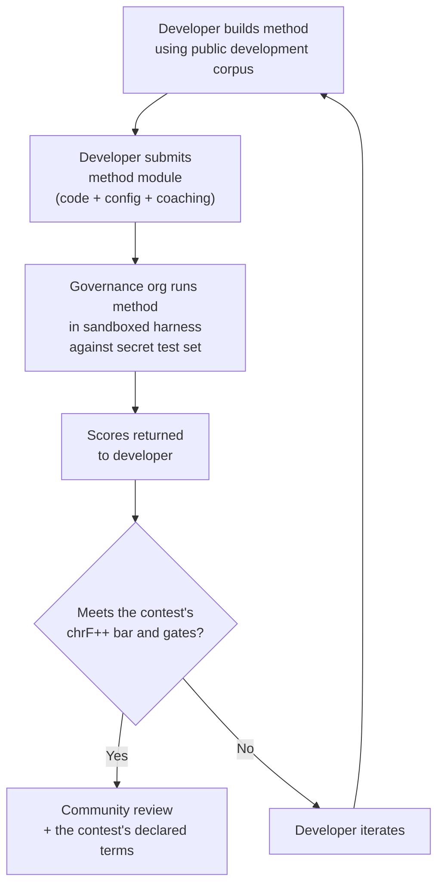

# 基准规范

> **执行摘要。** 本文档定义了 Champollion 机器翻译评估生态系统的评估协议：语料库格式（§2）、运行卡规范（§3）、基准测试协议（§6）、人工验证要求（§7）、主权机制（§8）、排行榜与提交模型（§9）、成本框架（§10）以及对新语言的可扩展性（§11）。有关运行如何评分（chrF++ 主要指标、并列的标准指标以及诊断指标）以及成本/速度指标公式，请参阅 `SCORING_SPEC.md` —— 它是所有评分逻辑的唯一可信源。本文档引用 SCORING_SPEC 获取这些细节，而非重复说明。


---

## 1. 原则

### 1.1 语言是生物数据

语言不是中立的测试材料。就像遗传或健康数据一样，语言数据是**生物数据**：它承载着说话者的身份、亲缘关系和相互关系，并且无法有意义地匿名化 — 剥离元数据后，语言仍然编码了其使用者的身份。这对本规范的后果是具体的：提供语料库的人掌握着它的钥匙，以及针对它进行的任何测量的钥匙。因此，主权（§8）不是协议的附加项；它是协议的前提条件，下面的所有其他原则都在它内部运作。

### 1.2 自动化指标是代理

本文档中定义的每个指标都是机器计算的。chrF++、FST 接受度、形态学准确性、语义相似性 — 所有这些都是翻译质量的自动化代理。它们对于快速迭代、系统比较和检测回归很有用。它们**不是人工判断的替代品**。

评估层次结构：

```
Automated metrics (run cards, benchmarks)
    ↓ proxy for
Human review (bilingual speakers validate output)
    ↓ proxy for
Actual utility (does this help a language community?)
```

无论自动评分多高，都无法取代流利的母语使用者阅读输出并确认其准确、自然且符合文化规范。正因如此，没有任何自动评分会带有质量标签（§5）：自动指标有助于跟踪进展，但单凭它们自身绝不充分。

### 1.3 方法，而非模型

我们对**方法**进行基准测试，而不是模型。模型是一个组件。方法是完整的配方：模型选择、提示设计、工具使用、前/后处理、教练数据、重试策略，一切。两个使用相同模型但采用不同方法的团队将获得不同的评分。这就是重点。

### 1.4 可重现性

每个基准测试结果都必须是可重现的。运行卡（§3）捕获实验的完整配置。指纹（§3.5）标识实验设置。运行卡哈希（§3.6）验证结果的完整性。任何使用相同方法、语料库和配置的人应该获得相差 ±2% 的评分（考虑到温度 > 0 时的 LLM 采样非确定性）。

### 1.5 无合成评估数据

**本项目不生成、使用或认可合成评估数据。** 所有语料库必须来自真实的人工创作文本 — 已发布的翻译、教科书、双语文档或来自流利使用者的引出翻译。

LLM 可以协助：
- 句子对齐（在现有双语文本中查找平行段落）
- 格式转换（将已发布的材料转换为语料库架构）
- 元数据丰富（建议难度等级、寄存器标签）
- 提议源句子供人工翻译（§11.3 — 翻译步骤始终是人工的）

LLM **绝不**应该生成参考翻译或评估对。

**我们在训练数据上是开发中立的。** 如果方法开发者在其方法中使用合成训练数据、回译或数据增强，那是他们的选择 — 我们评估输出，而不是训练过程。Meta 的 OMT-1600 使用大约 2.7 亿个通过回译生成的合成平行句子。我们对以这种方式训练的方法没有异议。我们仅在人工策划的数据上进行测试。

> **为什么不使用圣经文本进行评估？** OMT-1600 在圣经领域文本上评估 1,560 个 1,600 种语言（Meta AI，*Omnilingual MT*，arXiv:2603.16309，2026）。圣经翻译具有古老的寄存器、礼仪词汇和公式化的句子结构。我们的评估语料库来自社区策划的、领域多样化的文本 — 健康、法律、教育、政府、会话和技术领域（见 §2.7）。这是一个刻意的设计选择。社区需要在他们实际生活和工作的领域中进行翻译，而不是单一的宗教寄存器。在创世纪 1:1 上评分很高的方法几乎无法告诉你它在乐队委员会议程或诊所登记表上的性能。

---

## 2. 语料库架构

语料库是一组精选的平行文本对，具有结构化元数据。它是所有方法都根据其进行测量的基本事实。

### 2.1 数据集信封

语料库文件的顶级结构：

```json
{
  "dataset": {
    "id": "edtekla-dev-v1",
    "version": "1.0",
    "language_pair": "EN→CRK",
    "source_language": "en",
    "target_language": "crk",
    "created": "2026-05-01",
    "license": "LicenseRef-EdTeKLA-Modified-CC-BY-NC-SA-4.0",
    "provenance": ["gold_standard", "textbook"]
  },
  "entries": [ ... ]
}
```

| 字段 | 类型 | 必需 | 描述 |
|-------|------|----------|-------------|
| `id` | string | ✅ | 唯一的数据集标识符，用于运行卡和排行榜 |
| `version` | string | ✅ | 语义版本。递增会使先前的运行卡比较失效 |
| `language_pair` | string | ✅ | 显示标签（例如，`EN→CRK`） |
| `source_language` | string | ✅ | BCP 47 源语言代码 |
| `target_language` | string | ✅ | BCP 47 目标语言代码 |
| `created` | string | ✅ | ISO 8601 创建日期 |
| `license` | string | ✅ | SPDX 许可证标识符 |
| `provenance` | string[] | ✅ | 在条目中使用的来源标签列表 |

### 2.2 条目架构

语料库中的每个条目代表一个翻译挑战：

```json
{
  "id": 42,
  "source": "I see the dog",
  "reference": "niwâpamâw atim",
  "segment": "gold_standard",
  "difficulty": 2,
  "provenance": "gold_standard",
  "register": "conversational",
  "context": "declaration",
  "morphological_analysis": "ni-wâpam-âw atim | 1sg-see.TA-3sg.DIR dog.AN",
  "notes": "Animate noun (atim); direct form because speaker is proximate",
  "variant_class": "simple-ta-direct"
}
```

| 字段 | 类型 | 必填 | 描述 |
|-------|------|----------|-------------|
| `id` | integer | ✅ | 语料库内的唯一标识符 |
| `source` | string | ✅ | 源语言的源文本 |
| `reference` | string | ✅ | 目标语言的黄金标准参考翻译 |
| `segment` | string | 📎 | 语料库划分：`gold_standard`、`held_out`、`development` 或 `diagnostic` |
| `difficulty` | integer | 📎 | 难度等级 1–5（参见 §2.4） |
| `provenance` | string | 📎 | 该条目的来源（参见 §2.5） |
| `register` | string | 📎 | 语体/正式程度（参见 §2.6） |
| `context` | string | 📎 | 交际功能（参见 §2.6） |
| `domain` | string | 📎 | 16 编码分类体系中的用例领域（参见 §2.7）。必须是以下之一：`conv`、`ecommerce`、`edu`、`financial`、`gov`、`legal`、`literary`、`marketing`、`medical`、`news`、`religious`、`scientific`、`subtitles`、`support`、`tech`、`ui`。在构建时验证。 |
| `morphological_analysis` | string | ❌ | 黄金标准形态学分解 |
| `notes` | string | ❌ | 译者附注、方言变体、歧义标记 |
| `variant_class` | string | ❌ | 对可接受的翻译变体进行分组的类别标签 |

> **📎 = 建议提供。** 测试框架会通过默认值优雅地处理缺失的可选字段。第三方语料库每个条目仅需提供 `id`、`source` 和 `reference`。


### 2.3 语料库分段

语料库分为具有不同访问级别的分段：

| 分段 | 目的 | 访问权限 | 最小大小 |
|---------|---------|--------|-------------|
| `development` | 方法开发和迭代。开发者可自由使用这些。 | **公开** | 30 个条目 |
| `diagnostic` | 针对特定语言现象的目标测试。 | **公开** | 10 个条目 |
| `gold_standard` | 官方基准评估。排行榜评分来自这里。 | **秘密** — 由治理组织持有 | 50 个条目 |
| `held_out` | 为未来评估保留。激活前永不使用。 | **秘密** — 由治理组织持有 | 10 个条目 |

> **当前状态：** 已发布的数据集中仅存在 `development` 分段。`diagnostic`、`gold_standard` 和 `held_out` 分段定义供未来使用，随着语料库增长。

`gold_standard` 和 `held_out` 分段完全保密。源句子和参考翻译都保存在治理控制的基础设施上。方法开发者永远看不到问题或答案。有关主权机制，请参阅 §8。

### 2.4 难度等级

| 等级 | 描述 | 示例 |
|------|-------------|----------|
| 1 — 基础词汇 | 单词、常见问候、数字 | "hello" → "tânisi"、"dog" → "atim" |
| 2 — 简单句子 | 主语-动词或 SVO、现在时 | "I see the dog" → "niwâpamâw atim" |
| 3 — 中等复杂性 | 过去/未来时、所有格、生命性 | "I saw his dog yesterday" |
| 4 — 复杂形态学 | 显著性、被动语态、连接词顺序、相对从句 | "the woman whose son went to the store" |
| 5 — 高级 | 多从句、正式寄存器、仪式性、习语 | 具有寄存器适当语气的完整段落 |

精心构建的语料库应包括所有五个难度等级的条目，权重偏向于大多数真实翻译挑战所在的 2–4 等级。

### 2.5 来源标签

每个条目必须指示其来源：

| 标签 | 含义 |
|-----|---------|
| `gold_standard` | 由流利使用者验证 |
| `textbook` | 来自已发布的教育材料 |
| `elicited` | 通过结构化引出会话产生 |
| `corpus` | 从平行语料库中提取 |

> **注意：** 实际上，来源值是自由格式的字符串。上面的标签是约定，而不是经过验证的枚举 — 数据集可能使用其他描述性来源字符串。

### 2.6 寄存器和上下文

**寄存器**描述正式程度和社会背景：

| 寄存器 | 描述 |
|----------|-------------|
| `conversational` | 平等者之间的日常言语 |
| `formal` | 官方或机构语言 |
| `technical` | 领域特定词汇 |
| `ceremonial` | 传统或神圣的语言使用 |
| `educational` | 语言教学材料 |

**上下文**描述交际功能：

> 🔲 **计划中。** `context` 字段在架构中定义但在当前数据集中尚未填充。它保留供未来语料库丰富。

| 上下文 | 描述 |
|---------|-------------|
| `greeting` | 社交问候或告别 |
| `declaration` | 事实陈述 |
| `question` | 疑问句 |
| `instruction` | 命令或指令 |
| `narrative` | 讲故事或描述 |
| `label` | UI 标签、按钮文本或标题 |
| `error` | 错误消息或警告 |

### 2.7 领域 {#27-domain}

**领域**描述真实世界的用例 — 正在翻译的内容类型。这与寄存器和上下文正交：

- **寄存器**回答：*这有多正式？*
- **上下文**回答：*这个句子在做什么？*
- **领域**回答：*这是针对哪个行业/用例的？*

法律合同（领域：`legal`）可能是正式的（寄存器：`formal`）并包含声明（上下文：`declaration`）。法律聊天机器人记录（领域：`legal`）可能是会话式的（寄存器：`conversational`）并包含问题（上下文：`question`）。相同的领域，不同的寄存器和上下文。

| 领域代码 | 描述 | 典型消费者 |
|-------------|-------------|-------------------|
| `ui` | 软件界面字符串 | 应用开发者、本地化团队 |
| `legal` | 合同、法规、法庭文件、移民文件 | 律师事务所、法院、合规团队、知识产权律师 |
| `medical` | 临床笔记、药物标签、患者沟通、试验协议 | 医院、制药公司、临床试验、患者门户 |
| `financial` | 银行、保险、监管申报、审计报告 | 银行、保险公司、监管机构、审计师 |
| `edu` | 教科书、课程、课程计划、学术材料 | 学校、大学、教科书出版商 |
| `ecommerce` | 产品描述、评论、市场列表 | 在线零售商、市场卖家 |
| `marketing` | 广告文案、品牌信息、活动、标语 | 广告代理、品牌团队 |
| `gov` | 政策文件、法规、公开通知、立法 | 政府机构、合规团队 |
| `scientific` | 研究论文、摘要、方法、拨款提案 | 研究人员、期刊、拨款机构 |
| `religious` | 经文、礼仪文本、神学评论 | 信仰社区、礼仪出版商 |
| `support` | 常见问题、错误消息、故障排除指南、聊天机器人脚本 | SaaS 公司、帮助台 |
| `subtitles` | 电影、电视、流媒体和游戏对话 | 流媒体平台、工作室、游戏公司 |
| `news` | 新闻、电讯报道、社论、新闻稿 | 媒体组织、电讯社 |
| `literary` | 小说、诗歌、叙事、文化文本 | 出版商、文化保护组织 |
| `conv` | 非正式对话、社交媒体、消息 | 消费者应用、社交平台 |
| `tech` | API 文档、手册、工程规范、技术指南 | 文档团队、工程组织 |

> **特定领域的基准。** 一般基准在所有领域评估方法。但网络也支持**领域过滤的基准** — 其中评分仅在标记有特定领域的条目上计算。这让用户可以回答："哪种方法最适合将法律文件翻译成法语？"与"哪种方法具有最佳的整体法语评分？"
>
> 领域过滤的排行榜排名让用户在单个用例中比较方法。不同的方法在不同领域的表现不同 — 在法律术语上微调的方法在法律文本上的评分可能远高于在会话文本上的评分。网络帮助用户找到最适合其特定用例的方法。

> **未来：网络助手。** 一个会话助手，帮助用户描述其 MT 用例（领域、语言对、质量要求）并从排行榜中显示相关的社区验证方法 — 例如，"哪种方法在医学领域 EN→JA 基准上评分最高？" — 是我们正在考虑的导航辅助工具，受足够的领域标记评估数据和方法多样性的限制。

---

## 3. 运行卡架构 {#3-run-card-schema}

运行卡是评估的原子单位。它是一个自包含的 JSON 文档，记录单个评估运行的完整配置和结果：一个方法、一个模型、一个配置、一个数据集。

每个运行卡捕获三个维度：
- **质量** — 翻译有多好？
- **成本** — 生成它们需要多少成本？
- **速度** — 需要多长时间？

### 3.1 顶级字段

| 字段 | 类型 | 描述 |
|-------|------|-------------|
| `run_id` | string | 运行开始时生成的 UUID v4 |
| `harness_version` | string | 测试框架的语义化版本（例如 `2.0`） |
| `timestamp` | string | 运行开始时的 ISO 8601 UTC 时间戳 |
| `elapsed_seconds` | number | 整个运行的挂钟耗时 |
| `score_caveats` | array | 仅在存在对评分有限定说明的情况时出现：`{kind, source, severity, message, …}` 对象列表，例如测试集的行在训练数据中存在几乎完全相同的双胞胎、输出远长于或远短于参考文本、输出直接复制源文本，或者对许多不同源文本给出相同的输出。仅供参考：它绝不会改变评分，且无论在何处展示评分，它都会显示在 chrF++ 主要指标旁。参见[运行卡规范](/docs/network/specifications/run-card#score_caveats) |

### 3.2 方法配置

这些字段定义实验设置 — 测试的内容和方式。

| 字段 | 类型 | 必需 | 描述 |
|-------|------|----------|-------------|
| `model_slug` | string | ✅ | 模型标识符（例如，`google/gemini-2.5-flash`） |
| `model_id` | string | ❌ | API 返回的已解析模型标识符 |
| `condition` | string | ✅ | 实验标签（例如，`baseline`、`coached-v3`、`few-shot`） |
| `temperature` | number | ✅ | 采样温度 |
| `system_prompt_sha256` | string | ✅ | 完整系统提示的 SHA-256 哈希 |
| `system_prompt_used` | string | ✅ | 完整系统提示文本 |
| `coaching_data_sha256` | string | ❌ | 教练数据文件的 SHA-256 哈希（如果使用） |
| `fst_version` | string | ❌ | FST 分析器的版本（如果使用） |
| `tools_enabled` | string[] | ❌ | 方法可用的工具列表 |
| `batch_size` | number | ❌ | 每个并发 API 批次的条目数 |
| `max_retries` | number | ❌ | FST 拒绝的最大重试次数（如果适用） |

:::info[已发布的运行卡包含 method_config]
当运行卡发布到排行榜时（通过 `mt-eval publish`），它还会包含一个 `method_config` 块，其中包含规范的 8 字段 MethodConfig（`model`、`temperature`、`batchSize`、`register`、`coachingFile`、`coachingPrompt`、`promptContext`、`qualityTier` —— 均为小驼峰命名；在新卡上 `qualityTier` 始终为 null，因为质量层级已废弃）。这实现了零重构导入：`champollion leaderboard --install` 直接读取 `method_config` 并将其写入为插件清单。上述遥测字段（§3.2）记录了测试框架观察到的内容；`method_config` 则记录了开发者的预期。
:::

### 3.3 数据集参考

| 字段 | 类型 | 描述 |
|-------|------|-------------|
| `dataset.id` | string | 数据集标识符 |
| `dataset.version` | string | 数据集版本 |
| `dataset.language_pair` | string | 显示标签 |
| `dataset.sha256` | string | 数据集文件内容的 SHA-256 哈希 |
| `dataset.entry_count` | number | 评估的条目数 |

数据集 SHA-256 将结果固定到数据的特定版本。如果数据集更改，旧运行卡不可比较。

### 3.4 评分（质量）

整个运行的聚合指标。所有质量指标都是**自动化的** — 见 §1.2。

| 字段 | 类型 | 描述 |
|-------|------|-------------|
| `scores.total` | number | 已评估的总条目数 |
| `scores.exact_matches` | number | 输出与参考完全匹配的条目数 |
| `scores.exact_match_rate` | number | 0.0–1.0 |
| `scores.equivalent_matches` | number | 匹配可接受变体的条目数 |
| `scores.equivalent_match_rate` | number | 0.0–1.0 |
| `scores.fst_accepted` | number | FST 分析器接受的输出词数，在所有条目上求和（词数统计，而非条目统计） |
| `scores.fst_acceptance_rate` | number | 0.0–1.0，各条目接受率的均值（每个条目接受的词数 ÷ 该条目的总词数）；若未配置 FST 则为 `null` |
| `scores.morphological_accuracy` | number | 0.0–1.0，基于 FST（词元匹配），若无 FST / 无词元匹配词则为 `null`。激活前仅供参考 —— 参见评分规范 §2.2 |
| `scores.morph_coverage` | number | 0.0–1.0，可分析的预测词中与参考词元匹配的比例（揭示 `morphological_accuracy` 的稀疏程度） |
| `scores.chrf_plus_plus` | number | **主要及排名指标：** 语料库级别 chrF++（0–100）。其 95% bootstrap 置信区间为 `scores.confidence_intervals.corpus_chrf`，其 sacreBLEU 签名为 `scores.sacrebleu_signatures.chrf` |
| `scores.scoring_standard` | string | 每张新卡上均为 `"standard/1"`。在标准出台前发布的卡片上缺失，读取为 `legacy-composite` |
| `scores.primary_metric` | string | `"chrf_plus_plus"` |
| `scores.spbleu` | number | spBLEU（FLORES-200 SentencePiece），显示在 chrF++ 旁 |
| `scores.sacrebleu_signatures` | object | 计算的各项 sacreBLEU 指标的签名（`chrf`, `chrf_plain`, `bleu`, `spbleu`, `ter`） |
| `scores.semantic_score` | number | 基于嵌入的语义相似度（0.0–1.0） |
| `scores.ter` | number | 翻译编辑率（0–∞，越低越好） |
| `scores.length_ratio` | number | avg(len(predicted)/len(reference))，理想值为 1.0 |
| `scores.code_switching_rate` | number | 0.0–1.0，存在源语言泄漏的条目比例 |
| `scores.hallucination_rate` | number | 0.0–1.0，存在幻觉内容的条目比例 |
| `scores.terminology_adherence` | number | 0.0–1.0，术语表词汇一致性（若无术语表则为 `null`） |
| `scores.tokens_per_second` | number | total_tokens / elapsed_seconds |
| `scores.entries_per_minute` | number | 每分钟翻译的条目数 |
| `scores.composite` | number \| null | **已废弃。** 在每张新卡上为 `null`；旧版卡保留其存储的综合评分，显示为“旧版综合评分（已废弃）”。参见 SCORING_SPEC §4 |
| `scores.quality_tier` | string \| null | **已废弃。** 在每张新卡上为 `null`。参见 SCORING_SPEC §5 |
| `scores.cost_adjusted` | number \| null | 随综合评分**一同废弃**；在每张新卡上为 `null` |
| `scores.errors` | number | 失败的条目数（API 错误、超时等） |
| `scores.by_difficulty` | object | 按难度等级细分的评分 |
| `scores.by_provenance` | object | 按来源标签细分的评分 |
| `scores.by_domain` | object | ✅ 已实现 —— 按领域细分的评分（§2.7）。支持基于领域过滤的排行榜排名。由 tester.py 计算并通过 publish.py 传递。 |

### 3.5 总计（成本）

| 字段 | 类型 | 描述 |
|-------|------|-------------|
| `totals.prompt_tokens` | number | 所有 API 调用中的总输入令牌 |
| `totals.completion_tokens` | number | 总输出令牌 |
| `totals.reasoning_tokens` | number | 用于思维链的令牌（大多数模型为 0） |
| `totals.cached_tokens` | number | 从提供商的提示缓存提供的令牌 |
| `totals.total_cost_usd` | number | 总成本（美元） |
| `totals.cost_per_entry_usd` | number | `total_cost_usd / entry_count` |
| `totals.cost_per_source_char` | number | 美元每源字符 — 可跨语言比较 |

### 3.6 计时（速度）

| 字段 | 类型 | 描述 |
|-------|------|-------------|
| `elapsed_seconds` | number | 完整运行的挂钟持续时间（顶级） |
| `scores.avg_latency_seconds` | number | 每个条目的平均响应时间 |
| `scores.median_latency_seconds` | number | 每个条目的中位响应时间 |
| `scores.p95_latency_seconds` | number | 每个条目的第 95 百分位响应时间 |

### 3.7 按条目结果

`results[]` 数组中的每个条目记录一个翻译。按条目数据在 `run_card_entries` 表中持久化（迁移 005），带有非规范化的 LYSS 判决（迁移 006）。

| 字段 | 类型 | 描述 |
|-------|------|-------------|
| `entry_id` | string | 匹配语料库中的 `entries[].id` |
| `source` | string | 被翻译的源文本 |
| `expected` | string | 黄金标准参考翻译 |
| `raw_predicted` | string \| null | 后处理前的原始模型输出 |
| `predicted` | string | 方法的实际输出（后处理） |
| `segment` | string | 分段标识符（例如，句子索引） |
| `difficulty` | string \| null | 来自语料库的难度等级 |
| `domain` | string | 来自语料库的领域标签（§2.7） |
| `exact_match` | boolean | 输出是否完全匹配参考 |
| `chrf_score` | number \| null | 句子级 chrF++（0–100） |
| `bleu_score` | number \| null | 句子级 BLEU（0–100） |
| `latency_s` | number \| null | 响应时间（秒） |
| `cost_usd` | number \| null | 此条目的成本（美元） |
| `tool_call_count` | integer | 使用的工具调用数（如果没有则为 0） |
| `error` | string \| null | 如果此条目失败，则为错误消息 |
| `plugin_metrics` | object | 完整的按条目插件输出（JSONB） |
| `fst_valid` | boolean \| null | GiellaLT FST 接受了预测（非规范化的 LYSS-fst） |
| `equivalent_match` | boolean \| null | CRK linter 确认了结构等价性（非规范化的 LYSS-eq） |
| `semantic_verdict` | string \| null | LYSS-sem 判决：`VALID`、`MISMATCH`、`UNKNOWN`、`ERROR` |
| `code_switching_detected` | boolean \| null | 在输出中检测到源语言令牌 |
| `hallucination_detected` | boolean \| null | 在输出中检测到虚构内容 |


### 3.8 指纹

可复现性标识符。两个具有相同指纹的运行使用了相同的实验设置。

指纹是对以下内容的规范 JSON（键已排序）计算的 SHA-256 哈希：
- `dataset.sha256`
- `model_slug`
- `condition`
- `system_prompt_sha256`
- `temperature`
- `harness_version`
- `batch_size`
- `tools_enabled`

> **为什么是 8 个组件？** 批次大小和工具调用会显著影响输出质量，必须包含在身份中。两个具有不同批次大小或不同启用工具的运行是不同的实验设置，即使所有其他参数匹配。

**版本 2（测试框架 0.2.0 及更高版本）** 新增了五个组成部分：
- `api_provider`：文本所经由的渠道（OpenRouter、服务商自身的 API、本地端点；机器翻译引擎的 id；对于方法插件，为 `--attest-local-transport` 下的 `local`，否则为 `method-plugin`）。在修正此项之前写入的插件和引擎运行日志显示为 `openrouter`，这是一个它们从未经由的默认值；发布流程同样会为它们记录修正后的值，这会更改它们在版本 2 下的标识 —— 这是刻意为之的，因为旧值是不真实的
- `endpoint_host_sha256`：端点主机的 SHA-256，绝非原始 URL（原始 URL 可能包含内部主机名或凭据）
- `max_tokens`
- `method_version`：方法卡片的版本，否则为方法插件的 `method.json` 声明的版本
- `method_sha256`：已执行 bundle 的哈希（针对竞赛节点运行的方法），否则为覆盖方法插件文件（`method.json` 及其 `.py` 文件）的哈希

**方法插件**运行（`mt-eval run --method <plugin dir>`）额外增加了两项：
- `method_model`：通过 `-m/--model` 传递给插件的模型（插件将其读取为 `config.method_model`），若未提供则为 `null`
- `method_dependencies_sha256`：插件的 `method.json` 声明的 `dependencies` 列表的 SHA-256（规范 JSON），若未声明则为 `null`

若没有这些，在两个不同模型上运行的同一个插件将共享同一个标识。测试框架 0.2.0 在发布前添加了它们，因此插件运行的标识在此仅更改一次；其他类型的运行均不受影响。

运行由其**给定**模型的机器翻译引擎（`mt-eval run --method local-model -m <model>`）同样增加了两项：
- `method_model`：加载的模型 —— 其 Hugging Face id 或模型目录的名称
- `method_model_sha256`：对于目录，为其文件的 `sha256sum` 风格列表的 SHA-256（每个文件一行 `<sha256>  <relative path>`，按路径排序，忽略点开头的目录）；对于 Hugging Face id，为加载的修订版本（revision）

通过同一引擎运行两个模型属于两次不同的实验。未指明模型的 `local-model` 运行日志（较早的 0.2.0 构建版本未向引擎传递 `-m`，引擎随后运行了回退模型 `Helsinki-NLP/opus-mt-en-es`）无法说明是什么生成了其数据：`mt-eval publish` 会拒绝它，且 `contest qualify` 不会为其生成收据。

在版本 1 下，通过两个不同渠道调用的同一模型会共享同一个标识，并且由于已发布的卡片不可变，两者中的第二个会被作为重复项拒绝。运行卡记录 `fingerprint.version`。来自早期测试框架的运行日志保持版本 1，因此重新发布它会重现其原始标识。

具有相同指纹的两个运行应该产生可比较的结果。差异是由于 API 非确定性（温度 > 0）或提供商端模型更新。

### 3.9 运行卡哈希

整个运行卡 JSON 的 SHA-256 哈希（在哈希期间将 `run_card_hash` 字段本身设置为 `""`）。这是防篡改密封。如果任何字段更改，哈希会中断。

---

## 4. 自动化指标

本部分中的所有指标都是机器计算的。见 §1.2。

### 4.1 指标定义

| 指标 | 状态 | 衡量内容 | 范围 |
|--------|--------|-----------------|-------|
| **chrF++** | ✅ 已实现 | 字符级 n-gram F 分数。在字符级别运作，对于词汇较长且形态变化丰富的富形态语言，它比词级指标（BLEU）更加健壮。由 sacrebleu 计算。 | 0–100（原生标度）。**主要及排名指标**，与其 95% 置信区间和 sacreBLEU 签名一同发布。 |
| **FST 接受率** | ✅ 已实现（诊断指标） | 形态分析器（GiellaLT HFST）接受为目标语言有效形式的预测词比例。FST 接受的词是真实的、结构上有效的词 —— 而非幻觉。 | 0.0–1.0 |
| **完全匹配率** | ✅ 已实现（诊断指标） | 经过 Unicode 规范化后与参考文本完全匹配的预测比例。严格但明确 —— 可用作上限检查。 | 0.0–1.0 |
| **形态准确率** | ✅ 已实现（诊断指标） | 基于 FST 且词元匹配：对于词根出现在参考文本中的每个预测词，检查其屈折形式是否匹配。比 FST 接受率更细粒度 —— 一个词可以通过 FST 验证但具有错误的屈折（词根正确，时态错误）。需要 FST 分析器而非拼写检查接受器；参见 SCORING_SPEC §2.2。 | 0.0–1.0 |
| **等价匹配率** | ⚡ 部分实现（诊断指标） | 与参考文本的可接受变体相匹配的比例 —— 考虑词序、方言差异和正字法惯例。目前针对 CRK 通过 CRK 评估标准的 `CrkLinterMetric`（位于 `eval_standards/crk/` 中）实现；通过 CRK 语言卡的 `evalMetrics` 声明自动加载。通用实现需要在语料库中为每个条目提供 `variants[]`。 | 0.0–1.0 |
| **语义评分** | ⚡ 部分实现（诊断指标） | 不考虑表层形式的意义保留程度。目前针对 CRK 通过 CRK 评估标准的 `CrkSemanticMetric`（位于 `eval_standards/crk/` 中，判定加权代理）实现。计划支持基于通用嵌入的余弦相似度 —— 参见 SCORING_SPEC §2.3。 | 0.0–1.0 |

### 4.2 主要指标及与其并列的标准指标

运行按照评分标准 `standard/1` 进行评分，这与 WMT、FLORES-200 以及 AmericasNLP 共享任务报告机器翻译评估的方式一致：

- **一项主要及排名指标：** 语料库 chrF++，附带其 95% bootstrap 置信区间和 sacreBLEU 签名，记为 `chrF++ 47.5 [45.9, 49.0]`。
- **其他标准指标与其并列，绝不混杂：** BLEU、spBLEU、TER，以及计算时的 COMET（附带其模型 id）。
- **单独报告的诊断指标：** 完全匹配率、FST 接受率、形态准确率、等价匹配率、语义评分、语码转换、幻觉、术语、写作风格以及所有评分限定说明。它们用于解释评分；它们本身绝非评分。
- **“更优”由 chrF++ 上的配对显著性检验决定**（[显著性](/docs/network/specifications/significance)），而非通过直接对比两个数字。

**完整定义见 `SCORING_SPEC.md`**（[运行如何评分](/docs/network/specifications/scoring#how-runs-are-scored)）。测试框架代码在 `mt_eval_harness/scoring.py` 中与其保持一致。

> **为什么不用 BLEU 作为主要指标？** BLEU 在词级别运作，并会惩罚形态变体。对于多式综合语，单个词就可以是一个完整的子句 —— BLEU 会将细微的屈折差异视为完全未命中。chrF++ 通过在字符级别运作能更好地处理这种情况。BLEU 与其并列展示。参见 SCORING_SPEC 附录 A。

### 4.3 已废弃的综合评分

在标准出台前，运行是根据 chrF++、完全匹配率、FST 接受率、形态准确率以及行为指标的加权综合评分进行排名的。该评分已**废弃**：新卡片发布 `composite: null` 和 `cost_adjusted: null`。它可能被刷分 —— 一个未经训练的模型对每个输入重复输出一句有效的北萨米语句子，就能获得 0.6244 的综合评分，而 chrF++ 仅为 5.5 —— 并且将对不同语言含义不同的信号混合在一起也无法解读。旧版卡片保留其存储的综合评分并保持可验证性；参见 [SCORING_SPEC §4](/docs/network/specifications/scoring#4-composite-score)。

---

## 5. 质量层级（已废弃） {#5-quality-tiers}

**没有任何自动评分会带有质量标签。** 曾经从综合评分推导出的质量层级（Baseline、Emerging、Functional、Deployable、Fluent）已随之一同废弃：新卡片发布 `quality_tier: null`，且任何输出都不会打印层级。在自动评分上冠以像“实用（functional）”这样的标签，是在宣称只有母语使用者才能确认的事情 —— 废弃的层级曾将对每个输入都重复同一句话的系统称为“实用”。质量是由人工验证认证的（§7）。旧版卡片仍存储层级；[SCORING_SPEC §5](/docs/network/specifications/scoring#5-quality-tiers) 保留旧阈值仅为了能够读取这些卡片。

---

## 6. 基准协议

**基准**是在给定数据集上跨声明参数空间的系统运行卡生成。它不是单个运行 — 它是对不同配置如何执行的结构化探索。

### 6.1 基准生成的内容

基准生成一个**运行卡矩阵** — 参数值的每个组合一个。矩阵支持跨以下方面的多方面比较：

- **质量** —— chrF++ 及其置信区间、其他标准指标以及诊断指标
- **成本** —— 每个配置的总成本和单条目成本
- **速度** —— 挂钟耗时和单条目延迟

不存在单一的“基准测试评分”。基准测试是完整的矩阵。不同的利益相关者会关注不同的方面：研究人员看重 chrF++ 的显著提升，部署工程师优化单条目成本，社区则审查质量。

### 6.2 参数空间

基准声明哪些参数被排列：

| 轴 | 典型值 | 目的 |
|------|---------------|---------|
| `model` | 4–12 个模型（前沿 + 中端 + 预算） | 模型能力有多重要？ |
| `temperature` | 0.0、0.3、0.7 | 采样随机性是否有帮助或伤害？ |
| `prompt_version` | 2–3 个提示策略 | 方法对提示设计的敏感性如何？ |
| `coaching_config` | 有/无教练数据 | 注入语言知识是否改进输出？ |
| `tool_config` | 有/无 FST、有/无字典 | 语言工具是否改进输出？ |

完整的排列空间：
```
runs = |models| × |temperatures| × |prompts| × |coaching| × |tools|
```

典型的初始基准：12 个模型 × 3 个温度 × 2 个提示 × 2 个教练 = 144 个运行。

### 6.3 基线与方法评估

基准有两个不同的目的：

**基线** — 用朴素方法绘制景观。"现有模型在没有任何特定语言工程的情况下可以为这种语言做什么？"这建立了标准。基线矩阵告诉你：哪些模型幻觉最少，哪些温度产生最一致的输出，教练数据是否有帮助，所有模型在哪里统一失败（这揭示了困难的语言问题）。

**方法评估** — 测试特定的工程方法。"我的 FST 门控教练管道是否击败基线？"方法的运行卡与基线矩阵进行比较。当方法超越最佳基线时 — 当工程在朴素模型调用上增加价值时 — 方法很有趣。

两项活动都生成具有相同架构的运行卡。区别在于意图和参数空间：基线跨模型和配置排列；方法评估针对最佳配置测试一个方法。

### 6.4 开发与黄金标准评估

方法开发者针对 `development` 和 `diagnostic` 语料库分段自由迭代。这是非正式的 — 没有限制、没有提交、没有治理参与。开发者在学习什么有效。

官方排行榜评分仅来自 `gold_standard` 评估。这是正式的：
1. 开发者提交他们完整的、可运行的方法（代码 + 配置 + 教练数据）
2. 治理组织在沙箱工具中针对秘密测试集运行它
3. 仅返回评分

有关完整的主权机制，请参阅 §8。

---

## 7. 人工验证 {#7-human-validation}

自动化指标是代理。人工验证是基本事实。

### 7.1 人工审查捕获的指标遗漏的内容

- **形态学有效但语义错误** — FST 接受该词，chrF++ 很高，但翻译意味着不同的东西
- **文化上不适当** — 翻译在技术上是正确的，但使用社区会拒绝的寄存器或框架
- **幻觉的可信度** — 输出对非使用者看起来像目标语言，但对流利使用者来说是胡言乱语
- **可接受但未标记的变体** — 输出是正确的，但自动化指标将其标记为错误，因为它使用了参考中没有的方言变体

### 7.2 验证门

未经人工验证确认双语使用者认可输出可用，任何方法都不能被称为可用。这不是走过场 —— 而是核心所在。自动化指标的存在是为了减少需要人工审核的输出量，它们无法取代人工审核。

### 7.3 社区审查协议

> 🔲 **计划中**：社区审查界面尚未上线。本部分描述了预期的流程。

1. 提交方法以供审核 —— 由其开发者提出，或因其达到了竞赛的自动阈值（chrF++ 门槛以及竞赛声明的任何诊断门槛）
2. 将输出样本（按难度等级分层）呈现给双语使用者
3. 使用者按以下标度对每条翻译进行评级：**拒绝**、**大意**（含义清晰但措辞有误）、**可接受**（正确且有细微问题）、**优秀**（与人工翻译无异）
4. 治理机构审查汇总评级
5. 若社区接受该方法，它将进入竞赛声明的奖励条款所规定的流程（§8.3）并投入部署

评审在能够获得**社区验证**等级（§9.4）之前必须满足最低要求：分层样本涵盖**至少 30 个条目**、**至少 2 名评审员** — 两者都符合社区自身的协议资格 — 且**至少 70%** 的条目必须符合社区的接受标准。该等级仅通过社区自行测试其运行来授予，由社区自行决定，降级是对称的：作为抽查运行的相同协议会像授予等级一样公开地移除该等级。

---

## 8. 主权

评估数据集包含属于语言社区的精选语言知识。本部分定义保护该数据的技术和法律框架。

### 8.1 问题

传统基准公开发布测试集。一旦发布，数据就无法取消发布。对于土著和少数民族语言社区，这造成了一种提取性动态 — 语言数据在没有持续同意的情况下被使用。遵循 Dhein 对生物数据主权的实用观点，我们将语言数据视为需要动态、关系治理的"具有未知潜力的易变资源"。

### 8.2 沙箱执行

主要执行机制：开发者交出他们的方法模块，治理组织在他们自己的基础设施上针对完全秘密的测试集运行它，仅返回评分。开发者永远看不到源句子或参考翻译。



流程如下：
1. **开发语料库是公开的。** 对 `development` 和 `diagnostic` 分片没有任何限制。
2. **黄金标准测试集完全保密。** 源句和参考翻译均保存在受治理控制的基础设施上。
3. **要获得官方评分，您必须移交您的方法。** 治理机构在沙箱中运行它。只返回评分。
4. **治理机构已经持有该方法。** 提交内容即是模型或方法本身；持有正是实现主权评估的前提。之后对其如何处理取决于竞赛声明的奖励条款（§8.3）。
5. **提交需要同意条款。** 始终需要同意方法提交条款，且 —— 当竞赛声明奖励条款时 —— 需要通过哈希显式接受这些条款（§8.3）。
6. **治理机构完全控制访问权限。** 他们可以随时拒绝或撤销评估。动态同意。
7. **静态加密是纵深防御。** 主要强制措施是架构层面的。

### 8.3 方法后续如何处理 {#8-3-method-transfer}

有一点是结构性的且不可协商：主权评估意味着治理机构**实际占有其运行的内容** —— 模型或方法进入其节点正是为了能够进行评分。在占有之外的所有事项均属于**竞赛声明的奖励条款**，由主办方选择并在任何人参赛之前发布。

该条款是每个竞赛声明的三种条款之一：`pass_to_holders`（方法转交给主权基准测试持有者，无论如何他们都会对其评分并保留）、`retain_ip`（开发者保留所有权；主办方最多保留一份封存副本用于审计）或 `release_open`（开发者保留所有权，但必须在开源许可证下发布该方法，且该发布是发放奖励的前提条件）。每个选项的具体含义 —— 保留什么、权利是否转移、主办方可将其用于何处、何时到期发布 —— 均由该选项推导得出，而在支付前如何验证各项条款详见[奖励规范 §1.3](/docs/network/specifications/prizes#1-3-declared-terms)。未声明奖励条款的竞赛没有奖励，参赛条目的任何权益均不转移。

**在任何情况下，开发者均保留：**
- 署名权与荣誉（姓名保留在排行榜上）
- 发表关于该方法的论文/文章的权利
- 将该方法用于其他语言对的权利

**治理机构获得的权益**严格遵循其自身声明的条款 —— 范围从“无；评分后构件已被删除”到完整的转让（包括针对其语言使用、修改、分发、商业化和转授权该方法的权利）。在黄金标准评估中达到竞赛声明的阈值（chrF++ 门槛和任何诊断门槛）并通过人工验证（§7）是使方法*具备获奖资格*的条件；这本身不会转移任何权利。

### 8.4 治理组织要求

要作为语言基准的关键保管人：

1. **代表语言社区** —— 与母语使用者和文化权威机构有可证实的联系
2. **具备密钥管理能力** —— 管理加密密钥的技术能力
3. **承诺评估可用性** —— 基准测试必须保持可评估状态
4. **发布参与条款** —— 明确记录开发者所同意的内容
5. **在公认的数据主权原则下运作** —— 语言数据的社区所有权与控制权、CARE 原则或同等原则

### 8.5 践行数据主权与 CARE 原则

**社区所拥有的。** 语言数据归社区所有，治理机构运行对其进行衡量的评估基础设施。该机构决定谁可以提交以及按照何种条款提交，而沙箱化执行是让该决定得以*执行*而非仅仅口头声明的方式。社区对其自身数据、评估结果以及针对其开发的方法拥有不受限制的访问权限。密封的测试集绝不会离开治理机构自身的基础设施；其后的静态加密是第二道防线。

**CARE 原则。**

| 原则 | 实现 |
|-----------|---------------|
| **集体利益（Collective Benefit）** | 主办方设定奖励条款，因此希望参赛条目造福于自身的社区可以提出严格要求 —— 并保留该方法及其产生的所有收益；平台在任何情况下均不抽取分成。 |
| **控制权（Authority to Control）** | 沙箱化执行是其技术实现。 |
| **责任（Responsibility）** | 开发者通过参与条款承担责任。 |
| **伦理（Ethics）** | 社区权利优先于研究人员的便利。 |

### 8.6 依赖类和沙箱网络政策

沙箱执行（§8.2）和所有权转移（§8.3）都取决于准确了解方法在运行时需要什么。[方法接口规范](/docs/network/specifications/methods#method-validity-and-dependency-classes)定义了五个**依赖类** — S（自包含）、O（开放外部）、A1（可替换 LLM 推理）、A2（不可替换外部 API）、X（封闭）— 以及每个方法必须声明的依赖清单。本小节记录沙箱网络政策如何执行它们。

**默认拒绝出口。** 沙箱规范要求方法容器默认没有网络访问。这不是防火墙规则 — 规范从执行环境中移除网络，因此未声明的网络依赖在架构层失败，而不是政策层。S 类和 O 类方法完全从提交中供应的工件运行（O 类工件在提交时被固定和镜像）。

**LLM 网关（🔲 计划中）。** 大多数方法调用 LLM，所以沙箱规范定义了恰好一个出口异常：一个**LLM 网关**由评估基础设施运作。网关：

- 将推理请求代理到**固定的明确允许的模型白名单** —— 即在方法的清单和运行卡中记录的模型标识符；
- 在只追加、哈希链接的审计日志中**记录每个请求和响应**，以便在发布评分前审查网关流量是否存在数据外发企图；
- 是*唯一*的网络路径 —— 没有通用出站网络，没有 DNS，没有其他端点。

这是使 A1 类方法可评估而不放弃 §8.2 的可验证性保证的原因 — 但这是一个真实的权衡，规范明确命名它：通过外部模型翻译秘密源句子**向模型提供商披露该源句子**。参考翻译永远不会离开（它们由工具持有，在容器外；见 §8.2），方法本身仍然无法泄露超过记录的、允许列表的推理调用包含的任何内容。对于给定的语料库，有界披露是否可接受是管理员决定：授权 A1 类评估意味着有意识地授权它，按运行，就像数据的任何其他使用一样。

**状态。** 针对主办方运行的竞赛，网络隔离的方法执行**沙箱已实现**（于 2026-07-08 发布；有关已构建和未构建的确切内容，请参见[实事求是的局限性](/docs/network/honest-limitations)）。**LLM 网关已规范化但尚未构建。** 在网关投入运行之前，只有 S 类和 O 类方法可以生成黄金标准评分；A1 类方法原则上仍具备获奖资格（参见[奖励规范 §1.6](/docs/network/specifications/prizes)），但目前尚无法针对机密分片进行评估。在权利持有者授予许可之前，A2 类依赖项根本无法进入沙箱 —— 在涉及任何网络问题之前，构件必须先被允许*存在*于沙箱中。

---

## 9. 排行榜和提交

### 9.1 提交要求

有效的**排行榜**提交包含完整的运行卡（§3），其中包含所有必填字段和可解析的数据集引用。这就是 `mt-eval publish` 发送的全部内容，您的代码仍属于您自己。

**主权**（`gold_standard`）参赛条目则是另一回事 —— 它是模型或方法本身，且必须包含：

1. 方法代码 —— 完全可运行，附带安装说明 —— 或作为声明式权重的模型
2. 所有依赖项（包含在内）—— 辅导数据、词典、FST 二进制文件、提示词
3. 成本报告
4. 方法的方法论与局限性说明

参见 §9.5 和[主权竞赛指南](/docs/network/sovereignty/run-a-sovereign-contest)。

### 9.2 合法性标准

1. **未在评估数据上训练。** 方法不得暴露于 `gold_standard` 或 `held_out` 条目。（架构上执行 — 你无法训练你从未见过的数据。）
2. **声明开发数据使用。** 使用 `development` 条目进行少样本提示是允许的，但必须声明。
3. **可重现性。** 治理组织必须能够重新运行并达到相差 ±2% 的评分。
4. **泛化。** 方法必须在未见过的条目上工作，而不仅仅是记忆的示例。

### 9.3 反作弊

1. **变体类 linting** — 对具有已知变体的条目的可疑完美性能被标记
2. **语料库轮换** — 治理组织可以在没有通知的情况下在分段之间轮换条目
3. **社区审查** — 人工验证门（§7）捕获游戏指标但产生不良输出的方法

### 9.4 验证等级

验证层级描述了**谁验证了结果**。（它们与已废弃的质量层级无关，§5。）

| 层级 | 含义 | 如何达成 |
|------|---------|--------------|
| **Self-benchmarked** | 开发者运行了测试框架并提交了运行卡 | 针对 `development` 分片运行 `mt-eval publish` |
| **Champollion Verified** | 项目针对 sha 固定的参考语料库重新对您提交的输出进行评分，并复现了您的评分 | 发布运行卡；当复现成功时，维护者的重新评分批处理会对其进行晋级。重新*运行*方法是尚未构建的独立层 |
| **Community Validated** | 根据社区自身协议取得资质的目标语言双语使用者审核了分层抽样的输出样本（≥30 个条目，≥2 位审核者），且 ≥70% 达到社区门槛。仅由社区自身的测试授予；抽查降级亦对称适用 | 向治理机构提交方法代码（§8.2）；他们针对 `gold_standard` 运行该代码，且输出通过人工验证（§7） |


### 9.5 分层提交模型

提交机制取决于你针对哪个语料库分段进行评估：

| 分片 | 提交路径 | 验证 | 是否需要方法代码？ |
|---------|----------------|-------------|----------------------|
| `development` | 自助服务：运行测试框架，使用 `mt-eval publish` 发布运行卡 | Self-benchmarked | 否 —— 您保留自己的代码 |
| `development` | 维护者的重新评分批处理针对 sha 固定的语料库，从您提交的输出中重新推导您的评分 | Champollion Verified | 否 —— 仅对输出重新评分，不会重新运行方法 |
| `gold_standard` | 将模型或方法移交给治理机构；其节点负责运行 | Champollion Verified（由节点评分）。仅当社区随后进行自身审核时才获得 **Community Validated**（§7）—— 目前尚未运行此类审核 | 是 —— 提交参赛条目并由其保留以供运行 |

自助服务路径（开发分片）没有任何限制。主权路径（黄金标准分片）需要完整提交方法，因为开发者永远看不到测试集：获得评分的唯一途径是由治理机构自己的节点来运行该方法。治理机构随后可对其进行的操作由竞赛声明的奖励条款决定（§8.3）。

### 9.6 方法类

方法按类型分类。规范枚举在工具代码中定义（`VALID_METHOD_CLASSES` 在 `config.py` 中）：

| 类 | 描述 |
|-------|-------------|
| `raw-llm` | 直接 LLM 调用，没有特定语言工程 |
| `coached-llm` | 带教练数据的 LLM（示例、语法注释、字典条目） |
| `pipeline` | 多步管道（例如，翻译 → FST 验证 → 重试） |
| `custom-plugin` | 自定义 `TranslationMethod` 插件 |
| `api` | 外部翻译 API（Google Translate、DeepL 等） |
| `human` | 人工翻译者基线 |

### 9.7 排行榜字段

| 字段 | 描述 |
|-------|-------------|
| 排名 | 在该评估集上按 chrF++ 排序的位置 |
| 方法名称 | 开发者选择的标识符 |
| chrF++ | 主要指标：语料库 chrF++（0–100），附带其 95% 置信区间和 sacreBLEU 签名（§4.2） |
| BLEU / spBLEU / TER / COMET | 与主要指标并列的标准指标（计算 COMET 时附带其模型 id） |
| FST 接受率 | 诊断指标：形态有效率（0.0–1.0） |
| 完全匹配率 | 诊断指标：严格匹配率（0.0–1.0） |
| 语义评分 | 诊断指标：意义保留度（0.0–1.0）—— 可用时为 🔲 |
| 评分限定说明 | 当触发任何限定条件时显示在主要指标旁 |
| 单条目成本 | 每个语料库条目的美元成本 |
| 速度 | 每个条目的平均延迟（秒） |
| 方法类别 | 选自 §9.6 枚举 |
| 模型 | 所使用的 LLM/引擎 |
| 验证层级 | 验证方（§9.4） |
| 日期 | 评估时间 |

> [!NOTE]
> **排行榜上显示的所有评分都是自动化代理测量。** 它们在受控条件下指示相对方法性能，但不构成质量保证。社区验证的方法通过验证等级列单独标记。有关方法详情，见[SCORING_SPEC.md](/docs/network/specifications/scoring)。

---

## 10. 成本框架 {#10-cost-framework}

### 10.1 按运行成本

```
run_cost = entries × api_calls_per_entry × cost_per_api_call
```

150 条目语料库的典型按运行成本：

| 方法 | 模型 | 估计成本 |
|--------|-------|---------------|
| 朴素 LLM | Gemini 2.5 Flash | $0.15–0.30 |
| 教练 LLM | Gemini 2.5 Flash | $0.30–0.60 |
| FST 门控（3 次重试） | Gemini 2.5 Flash | $0.45–1.20 |
| 朴素 LLM | Claude Sonnet 4 | $0.45–0.90 |
| 教练 LLM | GPT-4.1 | $0.60–1.50 |

### 10.2 基准（扫描）成本

```
sweep_cost = Σ run_cost(i)   for each parameter combination i
```

典型扫描：12 个模型 × 3 个温度 × 2 个提示 × 2 个教练 = 144 个运行，平均 ~$0.50 = **~$72 每扫描**。

### 10.3 按语言建立

| 组件 | 成本范围 | 注释 |
|-----------|-----------|-------|
| 使用者补偿（语料库） | $2,500–6,000 | 50–150 条目，每小时 $50–65 |
| 使用者补偿（审查） | $500–1,500 | 审查方法输出 |
| 计算（基准扫描） | $100–500 | 开发期间的多个扫描 |
| 计算（持续排行榜） | $50–200/年 | 运行提交的方法 |
| 基础设施（沙箱） | $200–500/年 | 治理组织的评估基础设施 |
| **总建立** | **$3,350–8,500** | |

### 10.4 程序规模

| 规模 | 年成本 | 注释 |
|-------|------------|-------|
| 1 种语言（维护） | $1,000–3,000 | 建立后 |
| 5 种语言（建立 + 维护） | $25,000–65,000 | 第一年 |
| 10 种语言（稳定状态） | $15,000–40,000 | 建立后每年 |

---

## 11. 扩展到新语言 {#11-extending-to-new-languages}

### 11.1 最低要求

1. **50+ 条目**在 `gold_standard` 分段中
2. **30+ 条目**在 `development` 分段中
3. **10+ 条目**在 `diagnostic` 分段中针对特定语言现象
4. **来源**对每个条目
5. **难度分布** — 至少 3 个 5 个等级
6. **寄存器分布** — 至少 2 个寄存器
7. **社区同意** — 来自语言社区的文件化协议

### 11.2 可选但有价值

- **FST 形态分析器** —— 为多式综合语提供最强大的指标支持
- **双语词典** —— 支持基于词典的方法，减少幻觉
- **黄金标准形态分析** —— 支持形态准确率指标
- **变体类别** —— 支持等价匹配指标和防刷分检查
- **治理机构** —— 实现密码学主权，并负责声明奖励条款

### 11.3 代理辅助路径

> 🔲 **计划中**：代理辅助语料库创建是未来的能力。

对于没有广泛现有资源的语言：

1. 代理跨难度等级和寄存器生成候选源句子
2. 双语使用者翻译它们（此步骤始终是人工的）
3. 代理提议形态学分析（由 FST 验证（如果可用），否则由使用者验证）
4. 代理将所有内容格式化为语料库架构
5. 语言学家或使用者审查最终语料库

这将使用者时间从 ~80 小时减少到 ~30–40 小时每语言。

---

*本规范是一份活文档。随着我们为更多语言建立基准，我们将学习什么有效并相应地改进。目标是足够严格以具有可信度，足够灵活以有用，足够开放以便任何人可以参与 — 在社区的条款下。*
