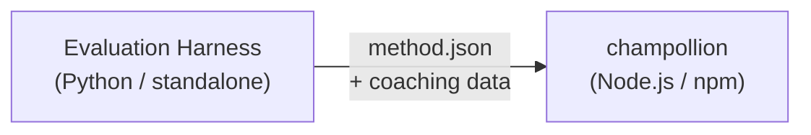

# 方法插件规范

> **版本**: 1.1  
> **受众**: 插件开发者  
> **规范架构**: [`shared/schemas/champollion-plugin.schema.json`](https://github.com/gamedaysuits/Champollion/blob/main/cli/shared/schemas/champollion-plugin.schema.json)

## 概述

champollion 使用**可插拔方法系统**。每个语言对可以使用不同的翻译方法（LLM、教练式、脚本转换器等）。方法在 `lib/translate.js` 中注册，并通过 `lib/pairs.js` 按语言对解析。

评估工具的职责是**开发、测试和导出**翻译方法。champollion 的职责是**消费和执行**它们。插件是**仅数据**——配置、教练内容和基准测试结果。没有 Python 代码，没有工具依赖。

### 数据流



工具在 Python 中开发和测试方法。当方法准备好部署时，工具导出 `method.json` 清单和可选的教练数据文件。Champollion 使用其自身内置的方法实现来安装和执行该方法。

---

## 方法插件格式

方法插件是单个 JSON 文件（`method.json`）加上可选的教练数据文件。

### `method.json` — 必需

```json
{
  "name": "french-formal-v1",
  "type": "llm-coached",
  "version": "1.0.0",
  "description": "Formally-tuned French with terminology enforcement and grammar coaching",
  "author": "Plugin Author",

  "config": {
    "model": "google/gemini-3.5-flash",
    "temperature": 0.2,
    "batchSize": 80,
    "register": "formal",
    "coachingFile": null,
    "coachingPrompt": null,
    "promptContext": null,
    "qualityTier": null
  },

  "locales": ["fr"],

  "benchmarks": {
    "fr": {
      "date": "2026-05-11T00:00:00Z",
      "corpus_size": 500,
      "exact_match_rate": 0.42,
      "corpus_chrf": 72.3,
      "corpus_bleu": 45.1,
      "model": "google/gemini-3.5-flash",
      "harness_version": "1.0.0"
    }
  },

  "provenance": {
    "resources": [],
    "commercialReady": false,
    "flags": ["license-unclear"]
  },

  "coaching": {
    "dir": "coaching"
  }
}
```

### 字段参考

| 字段 | 类型 | 必需 | 描述 |
|-------|------|----------|-------------|
| `name` | string | ✅ | 唯一方法标识符（kebab-case） |
| `type` | string | ✅ | Champollion 方法类型：`llm`、`llm-coached`、`api`、`google-translate`、`deepl`、`microsoft-translator`、`libretranslate`、`openai`、`anthropic`、`gemini` |
| `version` | string | ✅ | 语义化版本（例如 `1.0.0`） |
| `locales` | string[] | ✅ | 此方法针对的区域代码（最少 1 个） |
| `description` | string | — | 人类可读的描述 |
| `author` | string | — | 开发/测试此方法的人员 |
| `config.model` | string | — | OpenRouter 模型标识符 |
| `config.temperature` | number | — | LLM 温度（0.0–2.0，默认值：0.3） |
| `config.batchSize` | number | — | 每个 API 批次的键数（1–200，默认值：80） |
| `config.register` | string \| null | — | 目标语言寄存器/语调（预设键或自由格式文本） |
| `config.coachingFile` | string \| null | — | 自由文本教练提示文件的路径（相对于项目根目录） |
| `config.coachingPrompt` | string \| null | — | 已解析的教练提示文本（在运行时从 `coachingFile` 读取） |
| `config.promptContext` | string \| null | — | 注入系统提示的应用程序上下文（例如"电子商务产品描述"） |
| `config.qualityTier` | string \| null | — | 基准测试评估的质量等级（`standard`、`high`、`research`、`verified`） |
| `benchmarks` | object | — | 来自评估工具的按区域基准测试结果 |
| `provenance` | object | — | 许可和资源依赖 |
| `coaching.dir` | string | — | 教练数据目录的相对路径 |

:::info[规范 MethodConfig 形状]
`config` 块使用**规范 MethodConfig 架构**——在 `champollion.config.json`、工具运行卡、`mt-eval export-config` 和排行榜发布/安装中使用的相同 8 个字段。所有字段始终存在；未使用的值为 `null`。这确保了评估和生产之间的零摩擦往返。
:::

### 基准测试对象（按区域）

| 字段 | 类型 | 必需 | 描述 |
|-------|------|----------|-------------|
| `date` | string | ✅ | 基准测试运行的 ISO 8601 时间戳 |
| `corpus_size` | number | ✅ | 评估的条目数 |
| `exact_match_rate` | number | ✅ | 0.0–1.0，精确匹配的比例 |
| `corpus_chrf` | number | — | chrF++ 分数（0–100） |
| `corpus_bleu` | number | — | BLEU 分数（0–100） |
| `model` | string | ✅ | 评估期间使用的模型 |
| `harness_version` | string | ✅ | 使用的评估工具版本 |

:::info[显示哪些指标？]
`champollion status` 命令显示基准测试块中的 **chrF++** 和**精确匹配率**。`corpus_bleu` 在清单中被接受，但目前不由任何 champollion 命令显示或使用。[方法排行榜](/leaderboard)跟踪 chrF++、精确匹配和 FST 接受率。
:::

---

### 来源对象

来源块传达插件捆绑资源的许可状态。

| 字段 | 类型 | 默认值 | 描述 |
|-------|------|---------|-------------|
| `resources` | object[] | `[]` | 具有 `name`、`license` 和 `type` 的捆绑资源列表 |
| `commercialReady` | boolean | `false` | 插件是否已获准商业发行 |
| `flags` | string[] | `["license-unclear"]` | 机器可读的状态标志 |

**默认状态**——导出的插件附带 `commercialReady: false` 和 `flags: ["license-unclear"]`。

**已清除状态**——当许可已验证时：设置 `commercialReady: true` 并清除标志。

---

## 教练数据格式

如果 `type` 是 `llm-coached`，插件应在 `coaching/` 子目录中包含教练数据文件。

### `coaching/<locale>.json`

```json
{
  "grammar_rules": [
    "French adjectives agree in gender and number with the noun they modify",
    "Use 'vous' for formal contexts, 'tu' for informal"
  ],
  "dictionary": {
    "dashboard": "tableau de bord",
    "deployment": "déploiement",
    "settings": "paramètres"
  },
  "style_notes": "Prefer active voice. Avoid anglicisms where a native French term exists."
}
```

| 字段 | 类型 | 必需 | 描述 |
|-------|------|----------|-------------|
| `grammar_rules` | string[] | — | 为此区域注入每个 LLM 提示的规则 |
| `dictionary` | object | — | 术语 → 翻译映射。匹配的术语作为必需术语注入。 |
| `style_notes` | string | — | 附加到提示的自由格式样式说明 |

---

## 目录结构

```
french-formal-v1/
  method.json                 # Method manifest with benchmarks
  coaching/
    fr.json                   # Coaching data for French
```

对于多区域方法：

```
european-formal-v2/
  method.json                 # locales: ["fr", "de", "es", "it"]
  coaching/
    fr.json
    de.json
    es.json
    it.json
```

---

## Champollion 如何消费插件

### 安装

```bash
champollion plugin install ./french-formal-v1/
```

保存到 `.champollion/methods/french-formal-v1/`。

### 配置

```json title="champollion.config.json"
{
  "pairs": {
    "en:fr": {
      "methodPlugin": "french-formal-v1"
    }
  }
}
```

:::info[合并语义]
插件定义*使用什么*方法（`type`）。对配置调整*如何*运行它（`model`、`register`、`batchSize`）。如果对设置 `model`，它会覆盖插件的默认值。
:::

### 运行时

1. Champollion 从 `method.json` 读取 `.champollion/methods/french-formal-v1/`
2. 插件的 `type` 字段设置翻译方法（例如 `llm-coached`）
3. 从插件的 `coaching/` 目录加载教练数据
4. 使用 `config` 块填补模型/寄存器/温度的空白
5. `benchmarks` 块显示在 `champollion status` 输出中
6. `provenance` 块由 `champollion provenance` 检查许可标志

---

## 架构验证

插件清单在安装时根据 [`shared/schemas/champollion-plugin.schema.json`](https://github.com/gamedaysuits/Champollion/blob/main/cli/shared/schemas/champollion-plugin.schema.json) 进行验证。

在 `method.json` 中引用架构以获得 IDE 自动完成：

```json
{
  "$schema": "./node_modules/champollion/shared/schemas/champollion-plugin.schema.json",
  "name": "my-method-v1"
}
```

---

## 不包含的内容

- ❌ 没有 Python 代码或工具依赖
- ❌ 没有原始语料库数据或运行日志
- ❌ 没有 API 密钥或凭证
- ❌ 没有工具配置
- ❌ 没有内部提示模板（这些存在于 champollion 的方法实现中）

插件是**仅数据**：配置、教练内容和基准测试结果。

---

## 另请参阅

- [翻译方法](/docs/guides/translation-methods) — 每个内置方法的工作原理
- [配置](/docs/getting-started/configuration) — 按对和按语言配置
- [通过 API 提供方法](/docs/guides/serving-a-method) — 将方法作为 HTTP 服务托管
- [食谱：FST 门控管道](/docs/network/tutorials/fst-gated-pipeline) — 构建和打包管道
- [MT 评估](/docs/network/leaderboard/rules) — 为排行榜提交对方法进行基准测试
- [支持低资源语言](/docs/network/community/low-resource-languages) — 社区插件的用例
